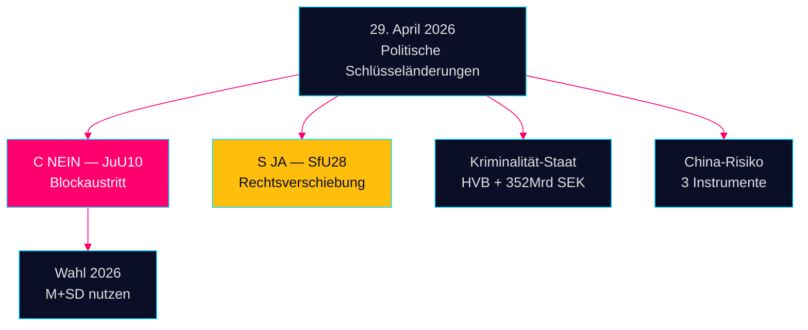

# Abendaufklärung — 29. April 2026: Demokratie unter Stress

**Autor**: James Pether Sörling  
**Datum**: 2026-04-29  
**Einstufung**: ÖFFENTLICH — DSGVO Art. 9(2)(e,g)  
**Vertrauen**: HOCH [B2]

---

## 🎯 Kurzzusammenfassung

Die Sitzung des Riksdag am 29. April 2026 lieferte drei Bestätigungssignale, die den Wahlkampf vor September 2026 prägen werden: (1) Centerpartiet brach mit seinen natürlichen Koalitionspartnern bei der Waffengesetzabstimmung JuU10 — bewusste Neupositionierung fünf Monate vor den Wahlen; (2) das Staatsbürgerschaftsgesetz wurde mit Unterstützung der Sozialdemokraten verabschiedet; (3) die Durchdringung von Wohlfahrtsinstitutionen durch organisierte Kriminalität wurde in Interpellationen aufgedeckt.

## 60-Sekunden-Aufklärungslektüre

- **JuU10 (Neues Waffengesetz) VERABSCHIEDET 16:13**: Cs 20 einstimmige NEIN-Stimmen sind die folgenreichste politische Handlung des Tages [HDC120260429ap]
- **SfU28 (Staatsbürgerschaft) VERABSCHIEDET 16:21**: S stimmte JA mit dem Tidö-Block [HD01SfU28]
- **Kriminelle Netzwerke**: HVB-Infiltration (HD10454) + 352 Mrd. SEK Kriminalwirtschaft (HD10451)
- **China-Risikokonvergenz**: Drei parlamentarische Instrumente zu chinesischen Bedrohungen heute

## Wichtigstes Vorwärtssignal

Cs NEIN beim Waffengesetz: bewusste Differenzierung oder einmalige Abweichung? Beobachtung mit mittlerer Konfidenz [B3].



---

**Wirtschaftlicher Kontext (IWF WEO April 2026)**: BIP-Wachstum +1,8%, Staatsschulden 34,3% des BIP.

```json
{
  "economicProvenance": {
    "provider": "imf",
    "dataflow": "WEO",
    "indicator": "NGDP_RPCH",
    "vintage": "2026-04",
    "retrieved_at": "2026-04-29"
  }
}
```


<!-- source-sha: aec9c4c63be21515d55b3a22362bc344c0b4a20e -->
