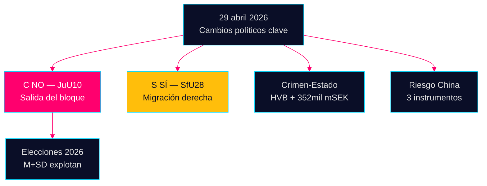

# Informe de inteligencia nocturno — 29 de abril de 2026: Democracia bajo presión

**Autor**: James Pether Sörling  
**Fecha**: 2026-04-29  
**Clasificación**: PÚBLICO — RGPD Art. 9(2)(e,g)  
**Confianza**: ALTA [B2]

---

## 🎯 Resumen ejecutivo

La sesión del Riksdag del 29 de abril de 2026 produjo tres señales de confirmación que darán forma a la campaña electoral de cara a septiembre de 2026: (1) Centerpartiet rompió con sus socios de coalición naturales en la votación de la ley de armas JuU10 — reposicionamiento político deliberado cinco meses antes de las elecciones; (2) la ley de ciudadanía fue aprobada con el apoyo de los socialdemócratas; (3) la infiltración de instituciones de bienestar social por parte de la delincuencia organizada quedó al descubierto en interpelaciones.

## Lectura de inteligencia en 60 segundos

- **JuU10 (Nueva ley de armas) APROBADA 16:13**: Los 20 votos NO unánimes de C son la acción política más trascendente del día [HDC120260429ap]
- **SfU28 (Ciudadanía) APROBADA 16:21**: S votó SÍ con el bloque Tidö [HD01SfU28]
- **Redes criminales**: Infiltración HVB (HD10454) + economía criminal de 352 mil millones SEK (HD10451)
- **Convergencia del riesgo China**: Tres instrumentos parlamentarios sobre amenazas chinas hoy

## Principal señal prospectiva

El NO de C en la ley de armas: ¿diferenciación deliberada o desviación puntual? Seguimiento con confianza media [B3].



---

**Contexto económico (FMI WEO abril 2026)**: Crecimiento PIB +1,8%, deuda pública 34,3% del PIB.

```json
{
  "economicProvenance": {
    "provider": "imf",
    "dataflow": "WEO",
    "indicator": "NGDP_RPCH",
    "vintage": "2026-04",
    "retrieved_at": "2026-04-29"
  }
}
```


<!-- source-sha: aec9c4c63be21515d55b3a22362bc344c0b4a20e -->
