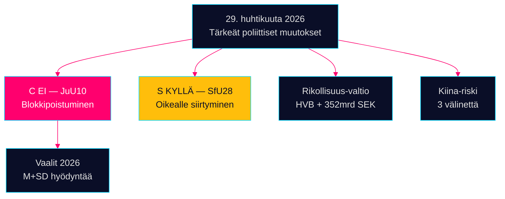

# Iltaraportti — 29. huhtikuuta 2026: Demokratia stressissä

**Tekijä**: James Pether Sörling  
**Päivämäärä**: 2026-04-29  
**Luokittelu**: JULKINEN — GDPR Art. 9(2)(e,g)  
**Luotettavuus**: KORKEA [B2]

---

## 🎯 Lyhyt yhteenveto

Riksdagenin istunto 29. huhtikuuta 2026 tuotti kolme vahvistussignaalia, jotka muovaavat syyskuun 2026 vaalikampanjaa: (1) Centerpartiet erosi luontaisista koaliopartnereistaan JuU10-äänessä — tarkoituksellinen poliittinen uudelleenpositiointi viisi kuukautta ennen vaaleja; (2) kansalaisuuslaki hyväksyttiin Socialdemokraternin tuella; (3) järjestäytyneen rikollisuuden tunkeutuminen hyvinvointilaitoksiin paljastui interpellaatioissa.

## 60 sekunnin tiedustelutiivistelmä

- **JuU10 (Uusi aselaki) HYVÄKSYTTY 16:13**: C:n 20 yksimielistä EI-ääntä on päivän merkittävin poliittinen teko [HDC120260429ap]
- **SfU28 (Kansalaisuus) HYVÄKSYTTY 16:21**: S äänesti KYLLÄ Tidö-blokin kanssa [HD01SfU28]
- **Rikollisverkoston paljastuminen**: HVB-läpitunkeutuminen (HD10454) + 352 mrd. SEK rikollinen talous (HD10451)
- **Kiina-riskikonvergenssi**: Kolme parlamentaarista välinettä Kiinan uhkista tänään

## Tärkein eteenpäin katsova signaali

C:n EI aselaissa: tarkoituksellinen erilaistuminen vai kertaluonteinen poikkeama? Seurataan keskitason luotettavuudella [B3].



---

**Taloudellinen konteksti (IMF WEO huhtikuu 2026)**: BKT-kasvu +1,8%, valtionvelka 34,3% BKT:sta.

```json
{
  "economicProvenance": {
    "provider": "imf",
    "dataflow": "WEO",
    "indicator": "NGDP_RPCH",
    "vintage": "2026-04",
    "retrieved_at": "2026-04-29"
  }
}
```


<!-- source-sha: aec9c4c63be21515d55b3a22362bc344c0b4a20e -->
