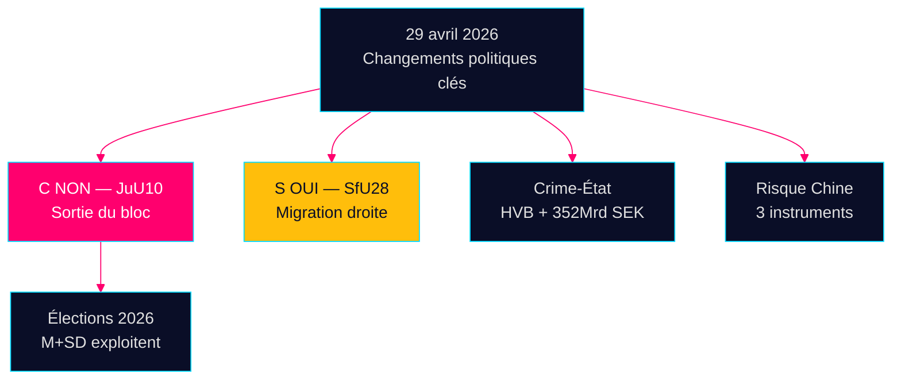

# Renseignement du soir — 29 avril 2026 : Démocratie sous pression

**Auteur** : James Pether Sörling  
**Date** : 2026-04-29  
**Classification** : PUBLIC — RGPD Art. 9(2)(e,g)  
**Confiance** : ÉLEVÉE [B2]

---

## 🎯 Résumé exécutif

La session du Riksdag du 29 avril 2026 a produit trois signaux de confirmation qui façonneront la campagne électorale avant septembre 2026 : (1) Centerpartiet a rompu avec ses partenaires de coalition naturels lors du vote sur la loi sur les armes JuU10 — repositionnement politique délibéré cinq mois avant les élections ; (2) la loi sur la citoyenneté a été adoptée avec le soutien des sociaux-démocrates ; (3) l'infiltration des institutions de protection sociale par la criminalité organisée a été révélée dans des interpellations.

## Lecture de renseignement en 60 secondes

- **JuU10 (Nouvelle loi sur les armes) ADOPTÉE 16h13** : Les 20 votes NON unanimes de C sont l'acte politique le plus conséquent de la journée [HDC120260429ap]
- **SfU28 (Citoyenneté) ADOPTÉE 16h21** : S a voté OUI avec le bloc Tidö [HD01SfU28]
- **Réseaux criminels** : Infiltration HVB (HD10454) + économie criminelle de 352 Mrd SEK (HD10451)
- **Convergence du risque Chine** : Trois instruments parlementaires sur les menaces chinoises aujourd'hui

## Signal prospectif principal

Le NON de C sur la loi sur les armes : différenciation délibérée ou déviation ponctuelle ? Suivi avec confiance moyenne [B3].



---

**Contexte économique (FMI PEM avril 2026)** : Croissance du PIB +1,8%, dette publique 34,3% du PIB.

```json
{
  "economicProvenance": {
    "provider": "imf",
    "dataflow": "WEO",
    "indicator": "NGDP_RPCH",
    "vintage": "2026-04",
    "retrieved_at": "2026-04-29"
  }
}
```


<!-- source-sha: aec9c4c63be21515d55b3a22362bc344c0b4a20e -->
