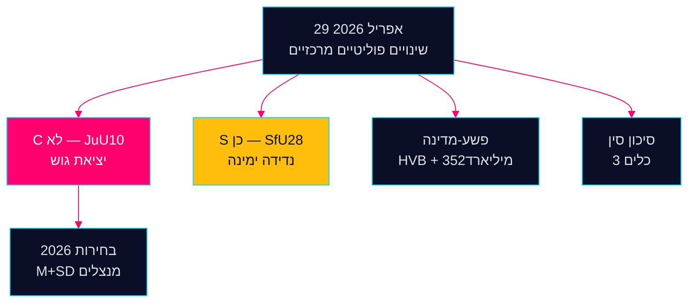

<div dir="rtl">

# מודיעין ערב — 29 באפריל 2026: דמוקרטיה תחת לחץ

**מחבר**: ג'יימס פת'ר סורלינג  
**תאריך**: 2026-04-29  
**סיווג**: ציבורי — GDPR סעיף 9(2)(ה,ז)  
**אמינות**: גבוהה [B2]

---

## 🎯 תמצית מנהלים

הישיבה של Riksdag ב-29 באפריל 2026 הניבה שלושה אותות אישור שיעצבו את מסע הבחירות לקראת ספטמבר 2026: (1) Centerpartiet פרץ עם שותפיו הטבעיים בקואליציה בהצבעה על חוק הנשק JuU10 — מיצוב פוליטי מכוון מחדש חמישה חודשים לפני הבחירות; (2) חוק האזרחות אושר בתמיכת הסוציאל-דמוקרטים; (3) חדירת הפשע המאורגן למוסדות הרווחה התגלתה בהצהרות ביניים.

## קריאת מודיעין ב-60 שניות

- **JuU10 (חוק נשק חדש) אושר 16:13**: 20 הצבעות הלא הפה-אחד של C הן הפעולה הפוליטית המשמעותית ביותר של היום [HDC120260429ap]
- **SfU28 (אזרחות) אושר 16:21**: S הצביע בעד עם גוש Tidö [HD01SfU28]
- **רשתות פשע**: חדירת HVB (HD10454) + כלכלה פלילית של 352 מיליארד כתר (HD10451)
- **התכנסות סיכון סין**: שלושה כלים פרלמנטריים בנושא איומים סיניים היום

## האות הצופה הקריטי ביותר

ה-לא של C בחוק הנשק: בידול מכוון או סטייה חד-פעמית? מעקב באמינות בינונית [B3].



---

**הקשר כלכלי (קרן המטבע הבינלאומית WEO אפריל 2026)**: צמיחת תוצר +1.8%, חוב ציבורי 34.3% מהתוצר.

```json
{
  "economicProvenance": {
    "provider": "imf",
    "dataflow": "WEO",
    "indicator": "NGDP_RPCH",
    "vintage": "2026-04",
    "retrieved_at": "2026-04-29"
  }
}
```

</div>


<!-- source-sha: aec9c4c63be21515d55b3a22362bc344c0b4a20e -->
