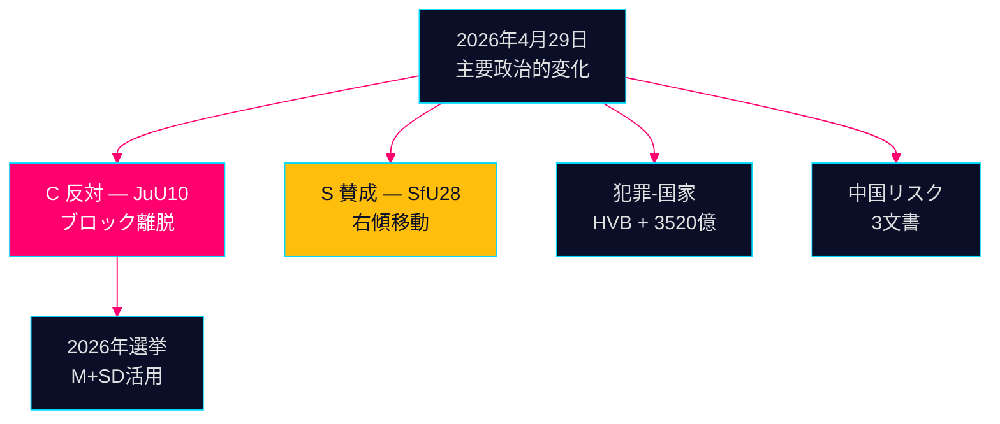

# 夕刊インテリジェンス — 2026年4月29日：ストレス下の民主主義

**著者**：James Pether Sörling  
**日付**：2026-04-29  
**分類**：公開 — GDPR第9条(2)(e,g)  
**信頼度**：高 [B2]

---

## 🎯 エグゼクティブサマリー

2026年4月29日のRiksdagの会議は、2026年9月の選挙戦を形成する3つの確認シグナルを生み出した：(1) CenterpartietはJuU10銃器法の投票で自然な連立パートナーから離脱 — 選挙5ヶ月前の意図的な政治的再ポジショニング；(2) 国籍法が社会民主党の支持で可決；(3) 組織犯罪による福祉機関への浸透が質問主意書で明らかになった。

## 60秒インテリジェンス要点

- **JuU10（新銃器法）可決 16:13**：Cの20票の全会一致の反対は本日最も重大な政治的行動 [HDC120260429ap]
- **SfU28（国籍）可決 16:21**：SはTidöブロックとともに賛成投票 [HD01SfU28]
- **犯罪ネットワーク**：HVB施設への浸透（HD10454）+ 3,520億クローナの犯罪経済（HD10451）
- **中国リスク収束**：本日、中国の脅威に関する3つの議会文書

## 最重要先行シグナル

銃器法に対するCの反対：意図的な差別化か一時的逸脱か？中程度の信頼度で監視 [B3]。



---

**経済的文脈（IMF WEO 2026年4月）**：GDP成長率+1.8%、政府債務GDP比34.3%。

```json
{
  "economicProvenance": {
    "provider": "imf",
    "dataflow": "WEO",
    "indicator": "NGDP_RPCH",
    "vintage": "2026-04",
    "retrieved_at": "2026-04-29"
  }
}
```


<!-- source-sha: aec9c4c63be21515d55b3a22362bc344c0b4a20e -->
