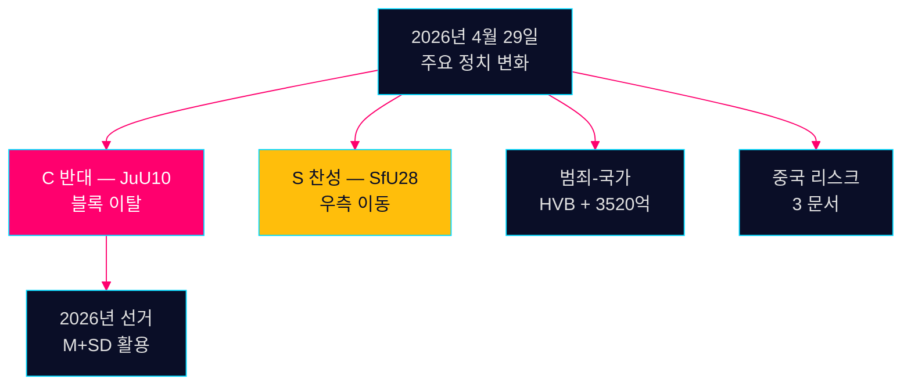

# 저녁 정보 보고 — 2026년 4월 29일: 스트레스 받는 민주주의

**저자**: James Pether Sörling  
**날짜**: 2026-04-29  
**분류**: 공개 — GDPR 9조(2)(e,g)  
**신뢰도**: 높음 [B2]

---

## 🎯 요약

2026년 4월 29일 Riksdag 회의는 2026년 9월 선거운동을 형성할 세 가지 확인 신호를 생성했습니다: (1) Centerpartiet가 JuU10 무기법 투표에서 자연스러운 연립 파트너들과 결별 — 선거 5개월 전 의도적인 정치적 재포지셔닝; (2) 사회민주당의 지지로 시민권법이 가결; (3) 조직범죄의 복지기관 침투가 질문에서 폭로.

## 60초 정보 요점

- **JuU10 (새 무기법) 가결 16:13**: C의 20표 만장일치 반대가 오늘 가장 중요한 정치적 행동 [HDC120260429ap]
- **SfU28 (시민권) 가결 16:21**: S는 Tidö 블록과 함께 찬성 투표 [HD01SfU28]
- **범죄 네트워크**: HVB 침투 (HD10454) + 3,520억 크로나 범죄 경제 (HD10451)
- **중국 리스크 수렴**: 오늘 중국 위협에 관한 3개의 의회 문서

## 최우선 선행 신호

무기법에 대한 C의 반대: 의도적 차별화 아니면 일회성 이탈? 중간 신뢰도로 모니터링 [B3].



---

**경제 맥락 (IMF WEO 2026년 4월)**: GDP 성장률 +1.8%, 국가 부채 GDP 대비 34.3%.

```json
{
  "economicProvenance": {
    "provider": "imf",
    "dataflow": "WEO",
    "indicator": "NGDP_RPCH",
    "vintage": "2026-04",
    "retrieved_at": "2026-04-29"
  }
}
```


<!-- source-sha: aec9c4c63be21515d55b3a22362bc344c0b4a20e -->
