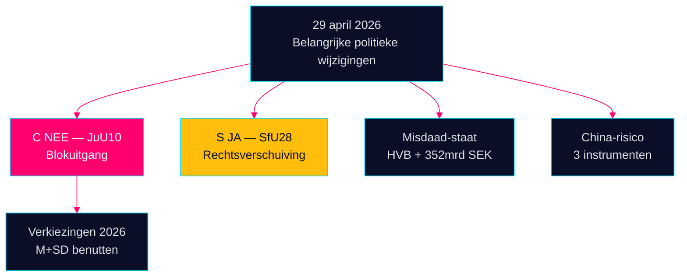

# Avondintelligentie — 29 april 2026: Democratie onder druk

**Auteur**: James Pether Sörling  
**Datum**: 2026-04-29  
**Classificatie**: OPENBAAR — AVG Art. 9(2)(e,g)  
**Vertrouwen**: HOOG [B2]

---

## 🎯 Uitvoerende samenvatting

De zitting van de Riksdag op 29 april 2026 leverde drie bevestigingssignalen op die de verkiezingscampagne voor september 2026 zullen bepalen: (1) Centerpartiet brak met zijn natuurlijke coalitepartners bij de stemming over de wapenwet JuU10 — bewuste politieke herpositionering vijf maanden voor de verkiezingen; (2) de staatsburgerlijkheidsvet werd aangenomen met steun van de sociaaldemocraten; (3) de infiltratie van welzijnsinstellingen door de georganiseerde misdaad werd onthuld in interpellaties.

## 60-seconden inlichtingenlectuur

- **JuU10 (Nieuwe wapenwet) AANGENOMEN 16:13**: De 20 unanieme NEE-stemmen van C zijn de meest ingrijpende politieke handeling van de dag [HDC120260429ap]
- **SfU28 (Staatsburgerlijkheid) AANGENOMEN 16:21**: S stemde JA met het Tidö-blok [HD01SfU28]
- **Criminele netwerken**: HVB-infiltratie (HD10454) + 352 mrd. SEK criminele economie (HD10451)
- **China-risicoconvergentie**: Drie parlementaire instrumenten over Chinese dreigingen vandaag

## Belangrijkste vooruitblikkend signaal

Cs NEE bij de wapenwet: bewuste differentiatie of eenmalige afwijking? Bewaking met gemiddeld vertrouwen [B3].



---

**Economische context (IMF WEO april 2026)**: BBP-groei +1,8%, staatsschuld 34,3% van het BBP.

```json
{
  "economicProvenance": {
    "provider": "imf",
    "dataflow": "WEO",
    "indicator": "NGDP_RPCH",
    "vintage": "2026-04",
    "retrieved_at": "2026-04-29"
  }
}
```


<!-- source-sha: aec9c4c63be21515d55b3a22362bc344c0b4a20e -->
