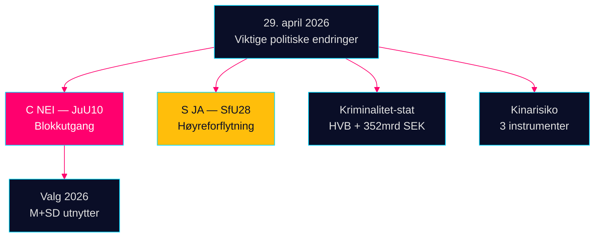

# Kveldsunderretning — 29. april 2026: Demokrati under press

**Forfatter**: James Pether Sörling  
**Dato**: 2026-04-29  
**Klassifisering**: OFFENTLIG — GDPR Art. 9(2)(e,g)  
**Konfidens**: HØY [B2]

---

## 🎯 Kortfattet sammendrag

Riksdagens sesjon 29. april 2026 leverte tre bekreftelsessignaler som vil forme valgkampen mot september 2026: (1) Centerpartiet brøt med sine naturlige koalisjonspartnere i JuU10 våpenloven — bevisst politisk omposisjonering fem måneder før valget; (2) statsborgerskapsloven ble vedtatt med Socialdemokraternas støtte; (3) organisert kriminalitets infiltrasjon av velferdsinstitusjoner ble avdekket i interpellasjoner.

## 60-sekunders underretningslesing

- **JuU10 (Ny våpenlov) VEDTATT 16:13**: Cs 20 enstemmige NEI-stemmer er dagens mest konsekvensrike politiske handling [HDC120260429ap]
- **SfU28 (Statsborgerskap) VEDTATT 16:21**: S stemte JA med Tidö-blokken [HD01SfU28]
- **Kriminelt nettverksavsløring**: HVB-infiltrasjon (HD10454) + 352 mrd. SEK kriminell økonomi (HD10451)
- **Kinarisikokonvergens**: Tre parlamentariske instrumenter om kinesiske trusler i dag

## Viktigste fremadskuende signal

Cs NEI om våpenloven: bevisst differensiering eller engangsavvik? Overvåkes med middels konfidens [B3].



---

**Økonomisk kontekst (IMF WEO april 2026)**: BNP-vekst +1,8%, statsgjeld 34,3% av BNP.

```json
{
  "economicProvenance": {
    "provider": "imf",
    "dataflow": "WEO",
    "indicator": "NGDP_RPCH",
    "vintage": "2026-04",
    "retrieved_at": "2026-04-29"
  }
}
```


<!-- source-sha: aec9c4c63be21515d55b3a22362bc344c0b4a20e -->
