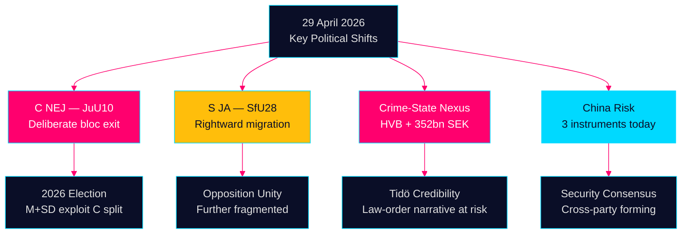

# Kvällsunderrättelse — 29 april 2026: Demokrati under stress

**Författare**: James Pether Sörling  
**Datum**: 2026-04-29  
**Klassificering**: OFFENTLIG — GDPR Art. 9(2)(e,g)  
**Konfidens**: HÖG [B2]  
**Körnings-ID**: 25121285494

---

## 🎯 Kortfattad sammanfattning

Riksdagens session den 29 april 2026 levererade tre bekräftelsesignaler som kommer att forma valrörelsen inför september 2026: (1) Centerpartiet bröt med sina naturliga koalitionspartners och oppositionen i vapenlagsvoteringen, vilket markerar en avsiktlig politisk ompositionering fem månader före valet; (2) medborgarskaplagen antogs med Socialdemokraternas stöd, vilket bekräftar S:s förflyttning mot det politiska mitten på identitetspolitik; (3) organiserad brottslighets genomträngning av välfärdsinstitutioner blottlades i interpellationer, vilket underminerar Tidökoalitionens kärna i lag och ordning-berättelsen. Under dessa politiska linjer formas en konvergerande Kina-riskberättelse över partilinjerna — den första flerdokuments parlamentariska dagen om kinesiska säkerhetshot sedan 2023.

## 🧭 3 beslut som detta underlag stöder

1. **Redaktionellt prioritetsbeslut**: Rama in Centerpartiets NEJ i vapenlagsfrågan som huvudhistoria — det är det mest bestående politiska signalet från dagen och kommer att utnyttjas i 2026 års valrörelse av SD och M.
2. **Täckningsarkitekturbeslut**: Koppla ihop HVB-brottshistorien, den kriminella ekonomin-interpellationen (352 miljarder SEK) och välfärdsreformmotionerna för att skapa en sammanhängande "Tidö-trovärdighetsgap"-berättelse.
3. **Framåt underrättelsebeslut**: Öppna PIR om huruvida S:s högerröstning om medborgarskap (SfU28) representerar en permanent strategisk förflyttning eller taktisk positionering — PIR-EA-01.

## 60-sekunders underrättelseläsning

- **JuU10 (Ny vapenlag) ANTAGEN 16:13**: C:s 20 enhälliga NEJ-röster är dagens mest konsekvensrika politiska handling — avsiktlig differentiering från Tidöblocket fem månader före valet [HDC120260429ap]
- **SfU28 (Medborgarskap) ANTAGEN 16:21**: S röstade JA med Tidöblocket om medborgarskapsskärpning; Annika Strandhäll ensam S-disssident — bekräftar S:s förflyttning mot höger på identitetspolitik [HD01SfU28]
- **HD03259 Transport 875 Mdr kr**: Infrastrukturplan dominerar propositioner — real BNP-påverkan 1,0% av BNP per år (IMF WEO apr-2026, NGDP_RPCH SWE +1,8%)
- **Kriminellt nätverksavslöjande**: HVB-hem-infiltration (HD10454) + 352 miljarder SEK kriminell ekonomi (HD10451) angriper direkt Tidökoalitionens lag och ordning-trovärdighet
- **Kina-riskkonvergens**: Tre parlamentariska instrument om kinesiska hot idag (HD12744, HD12746, HD10456) — säkerhetskonsensus formas över partilinjerna
- **Koalitionsintern spricka**: SD:s Josef Fransson kräver gasbrygga (HD10453) kontra KD:s energiminister Busch — diskret men beständig spänning
- **Ytterligare eftermiddagsomröstningar (re-run)**: 8 ytterligare kam-vo beslut antagna 16:00–16:21 — civilt skydd [FöU12, S NEJ punkt 2], fängelseexpansion [CU25, nära konsensus], EV-laddning [CU29], avfallsreform [MJU19], klimatrapporter [MJU20/21], Riksbanksöversyn [FiU23], forskarmigrering [SfU23]

## Viktigaste framåtblickande signal

**PIR-EA-01** (ÖPPEN): Kommer C:s NEJ om vapenlagen att kvarstå som en kampanjdifferentierande position, eller är det en engångsavvikelse? Bevaka C:s positioner i NU, JuU och partimanifest.

**Konfidens**: MEDEL [B3] — enstaka datapunkt men konsistent med Annie Lööfs ompositioneringsstrategi sedan 2024.



---

## Ekonomisk kontext (IMF WEO april 2026)

Sveriges BNP-tillväxt: +1,8% (2026e), +2,3% (2027e). Statsskuld: 34,3% av BNP. KPI: 2,9%. Finanspolitiskt utrymme finns för 875 miljarder transportplan om fasindelat. Nordisk jämförelse: SE underpresterar DK (+2,2%) men överpresterar FI (+1,1%).

```json
{
  "economicProvenance": {
    "provider": "imf",
    "dataflow": "WEO",
    "indicator": "NGDP_RPCH",
    "vintage": "2026-04",
    "retrieved_at": "2026-04-29"
  }
}
```


<!-- source-sha: aec9c4c63be21515d55b3a22362bc344c0b4a20e -->
