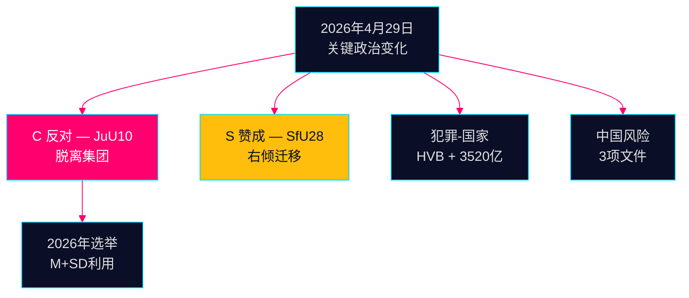

# 晚间情报简报 — 2026年4月29日：压力下的民主

**作者**：James Pether Sörling  
**日期**：2026-04-29  
**分类**：公开 — GDPR第9条(2)(e,g)  
**置信度**：高 [B2]

---

## 🎯 执行摘要

2026年4月29日Riksdag会议产生了三个确认信号，将塑造2026年9月的选举运动：(1) Centerpartiet在JuU10武器法投票中与其自然联合伙伴决裂 — 选举前五个月的蓄意政治重新定位；(2) 公民身份法以社会民主党的支持通过；(3) 有组织犯罪对福利机构的渗透在质询中被揭露。

## 60秒情报要点

- **JuU10（新武器法）通过 16:13**：C的20票一致反对是今天最重要的政治行动 [HDC120260429ap]
- **SfU28（公民身份）通过 16:21**：S与Tidö集团一起投票赞成 [HD01SfU28]
- **犯罪网络**：HVB渗透（HD10454）+ 3,520亿克朗犯罪经济（HD10451）
- **中国风险聚合**：今天就中国威胁的三个议会文件

## 最重要前瞻信号

C对武器法的反对：蓄意差异化还是一次性偏离？以中等置信度监测 [B3]。



---

**经济背景（IMF WEO 2026年4月）**：GDP增长+1.8%，政府债务占GDP 34.3%。

```json
{
  "economicProvenance": {
    "provider": "imf",
    "dataflow": "WEO",
    "indicator": "NGDP_RPCH",
    "vintage": "2026-04",
    "retrieved_at": "2026-04-29"
  }
}
```


<!-- source-sha: aec9c4c63be21515d55b3a22362bc344c0b4a20e -->
