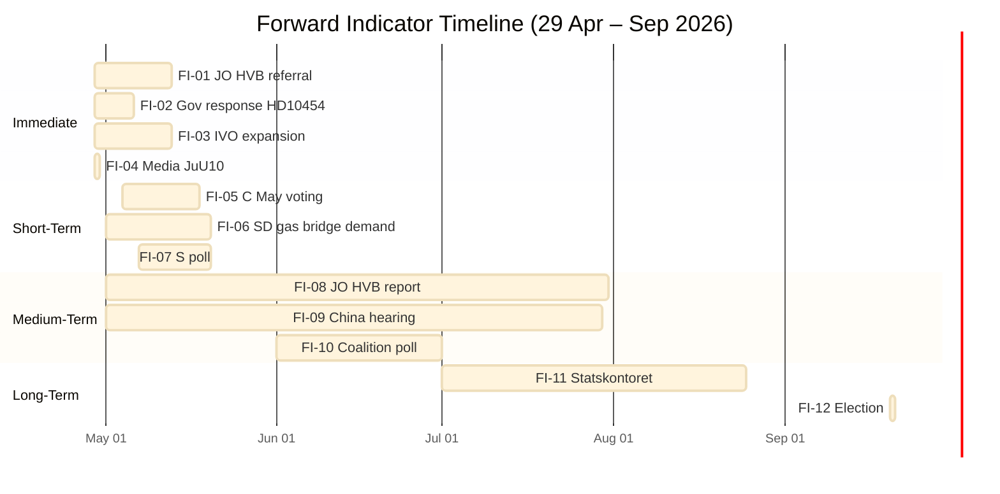

# Forward Indicators — Evening Analysis 29 April 2026

**Author**: James Pether Sörling  
**Date**: 2026-04-29

---

## Forward Indicator Registry

Minimum 10 dated indicators across 4 horizons. All indicators derive from today's parliamentary activity.

---

## Horizon 1: Immediate (0–14 days)

### FI-01: JO Report on HVB Criminal Operators
**Indicator**: JO (Justitieombudsmannen) announces investigation or receives referral regarding municipal oversight of HVB homes
**Date range**: 29 April – 13 May 2026
**Signal if triggered**: CONFIRMS KJ-04 (systemic failure confirmed at highest oversight level)
**Watch**: JO diarium (public) + Socialtjänstens pressreleaser

### FI-02: Government Response to HD10454 Interpellation
**Indicator**: Justitieminister Carl Oskar Bohlin formally responds to HD10454 in Riksdag chamber
**Date range**: 30 April – 7 May 2026
**Signal if triggered**: Government's defensive/proactive response determines media narrative for 2 weeks
**Watch**: Riksdag chamber schedule (riksdagen.se kalender)

### FI-03: IVO Announces HVB Review Expansion
**Indicator**: Inspektionen för vård och omsorg (IVO) publicly announces expansion of HVB oversight beyond current scope
**Date range**: 29 April – 13 May 2026
**Signal if triggered**: Government gets ahead of scandal; reduces electoral damage
**Watch**: IVO pressrum

### FI-04: SVT/DN Publish Vote Analysis of JuU10
**Indicator**: Major media publish detailed party analysis of C's NEJ on JuU10
**Date range**: 29–30 April 2026
**Signal if triggered**: Confirms media will amplify C's isolation; sets political temperature for May session
**Watch**: SVT Nyheter, Dagens Nyheter political desk

---

## Horizon 2: Short-Term (15–30 days)

### FI-05: Riksdag May Session First Week — C Voting Pattern
**Indicator**: C casts ≥1 more NEJ or Avstår vote against bloc on security/justice legislation
**Date range**: 4–18 May 2026
**Signal if triggered**: CONFIRMS KJ-01 is strategic, not tactical (bloc-exit confirmed)
**Watch**: riksdagen.se voteringsresultat

### FI-06: Gas Bridge Interpellation Response (SD)
**Indicator**: SD formally tables parliamentary question or motion demanding gas bridge decision before Q3 2026
**Date range**: 1–20 May 2026
**Signal if triggered**: SD–KD tension escalates from interpellation to formal parliamentary demand
**Watch**: Riksdag motionsdatabas; SD partiledning press

### FI-07: S Poll After Security Votes
**Indicator**: SVT Pejl or SIFO published with S polling after JuU10/SfU28 cross-bloc votes
**Date range**: 7–20 May 2026
**Signal if triggered**: S above 31% confirms security pivot working; below 28% suggests left hemorrhage
**Watch**: SVT Pejl monthly release

---

## Horizon 3: Medium-Term (31–90 days)

### FI-08: JO Preliminary Report on HVB Published
**Indicator**: JO publishes preliminary findings or opens formal granskning on municipal/polisens HVB oversight
**Date range**: 1 May – 31 July 2026
**Signal if triggered**: HIGH electoral impact; government accountability narrative crystallises
**Watch**: JO opinionsstöd (public search)

### FI-09: Riksdag Committee Hearing on China Risk
**Indicator**: Utrikesutskottet or Säkerhetspolitiska rådet schedules hearing on China critical sector exposure
**Date range**: 1 May – 30 July 2026
**Signal if triggered**: CONFIRMS KJ-06 China risk moving from motion to formal investigation
**Watch**: Riksdag utskottsarkiv, UD pressrum

### FI-10: Summer Recess Poll — Coalition Viability
**Indicator**: Major poll (SIFO/Kantar) published before July 1 showing Tidö below 175 OR L below 4%
**Date range**: 1 June – 1 July 2026
**Signal if triggered**: ACTIVATES Scenario 2 (fragmentation) preparation; triggers coalition recalculation
**Watch**: SIFO monthly; Kantar Sifo quarterly

---

## Horizon 4: Long-Term (91–144 days, to election)

### FI-11: Statskontoret Review of Migrationsverket Published
**Indicator**: Statskontoret publishes implementation assessment of SfU28 (citizenship) provisions
**Date range**: 1 July – 1 September 2026
**Signal if triggered**: Independent capacity confirmation/denial; affects S's citizenship messaging
**Watch**: Statskontoret publikationsdatabas

### FI-12: September 2026 Election Date Confirmation
**Indicator**: Riksdagen confirms third Sunday of September (20 September 2026) as election date
**Date range**: Confirmed May–June 2026 (de facto; formal announcement)
**Signal if triggered**: Campaign season officially begins; all parliamentary votes become electoral positioning
**Watch**: Val 2026 (valmyndigheten.se)

---

## Indicator Summary

| ID | Horizon | Topic | Days | Intelligence Priority |
|----|---------|-------|------|-----------------------|
| FI-01 | Immediate | JO/HVB | 0–14 | HIGH |
| FI-02 | Immediate | Gov HD10454 response | 0–7 | MEDIUM-HIGH |
| FI-03 | Immediate | IVO expansion | 0–14 | MEDIUM |
| FI-04 | Immediate | Media JuU10 analysis | 0–1 | MEDIUM |
| FI-05 | Short | C May voting | 15–30 | HIGH |
| FI-06 | Short | SD gas bridge demand | 1–20 days | MEDIUM-HIGH |
| FI-07 | Short | S poll post-votes | 7–20 days | MEDIUM |
| FI-08 | Medium | JO HVB report | 31–90 | VERY HIGH |
| FI-09 | Medium | China committee hearing | 31–90 | HIGH |
| FI-10 | Medium | Coalition viability poll | 31–90 | HIGH |
| FI-11 | Long | Statskontoret migration | 91–125 | MEDIUM |
| FI-12 | Long | Election date confirmed | 91+ | HIGH |

