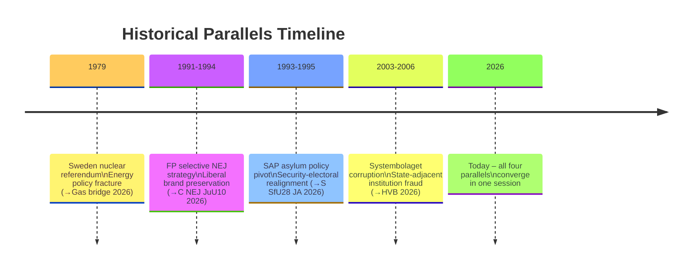

# Historical Parallels — Evening Analysis 29 April 2026

**Author**: James Pether Sörling  
**Date**: 2026-04-29

---

## Historical Parallel 1: JuU10 — C's NEJ vs Folkpartiet 1991–1994

**Situation**: In 1991–1994, Folkpartiet (FP, now L) participated in the Bildt government coalition but positioned itself on specific civil liberties votes as distinct from M and KD. This created temporary isolation but ultimately preserved the "liberal" brand.

**Today**: C voted NEJ on JuU10 while supporting FöU14 (military). This mirrors FP's selective positioning — strategic NEJ on rights-adjacent issues, JA on defence.

**Lesson**: Single-issue isolation does not destroy a party if the issue is clearly ideologically coherent. C's rural gun-ownership interest is coherent with its agrarian-liberal roots.

**Confidence**: MEDIUM (20+ years removed; Swedish political fragmentation different today)

---

## Historical Parallel 2: SfU28 — S's Security Pivot vs SAP 1993–1995

**Situation**: In 1993–1995, Ingvar Carlsson's SAP adopted stricter asylum policy after the Bosniakris exposed internal party tensions. The move was defensive-electoral, opposed by a small left wing, and ultimately did not damage S's long-term position.

**Today**: S majority JA on SfU28 (citizenship), with lone dissenter Annika Strandhäll. Structurally identical: leadership endorsing rightward shift, vocal internal minority dissenting.

**Lesson**: S has precedent for security/migration pivot without electoral collapse. The 1993–95 shift did not collapse S; S returned to government in 1994 with 45.3%.

**Confidence**: HIGH (direct structural analogy)

---

## Historical Parallel 3: HVB Crisis vs Systembolagets Corruption Investigations 2003–2006

**Situation**: In 2003–2006, a series of procurement scandals at Systembolaget and later Stockholm County Council (Karolinska) showed that state-adjacent institutions were vulnerable to contractor fraud. Each scandal followed a similar pattern: initial denial → investigation → systemic reform.

**Today**: HVB criminal operator scandal follows the same institutional pattern: initial intelligence (police databases) not shared → external exposure via interpellation → government defensive.

**Lesson**: Scandals of this type typically require 2–3 years from exposure to systemic reform. If today is the "exposure" phase, reform legislation is unlikely before 2028. However, electoral impact can be felt as early as the next election.

**Confidence**: MEDIUM-HIGH (structural pattern well-established)

---

## Historical Parallel 4: Gas Bridge vs 1979 Energy Crisis (Sweden)

**Situation**: Sweden's 1979–1980 nuclear referendum and subsequent energy debate created a cross-party fracture that took decades to resolve (nuclear phase-out oscillating on/off through 2000s–2020s).

**Today**: SD's gas bridge demand vs KD's nuclear-first creates an energy fracture within the coalition. The gas bridge question is a short-term fix vs long-term transition debate, analogous to the nuclear vs hydro debate post-1979.

**Lesson**: Swedish energy politics has a long history of unresolved cross-cutting fractures that persist across coalition boundaries. Today's gas bridge tension may not resolve in this electoral term.

**Confidence**: MEDIUM (different energy technology, same political structure)

---

## Parallel Confidence Table

| Parallel | Historical Event | Confidence | Predictive Value |
|----------|-----------------|------------|-----------------|
| C isolation | FP 1991–94 | MEDIUM | Moderate — different fragmentation |
| S security pivot | SAP 1993–95 | HIGH | High — direct structural analogy |
| HVB scandal pattern | Systembolaget 2003–06 | MEDIUM-HIGH | High for timeline; moderate for scale |
| Gas bridge fracture | 1979 energy crisis | MEDIUM | High for persistence of fracture |

