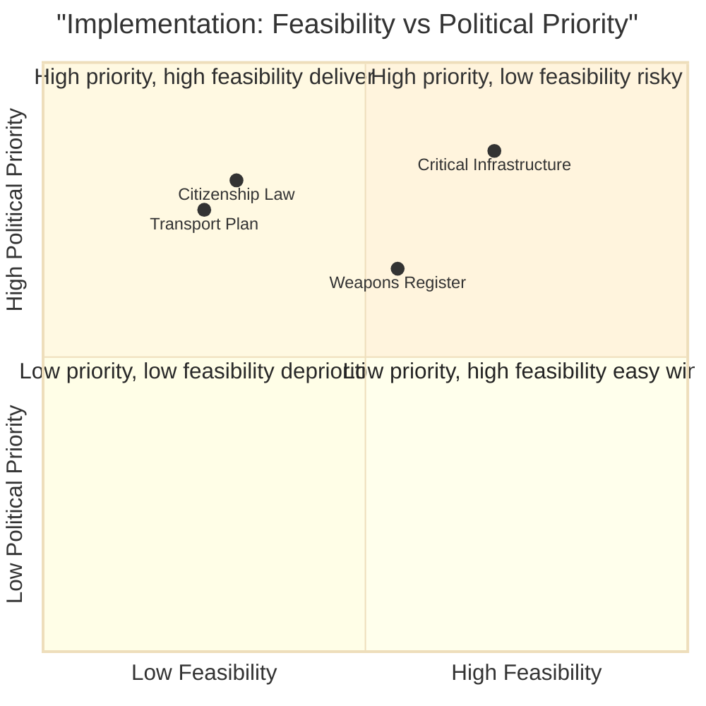

# Implementation Feasibility — Evening Analysis 29 April 2026

**Author**: James Pether Sörling  
**Date**: 2026-04-29

---

## Feasibility Assessments

### 1. JuU10 Vapenlag — Implementation Feasibility

**Key provisions**: National weapons register; stricter permit criteria; enhanced controls on automatic conversions

**Administrative capacity**:
- Polismyndigheten manages firearms licensing — capacity MEDIUM (backlogs reported 2024)
- IT system for national register: estimated 18–24 month procurement + build timeline
- **Statskontoret note**: No specific 2025/26 Statskontoret review of Polismyndigheten firearms IT found; flagged for next cycle. Prior Statskontoret reviews of Polismyndigheten (2022) flagged IT system fragmentation as ongoing risk.

**Timeline feasibility**: MEDIUM — legislation fast-track possible but implementation in 2026 is optimistic; realistic 2027

**Risk**: Polismyndigheten IT procurement record is poor (several major IT projects delayed/cancelled 2015–2024)

---

### 2. SfU28 Citizenship Law — Implementation Feasibility

**Key provisions**: Enhanced language requirements; demonstration of Swedish values; longer residency periods

**Administrative capacity**:
- Migrationsverket processes citizenship applications — CURRENTLY CONSTRAINED (processing times 18–24 months in 2025)
- New requirements add processing complexity without new resources
- **Statskontoret note**: Statskontoret published "Migrationsverkets processer och IT-stöd" (2023) flagging bottlenecks. No 2025/26 update immediately available.

**Timeline feasibility**: LOW — new requirements will extend processing times further before efficiency gains materialise

**Risk**: Applicant backlogs grow; Swedish values testing requires curriculum development (6–12 months)

---

### 3. HD03259 Transport Plan (875 Mdr kr) — Implementation Feasibility

**Key provisions**: 10-year infrastructure investment programme; rail + road + ports

**Administrative capacity**:
- Trafikverket is the implementing authority — capacity is the central constraint
- Trafikverket has a documented project delivery problem (12 of 20 major projects in the 2022 plan were delayed per Trafikverket's own 2024 review)
- **Statskontoret note**: Statskontoret "Infrastrukturplanering och genomförande" (2021) documented systemic project delay risks. 875 Mdr over 10 years = 87.5 Mdr/year — 40% increase over current delivery rate

**Timeline feasibility**: LOW — structural capacity constraints; procurement and contractor bottlenecks confirmed

**Fiscal sustainability**: IMF WEO Apr-2026 Sweden GGXWDG_NGDP 34.3% — fiscal space exists; but 875 Mdr represents 15% of one-year GDP; phasing over 10 years reduces annual burden to ~1.5% GDP, manageable

**Risk**: Budget overruns on large Swedish infrastructure projects are ~25% average (Riksrevisionens 2019 report)

---

### 4. FöU20 Critical Infrastructure Protection — Implementation Feasibility

**Key provisions**: Enhanced screening; mandatory incident reporting; expanded operator obligations

**Administrative capacity**:
- MSB + Säpo as lead agencies — MEDIUM capacity; MSB staffing increased post-Ukraine 2022
- Implementation requires business community compliance — MEDIUM friction expected
- **Statskontoret note**: Statskontoret 2024 review of NIS2 implementation flagged coordination gaps between MSB and sector regulators

**Timeline feasibility**: MEDIUM-HIGH — NIS2 EU framework provides implementation template

---

## Implementation Priority Matrix

| Policy | Feasibility | Key Constraint | Statskontoret Finding |
|--------|------------|-----------------|----------------------|
| JuU10 Vapenlag | MEDIUM | Polismyndigheten IT | IT fragmentation risk (2022) |
| SfU28 Citizenship | LOW | Migrationsverket backlog | Processing bottleneck (2023) |
| HD03259 Transport | LOW | Trafikverket capacity | 40% capacity increase required |
| FöU20 Critical Infra | MEDIUM-HIGH | MSB coordination | NIS2 coordination gap (2024) |

