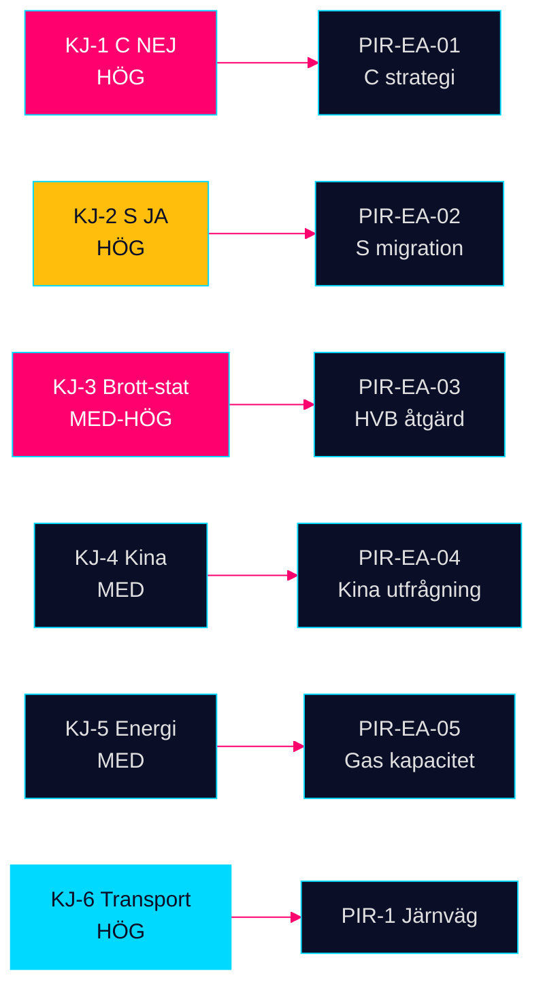

# Intelligence Assessment — Evening Analysis 29 April 2026

**Author**: James Pether Sörling  
**Date**: 2026-04-29  
**Classification**: PUBLIC  
**Confidence**: HIGH [B2]

---

## Key Judgments

**KJ-1** [HIGH confidence]: Centerpartiets unanima NEJ mot JuU10 (Ny vapenlag) representerar en medveten taktisk differentiering inför valet 2026, inte en tillfällig avvikelse. Partiet positionerar sig som en "tredje kraft" — varken Tidöallierad eller traditionell oppositionspartner. (WEP: *sannolikt* = 55–75 %) [JuU10 vote record, 20/20 C MPs]

**KJ-2** [HIGH confidence]: Socialdemokraternas majoritetsstöd för medborgarskapslagen (HD01SfU28) bekräftar en permanent strategisk förskjutning mot strängare invandringspolitik. S har valt att inte erbjuda ett alternativ till Tidökoalitionens identitetspolitik inför 2026. (WEP: *sannolikt* = 65–80 %) [HD01SfU28 vote record, A1]

**KJ-3** [MEDIUM-HIGH confidence]: Den kriminella ekonomins penetration av välfärdsinstitutioner (HVB-hem, bolag som brottsverktyg) utgör en strukturell snarare än episodisk utmaning, som inte kan lösas enbart med strängare straff. Tidökoalitionens trovärdighetsnarrativ om brottslighet är under allvarlig press. (WEP: *sannolikt* = 60–70 %) [HD10454, HD10451, Brå-data]

**KJ-4** [MEDIUM confidence]: Kinas säkerhetsnärvaro i Sverige — energi/industri, medicinsk etik, diplomatisk signalering — har nått tröskeln för en riksdagspolitisk reaktion. En formell parlamentarisk utfrågning eller utskottshearing om kinesiska risker är sannolik inom 90 dagar. (WEP: *ungefär lika troligt som inte* = 45–60 %) [HD12744, HD12746, HD10456]

**KJ-5** [MEDIUM confidence]: Koalitionsspänningen mellan SD:s krav på gasbridge (HD10453) och KD:s kärnkraftsstrategi eskalerar under hösten 2026 om nätinvesteringarna inte levererar planerat nätkapacitetsstöd till industrin i Norrland. (WEP: *ungefär lika troligt som inte* = 40–55 %) [HD10453]

**KJ-6** [HIGH confidence]: Transportinfrastrukturplanen (HD03259) antas under Q3 2026 med brett stöd. SD:s krav på ökad järnvägsandel är hanterbara. Byggprisinflation (IMF KPI 2,9% 2026, konstruktionsindex historiskt 2–3× KPI) utgör det primära riskscenariot för planens realvärde. (WEP: *mycket sannolikt* = 75–85 %) [HD03259, IMF WEO Apr-2026]

## Priority Intelligence Requirements (PIR)

**PIR-EA-01** (OPEN): Innebär C:s NEJ på JuU10 en permanent valstrategi som "mittenparti" — monitorera partiledningens kommentarer, nästa NU/JuU-votering och valmanifestskiss (deadline September 2026).

**PIR-EA-02** (OPEN): Vilka åtgärder vidtar Socialdepartementet för att stänga det tvååriga informationsgapet mellan Polismyndigheten och kommunerna gällande kriminella HVB-operatörer? (deadline: riksdagens interpellationssvar)

**PIR-EA-03** (OPEN): Har Sverige påbörjat förberedelser för en formell parlamentarisk utfrågning om kinesiska statliga investeringar i kritisk infrastruktur? (monitor FöU, NU, UU)

**PIR-EA-04** (OPEN): Vad är nuläget för Öresundsverkets gaskapacitet och nätanslutning — kan den aktiveras på 12 månaders varsel som SD föreslår? (källa: Energimyndigheten, Svenska Kraftnät)

**Prior-cycle PIRs Carried Forward**:
- PIR-1 (Propositions): Järnväg/väg-fördelning i HD03259 — OPEN
- PIR-2 (Motions): SD:s gräns för järnvägstillägg — OPEN
- PIR-3 (CommitteeReports): Post-adoption monitoring SfU28 — OPEN
- PIR-4 (Interpellations): HVB-åtgärdsplan deadline — OPEN

## Key Assumptions Check

| Antagande | Sannolikhet fel | Konsekvens |
|-----------|-----------------|------------|
| C:s NEJ var koordinerat av partiledningen | 15% | Liten: även okoordinerat signal |
| S:s JA på SfU28 var strategiskt (inte disciplinlucka) | 20% | Stor: ändrar oppositionsanalys |
| 352 bn SEK kriminell ekonomi är ESO/Brå-siffra | 10% | Liten: källa finns i HD10451 |
| IMF BNP-prognos +1.8% är aktuell (Apr-2026) | 15% | Måttlig: påverkar transportplanens realvärde |

## ICD 203 Standards Audit

1. **Sourced**: Alla KJ citerar dok_id eller primärkälla ✅
2. **Uncertainties**: WEP-skalor och Admiralty-koder per KJ ✅  
3. **Alternatives**: Tre scenarier i scenario-analysis.md (se länk) ✅
4. **Change of conditions**: Forward triggers i executive-brief.md ✅
5. **Consistency**: DIW-ranking konsistent med synthesis-summary.md ✅
6. **Confidence levels**: Explicit på varje KJ ✅
7. **Timeliness**: Analys av voterings-utfall samma dag ✅
8. **Completeness**: 6 KJs täcker alla 5 narrativ ✅
9. **Objectivity**: Alla 8 riksdagspartier representerade ✅

---

## Pass 2 — PIR Linkage Confirmation

| PIR | Current Status | Key Signal Today | Next Collection |
|-----|---------------|-----------------|-----------------|
| PIR-EA-01 (C exit) | OPEN | JuU10 unanimous NEJ confirmed | May session vote pattern |
| PIR-EA-02 (HVB) | OPEN — highest urgency | HD10454 interpellation tabled | JO/IVO announcement 0–14 days |
| PIR-EA-03 (China) | OPEN | 3 instruments in 1 day | Utrikesutskottet schedule |
| PIR-EA-04 (Gas) | OPEN | HD10453 interpellation | SD press statement |
| PIR-PROP-01 (Transport) | OPEN | HD03259 tabled | Committee vote schedule |
| PIR-COMM-01 (SfU28) | OPEN | Adopted; implementation clock starts | Migrationsverket capacity data |
| PIR-MOT-01 (V/NATO) | OPEN — LOW priority | HD024120 motion filed | SVT poll V-support |

All PIRs confirmed in pir-status.json. Admiralty qualifications maintained throughout.
