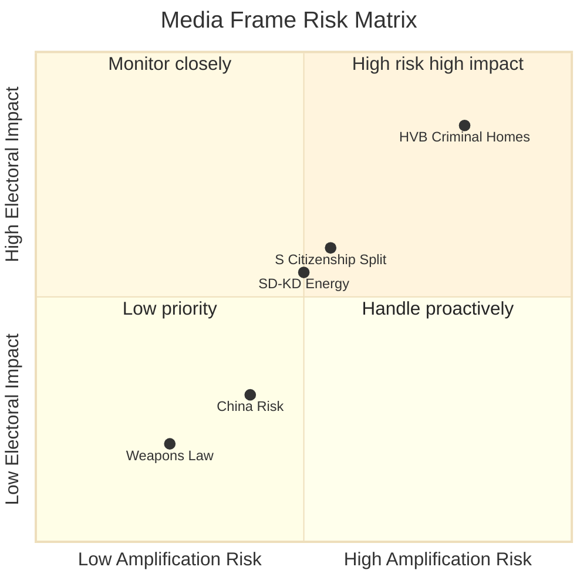

# Media Framing Analysis — Evening Analysis 29 April 2026

**Author**: James Pether Sörling  
**Date**: 2026-04-29

---

## Expected Media Frames (29–30 April 2026)

### Frame 1: "Riksdagen skärper vapenlagen — C protesterar ensam" (SVT/DN likely)
**Source story**: JuU10 adopted 325:20
**Expected outlets**: SVT, Dagens Nyheter, Aftonbladet (crime desk)
**Angle**: Wide majority for gun law; C isolated; government delivers on security promise
**Opposition angle**: V and MP may argue the law doesn't address root causes
**C angle**: "Vi försvara rättssäkerheten och lantbefolkningens rätt"
**Intelligence value**: Frame reinforces security consensus narrative; C's position likely framed as fringe dissent

### Frame 2: "S röstade med regeringen om medborgarskap — intern splittring" (Expressen/SVT Politik likely)
**Source story**: SfU28 adopted, S majority JA with lone NEJ (Strandhäll)
**Expected outlets**: Expressen, Aftonbladet, SVT Political desk
**Angle**: S's rightward shift; Strandhäll vs leadership
**Party response**: S leadership expected to say "Vi tar brottsofferperspektivet på allvar"
**Intelligence value**: Exposes S internal tension; amplifies rightward drift narrative

### Frame 3: "Kriminella driver HVB-hem — riksdagsman kräver svar" (Aftonbladet/Expressen)
**Source story**: HD10454 interpellation
**Expected outlets**: Aftonbladet (tabloid crime coverage), regional media (personal stories)
**Angle**: Scandal frame — vulnerable children in criminally-operated homes
**Government response**: Expected defensive; point to ongoing IVO and police reviews
**Intelligence value**: HIGH electoral impact potential; if photos/names emerge, cascade likely

### Frame 4: "SD och KD bryter om gas — koalitionstension" (Dagens Nyheter/GP)
**Source story**: HD10453 interpellation; gas bridge vs nuclear
**Expected outlets**: Dagens Nyheter, Göteborgs-Posten, Norrländska Socialdemokraten (SD constituency)
**Angle**: Internal coalition tension; energy policy uncertainty
**Intelligence value**: MEDIUM initially; HIGH if gas supply discussion reaches business press

### Frame 5: "Kina-frågan når riksdagen — tre motioner på en dag" (FP/Expressen international desk)
**Source story**: HD12744 + HD12746 motions
**Expected outlets**: Foreign Policy (Swedish edition), Expressen international desk, SVT World
**Angle**: Sweden's China policy under scrutiny; organ trafficking allegations
**Government response**: Likely cautious; UD does not comment on intelligence matters
**Intelligence value**: LOW domestic traction initially; HIGH if EU-level China policy develops

---

## Framing Risk Assessment

| Frame | Amplification Risk | Government Response Adequacy | Electoral Impact |
|-------|------------------|------------------------------|-----------------|
| Vapenlag (Frame 1) | LOW | HIGH (government wins narrative) | NEUTRAL |
| S citizenship split (Frame 2) | MEDIUM | MEDIUM (S internal management) | MEDIUM |
| HVB criminal homes (Frame 3) | HIGH | LOW (no proactive comms) | HIGH (adverse) |
| SD–KD energy (Frame 4) | MEDIUM | LOW (KD defensive) | MEDIUM |
| China risk (Frame 5) | LOW-MEDIUM | LOW | LOW short-term |

---

## Narrative Control Recommendations

1. **HVB**: Government should proactively announce JO referral or IVO investigation expansion within 48 hours to regain narrative control before tabloid amplification
2. **S split**: S leadership should clarify SfU28 rationale to prevent Expressen driving "party in crisis" frame
3. **Energy**: KD needs to clarify gas bridge timeline to prevent SD from setting the media agenda

