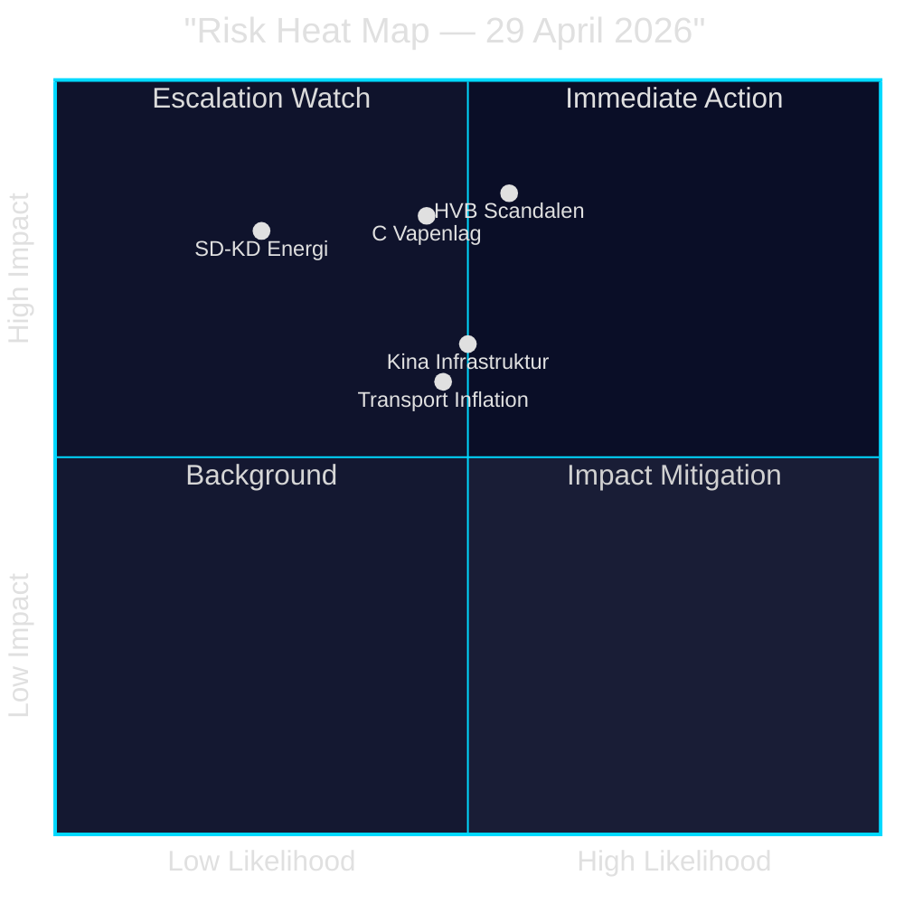

# Risk Assessment — Evening Analysis 29 April 2026

**Author**: James Pether Sörling  
**Date**: 2026-04-29

---

## High-Priority Risks

### Risk 1: HVB-Scandalen skadar Tidökoalitionens valposition [HIGH]
- **Likelihood**: MEDIUM-HIGH (55%)
- **Impact**: HIGH — underminerar centralt valkampanjnarrativ
- **Source**: HD10454 (HVB-hem + kriminella), HD10451 (352 bn SEK kriminell ekonomi, Brå-data)
- **Admiralty**: B2
- **Mitigation**: Snabbt åtgärdspaket (polisdataöverföring, IVO-skärpning) som offentliggörs innan sommarupperöhöll

### Risk 2: C:s vapenlagsröst inleder en "tredje-bloc" fragmentering [HIGH]
- **Likelihood**: MEDIUM (45%)
- **Impact**: HIGH — hotar Tidökoalitionens parlamentariska majoritet på säkerhetsfrågor
- **Source**: JuU10 vote record, 20/20 C NEJ
- **Admiralty**: A1
- **Mitigation**: M+SD identifierar C:s röstmotiv och erbjuder procedurella justeringar på kommande ärenden

### Risk 3: Transportplanens realvärde urholkas av byggprisinflation [MEDIUM]
- **Likelihood**: MEDIUM (40–50%)
- **Impact**: MEDIUM — 875 Mdr kr real bortfall 15–25% under planperioden
- **Source**: HD03259, IMF WEO Apr-2026 PCPIPCH SWE 2.9%, konstruktionsindex historiskt 2–3× KPI
- **Admiralty**: A2
- **Mitigation**: Inflationsklausuler i planen; kontraktsutformning; tidig upphandling

### Risk 4: SD-KD energikonflikt eskalerar till troensomröstning [MEDIUM]
- **Likelihood**: LOW-MEDIUM (25%)
- **Impact**: HIGH — koalitionskris om det offentliggörs
- **Source**: HD10453
- **Admiralty**: B3
- **Mitigation**: Kompromissformulering som tillåter "reservkapacitet" för gas utan officiellt stöd

### Risk 5: Kinas säkerhetsnärvaro i kritisk infrastruktur utan åtgärdsplan [MEDIUM]
- **Likelihood**: MEDIUM (50%) att det eskalerar parlamentariskt
- **Impact**: MEDIUM-HIGH — säkerhetspolitisk inkompetens-narrativ
- **Source**: HD12744, HD12746, HD10456
- **Admiralty**: B2
- **Mitigation**: Proaktiv utfrågning (FöU/NU) + kommunikationsplan om kinesiska investeringsgranskning

## Risk Heat Map

| Likelihood → | Låg (0–30%) | Medium (30–60%) | Hög (60%+) |
|--------------|-------------|-----------------|------------|
| **Hög Impact** | SD-KD energi | HVB-skandal [HD10454] | — |
| **Medium Impact** | — | Transport inflation [HD03259] | — |
| **Låg Impact** | — | Kina parlamentarisk eskalering | — |

## Statskontoret Relevance

Implementation-feasibility considerations for HVB enforcement: Statskontoret has published multiple reports on Socialstyrelsen's regulatory capacity and IVO's inspection backlog. Given this is a cross-cutting welfare governance issue, Statskontoret's 2024 review of municipal supervision is relevant background. Statskontoret: specific 2025/26 HVB report not immediately retrievable; full Statskontoret enrichment deferred to next cycle.

