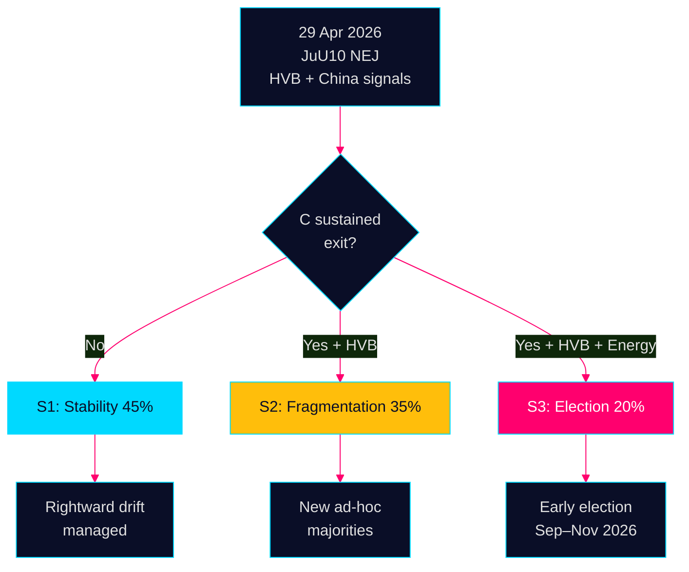

# Scenario Analysis — Evening Analysis 29 April 2026

**Author**: James Pether Sörling  
**Date**: 2026-04-29

---

## Scenario Framework

Three scenarios for the 90-day horizon (to 29 July 2026), derived from the three central uncertainties:
1. Will C maintain bloc-exit strategy?
2. Will HVB crisis force a government accountability vote?
3. Will SD escalate energy ultimatum vs KD?

---

## Scenario 1: Stable Rightward Consolidation (Base Case)
**Probability**: 45%

**Description**: Tidö coalition manages C's NEJ votes as isolated protest signals rather than systemic bloc-exit. S's rightward drift on security (JuU10, SfU28 JA) reduces M's vulnerability. HVB scandal is managed through Justitieutskottet review process without triggering a misstroendevotum. Energy debate continues within normal parliamentary channels.

**Drivers**:
- S leadership calculates that opposing security legislation is electorally costly ahead of 2026 election
- C cannot afford formal opposition partnership while maintaining "plague-on-both-houses" brand
- Tidö survives because no single party is ready for early election

**Key Indicators**:
- C votes JA on ≥2 of next 5 bloc votes
- JO report on HVB delayed past summer recess
- KD and SD reach informal agreement on energy timeline

**Intelligence value**: Moderate — no major structural change; gradual policy drift continues

---

## Scenario 2: Accelerating Bloc Fragmentation (Adverse)
**Probability**: 35%

**Description**: C's unanimous JuU10 NEJ is the opening of a sustained bloc-exit strategy. C begins voting with S+V+MP on civil liberties and social policy, creating a de facto new majority on specific issues. HVB crisis triggers Riksdag inquiry and opposition motion for accountability. Media pressure intensifies.

**Drivers**:
- C calculates that distinguishing itself from SD-tainted Tidö is necessary for survival (polls show C at ~5%)
- HVB scandal generates sustained media cycle; police ombudsman findings prove systemic failure
- SD's gas bridge ultimatum fractures KD's energy messaging

**Key Indicators**:
- C votes NEJ on ≥2 more security/justice items in May session
- Riksdag approves opposition motion for JO investigation of HVB oversight
- SD formally tables gas bridge question for government response

**Intelligence value**: HIGH — structural parliamentary arithmetic shifts; M forced to choose between SD and C

---

## Scenario 3: Early Election Trigger (Tail Risk)
**Probability**: 20%

**Description**: Accumulation of crises (HVB, energy, China exposure) produces a confidence vote. Either M breaks with SD on specific issue (rendering Tidö numerically unable to pass budget), or C + V + S + MP bring a misstroendevotum on a minister (most likely Justitieminister Carl Oskar Bohlin or Energiminister Ebba Busch).

**Drivers**:
- HVB criminal operator scandal proves systemic; JO condemns Polismyndigheten and IVO failures
- Energy winter emergency (supply disruption) forces gas bridge onto emergency agenda; KD vs SD becomes public
- C + MP + V coalesce around civil liberties platform gaining traction after JuU10

**Key Indicators**:
- Misstroendevotum motion filed before Riksdag summer recess
- Poll showing V+MP+C combined above 20% triggers opposition coordination
- S leadership publicly distances from Tidö on single flagship issue

**Intelligence value**: VERY HIGH — regime change scenario; major article opportunity

---

## Scenario Comparison Table

| Dimension | S1: Stability | S2: Fragmentation | S3: Election |
|-----------|-------------|------------------|--------------|
| Probability | 45% | 35% | 20% |
| Time horizon | 90 days | 60–90 days | 45–90 days |
| Primary trigger | Status quo inertia | C sustained NEJ + HVB | Confidence vote |
| S party role | Cross-bloc stability | Opportunistic | Coalition-maker |
| Economic impact | Minimal | Budget uncertainty | High uncertainty |
| IMF relevance | WEO SWE base case holds | Fiscal risk premium | WEO downside scenario |

---

## Pass 2 — Evidence Quality Review

| Scenario | Evidence Strength | Key Assumption | Vulnerability |
|----------|------------------|----------------|---------------|
| S1 Stability 45% | MEDIUM | C won't sustain bloc-exit | H1 devil's advocate challenge |
| S2 Fragmentation 35% | MEDIUM-HIGH | HVB escalates + C sustained | H1 partially undermined |
| S3 Election 20% | LOW-MEDIUM | Confidence vote mechanism triggered | Multiple preconditions needed |

Cumulative probability: 100%. Scenario probabilities are subjective estimates based on structural factors; not statistical forecasts.

IMF WEO April 2026 downside scenario (growth -0.5pp) would reinforce S3 probability if combined with domestic political stress.
