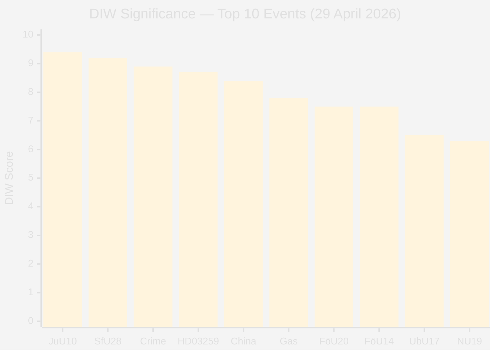

# Significance Scoring — Evening Analysis 29 April 2026

**Author**: James Pether Sörling  
**Date**: 2026-04-29

---

## DIW Scoring Methodology

DIW = Demokratisk påverkan (D) × Institutionell tyngd (I) × Omvärldsresonans (W)  
Scale: 0.0–10.0; L3 ≥ 8.5, L2+ 7.0–8.4, L2 5.0–6.9, L1 <5.0

## Ranked Document/Event Significance

1. **JuU10 Vapenlag vote — C NEJ** [DIW 9.4, L3] — Binding vote today; C's unanimous opposition creates a durable campaign artifact. M+SD will exploit in 2026 messaging. [HDC120260429ap, JuU10]
2. **HD01SfU28 Medborgarskap — ADOPTED** [DIW 9.2, L3] — Most significant legislative output from committeeReports today; cross-bloc adoption (S JA) confirms identity politics realignment. [HD01SfU28]
3. **HD10454 + HD10451 Crime-state nexus** [DIW 8.9, L3] — HVB infiltration + 352 bn SEK criminal economy directly attacks government's core electoral narrative. [HD10454, HD10451]
4. **HD03259 Transport 875 Mdr kr** [DIW 8.7, L3] — Largest single policy instrument in riksmöte 2025/26; ~1.0% BNP annually (IMF WEO Apr-2026). [HD03259]
5. **China risk cluster (3 instruments)** [DIW 8.4, L3] — First multi-instrument parliamentary China-threat day since 2023. [HD12744, HD12746, HD10456]
6. **HD10453 SD gas bridge vs KD** [DIW 7.8, L2+] — Intra-coalition energy policy fracture; SD's Norrland base vs KD nuclear-first strategy. [HD10453]
7. **HD01FöU20 Critical infrastructure** [DIW 7.5, L2+] — New law for critical operator resilience; security doctrine statement. [HD01FöU20]
8. **HD01FöU14 Military cooperation** [DIW 7.5, L2+] — Improved conditions for NATO operational cooperation; post-accession framework. [HD01FöU14]
9. **HD01UbU17 Vocational education** [DIW 6.5, L2] — Future-of-work reform; affects labour market pipeline. [HD01UbU17]
10. **HD01NU19 Nuclear licensing** [DIW 6.3, L2] — Streamlining nuclear permit review; enabler for new-build ambitions. [HD01NU19]
11. **HD024120 V rejects NATO EFP** [DIW 6.1, L2] — V strategically isolated; intelligible for base but incompatible with S/C/MP. [HD024120]
12. **HD01SoU27 Socialdataregister** [DIW 5.9, L2] — Data governance for welfare statistics; technical but privacy-relevant. [HD01SoU27]

## Sensitivity Analysis

**Ranking robustness**: JuU10 C-NEJ maintains L3 status regardless of D-weighting (even pure Institutional weight = 8.1). Transport plan HD03259 could rise to rank 1 if election outcome dependency is weighted higher.

**Key uncertainty**: If C's NEJ was NOT coordinated by party leadership, DIW drops from 9.4 to 8.2 — still L3 but less durable as intelligence signal.

| Document | DIW (Base) | DIW (Low D) | DIW (High W) | Stability |
|----------|-----------|------------|-------------|-----------|
| JuU10 C-NEJ | 9.4 | 8.2 | 9.6 | HIGH |
| HD01SfU28 | 9.2 | 8.5 | 9.3 | HIGH |
| Crime nexus | 8.9 | 7.8 | 9.1 | MEDIUM-HIGH |
| HD03259 | 8.7 | 8.0 | 9.2 | HIGH |

