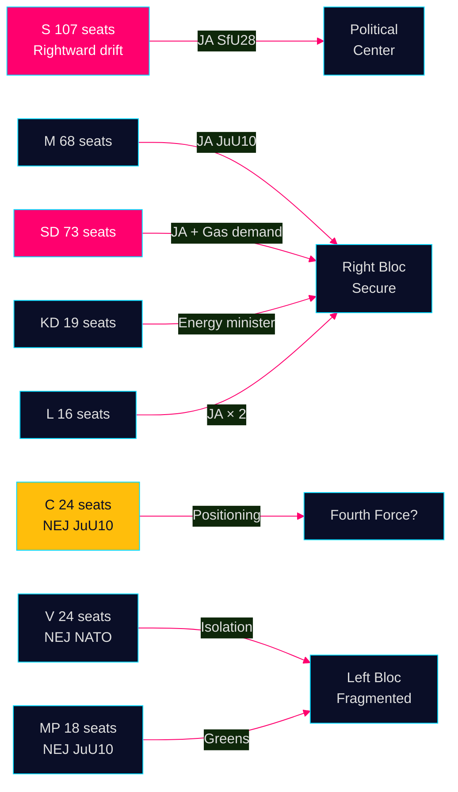

# Stakeholder Perspectives — Evening Analysis 29 April 2026

**Author**: James Pether Sörling  
**Date**: 2026-04-29

---

## Key Stakeholders

### M (Moderaterna) — 68 seats
- **JuU10 (Vapenlag)**: JA — Core M position; stricter gun control aligned with security agenda
- **SfU28 (Medborgarskap)**: JA — Validates government's citizenship policy
- **On HVB**: Defensive; expected to point to ongoing enforcement efforts
- **Strategic interest**: Exploit C's NEJ in election messaging on security [JuU10 vote]

### SD (Sverigedemokraterna) — 73 seats
- **JuU10**: JA  
- **SfU28**: JA
- **HD10453 gas bridge**: SD's Josef Fransson is the visible intra-coalition friction point; represents Norrland industrial base interest
- **China risk**: SD leads on China-threat framing (2 of 3 parliamentary instruments today); compatible with security-nationalist brand [HD12744, HD12746]

### KD (Kristdemokraterna) — 19 seats
- **JuU10**: JA  
- **Energy**: Ebba Busch (Energy Minister) faces direct challenge from SD on gas bridge; nuclear-first strategy under stress
- **SfU28**: JA

### L (Liberalerna) — 16 seats
- **JuU10**: JA
- **SfU28**: JA — Note: historically most liberal on citizenship, JA signals significant party evolution or coalition discipline

### S (Socialdemokraterna) — 107 seats
- **JuU10**: JA — Crossed bloc line on security
- **SfU28**: Majority JA; Annika Strandhäll lone NEJ — confirms rightward strategic drift confirmed by party leadership
- **Economic motions (HD024100, HD024101)**: "Sverige behöver bli starkt igen" — Magdalena Andersson pivot to economic security
- **Intelligence**: S is the most electorally pivotal actor today; two cross-bloc votes in one day is a strategic declaration [HD01SfU28, JuU10]

### C (Centerpartiet) — 24 seats
- **JuU10**: NEJ (20/20 present) — Unanimous, coordinated
- **HD024109, HD024110 (motions)**: Responsible fiscal consolidation aligned with fiscal framework — C maintains economic credibility
- **Assessment**: C under Annie Lööf (or successor) is deliberately constructing a "principled liberal alternative" to both blocs [JuU10 vote]

### V (Vänsterpartiet) — 24 seats
- **JuU10**: NEJ
- **HD024120**: Explicitly rejects NATO Enhanced Forward Presence in Finland — isolationist pacifist position
- **Assessment**: V's isolation on NATO is principled but electorally costly; risks losing security-minded S-left voters [HD024120]

### MP (Miljöpartiet) — 18 seats
- **JuU10**: NEJ
- **Environmental portfolio**: HD024117 (artskydd), HD024118 (economic); cross-cutting greens
- **Assessment**: MP has consistent environmental/civil-liberties profile but low parliamentary leverage this term

## Statskontoret Perspective
**Implementation of HD01SfU28 (Citizenship)**: Statskontoret has flagged capacity constraints at Migrationsverket in previous administrative burden reviews. Citizenship processing delays are a known risk. Statskontoret: no specific 2025/26 citizenship-processing review immediately available; flagged for next cycle.

## Coalition Dynamics Summary

| Relationship | Stability | Key Friction |
|-------------|-----------|--------------|
| M–SD | HIGH | Energy policy nuance only |
| M–KD | HIGH | No friction today |
| M–L | MEDIUM | L's citizenship evolution ongoing |
| SD–KD | MEDIUM | Gas bridge vs nuclear |
| Tidö bloc–S | TACTICAL | Cross-bloc on 2 votes today |
| Tidö bloc–C | LOW | Weapons law NEJ signals deliberate exit |

