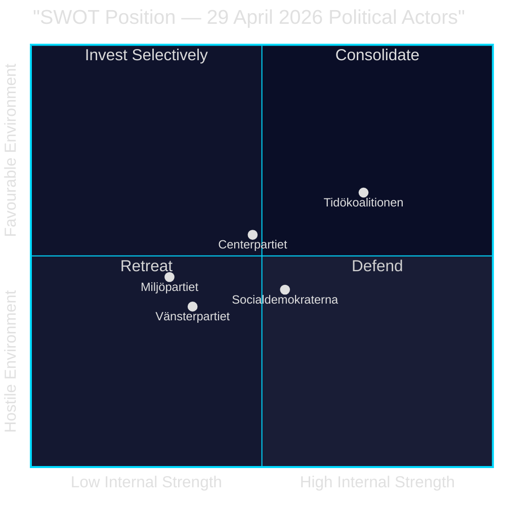

# SWOT Analysis — Evening Analysis 29 April 2026

**Author**: James Pether Sörling  
**Date**: 2026-04-29

---

## Governing Coalition (Tidökoalitionen: M+SD+KD+L) SWOT

### Strengths

- **Legislative productivity**: Three major committee reports adopted today (citizenship, critical infrastructure, military cooperation) — M+SD+KD+L delivered on core policy agenda [HD01SfU28, HD01FöU20, HD01FöU14] [A1]
- **Transport infrastructure mandate**: 875 Mdr kr plan (HD03259) gives the government a concrete, visible economic legacy argument for 2026 election [HD03259, IMF WEO Apr-2026 NGDP_RPCH SWE +1.8%] [A2]
- **S cross-over support**: Social Democrats voted JA on citizenship tightening (SfU28), validating the government's policy direction beyond its own majority [HD01SfU28 vote record] [A1]
- **Weapons law adoption**: JuU10 passed despite C opposition — M+SD+KD+L+S majority sufficient [JuU10 vote record] [A1]

### Weaknesses

- **Crime narrative undermined**: Criminal networks in HVB homes (HD10454) and 352 bn SEK criminal economy (HD10451) contradict four years of "tougher on crime" messaging [HD10454, HD10451] [B2]
- **Energy policy incoherence**: SD's gas-bridge demand (HD10453) vs KD's nuclear-first stance creates visible coalition disagreement without a clear resolution path [HD10453] [B3]
- **Accountability gap on HVB**: Police provided criminal HVB-operator list to Stockholm municipality only ~2 years after the 2024 request — a documented institutional failure during government watch [HD10454] [B2]
- **C defection on weapons law**: Losing C's 20 votes creates a "not credible on security" narrative risk if C repeats this pattern [JuU10 vote record] [A1]

### Opportunities

- **China risk leadership**: Three parliamentary instruments on China today creates opening for government to lead on a security issue with cross-party support [HD12744, HD12746, HD10456] [B2]
- **Transport plan as election anchor**: Approval of 875 Mdr kr plan five months before elections provides a concrete deliverable [HD03259] [A2]
- **S-Tidö identity convergence**: S JA on citizenship creates a "policy success" narrative — government has shifted the Overton window on identity politics [HD01SfU28] [A1]

### Threats

- **HVB scandal escalation**: If media investigations confirm broader criminal welfare infiltration, the accountability narrative could dominate the final pre-election period [HD10454] [B3]
- **C as swing vote risk**: A more assertive C strategy of differentiation could create coalition vulnerabilities on JuU, NU votes [JuU10 vote pattern] [B2]
- **Construction inflation**: IMF projects KPI 2.9% 2026 — transport plan's real value could erode 15–25% if construction index runs 2–3× CPI [IMF WEO Apr-2026, PCPIPCH SWE] [A2]
- **SD energy ultimatum**: If Norrland industrial energy crisis intensifies, SD's gas bridge demand could escalate to a confidence test [HD10453] [B3]

## TOWS Matrix

| | Opportunities | Threats |
|--|--------------|---------|
| **Strengths** | SO: Lead China policy + deliver transport plan = dual election anchor | ST: Use S JA on citizenship to counter HVB narrative: "policy working, enforcement improving" |
| **Weaknesses** | WO: Pivot energy incoherence to "responsible nuclear path" with SD gas as short-term bridge, KD nuclear as long-term | WT: If HVB + energy fracture converge, worst case is SD using HVB failure as leverage for gas bridge concession |

## Cross-SWOT (Tier-C): Opposition Parties

### Socialdemokraterna (S)
- **S-Strength**: JA on citizenship shows ability to win majority issues [HD01SfU28]
- **S-Weakness**: Fragmented economic programme vs V, C, MP — no unified alternative [HD024100, HD024108, HD024109, HD024118]
- **S-Threat**: Rightward migration alienates left base; V could absorb progressive S voters [HD024120]

### Centerpartiet (C)  
- **C-Strength**: Weapons law NEJ — unique positioning as liberal-conservative alternative to both blocs [JuU10]
- **C-Weakness**: No economic alternative to Tidö's infrastructure plan; single-issue differentiation risks [HD024109]

### Vänsterpartiet (V)
- **V-Strength**: Consistent anti-NATO stance creates clear identity for base [HD024120]
- **V-Weakness**: Isolated on NATO vote — incompatible with other opposition parties on security

