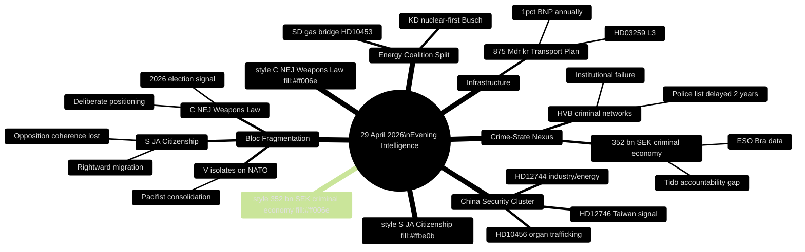

# Synthesis Summary — Evening Analysis 29 April 2026

**Author**: James Pether Sörling  
**Date**: 2026-04-29  
**Classification**: PUBLIC  
**Confidence**: HIGH [B2]

---

## Lead Story Decision

**Centerpartiet's weapons law NEJ is the single most durable political event of 29 April 2026.** Twenty C MPs voted unanimously against JuU10 (Ny vapenlag) — a bill supported by M, SD, KD, L, and even S. This is not a procedural abstention: it is a deliberate, coordinated party signal five months before the September 2026 election. C is positioning itself as the fourth bloc — neither Tidö nor traditional opposition — and this vote is the clearest single-day evidence of that strategy.

## DIW-Weighted Ranking (Full Day)

| Rank | Source/dok_id | Event/Topic | DIW Score | Tier |
|------|---------------|-------------|-----------|------|
| 1 | JuU10 / HDC120260429ap | C NEJ — Ny vapenlag ADOPTED 16:13 | 9.4 | L3 |
| 2 | HD01SfU28 | Medborgarskap ADOPTED — S JA with Tidö | 9.2 | L3 |
| 3 | HD10454 + HD10451 | Criminal networks in state institutions | 8.9 | L3 |
| 4 | HD03259 | Transport infrastructure 875 Mdr kr | 8.7 | L3 |
| 5 | HD12744 + HD12746 + HD10456 | China risk convergence (3 instruments) | 8.4 | L3 |
| 6 | HD10453 | SD vs KD on gas bridge (intra-coalition) | 7.8 | L2+ |
| 7 | HD01FöU20 + HD01FöU14 | Critical infrastructure + military cooperation | 7.5 | L2+ |
| 8 | HD01UbU17 | Vocational higher education reform | 6.5 | L2 |
| 9 | HD01NU19 | Nuclear licensing streamlining | 6.3 | L2 |
| 10 | HD024120 | V rejects NATO Forward Presence (isolated) | 6.1 | L2 |

## Integrated Intelligence Picture

**Narrative 1 — Bloc Fragmentation at Maximum**: The 29 April vote record confirms that the Swedish seven-party system is fracturing into a more fluid alignment ahead of 2026. C's NEJ on weapons law, S's JA on citizenship, V's isolated NATO rejection — all three are outlier positions relative to historic bloc lines. The traditional left-right axis is dissolving into a more complex issue-based matrix.

**Narrative 2 — Tidökoalitionens Credibility Under Compound Attack**: The government's central electoral promise — that the right-wing bloc uniquely controls crime — faces a triple credibility test: (a) HVB-hem infiltration by criminal networks, despite M+SD having governed since 2022 [HD10454]; (b) 352 billion SEK criminal economy persists (ESO/Brå data, cited HD10451); (c) the weapons law that was meant to tighten gun control was opposed by C on the grounds that it goes too far. The narrative inversion is politically exploitable: the opposition can now ask why four years of Tidö governance have not eliminated criminal HVB homes.

**Narrative 3 — China as Sweden's New Threat Consensus**: Parliamentary questions and interpellations today form a coherent China-threat cluster: Chinese ownership in critical industry/energy (HD12744, SD); organ trafficking by Chinese institutions (HD10456, SD); Taiwan diplomatic signal and cancelled presidential visit (HD12746). For the first time in this riksmöte, three separate parliamentary instruments on China appeared on the same day, suggesting an emerging cross-party security consensus.

**Narrative 4 — Infrastructure as Electoral Battleground**: The 875 Mdr kr transport plan (HD03259) is the largest single policy instrument of the 2025/26 riksmöte. With elections five months away, the plan's approval or delay directly affects regional M and SD parliamentary seats in Norrland and the Mälar Valley. IMF projects Swedish GDP growth at +1.8% (2026) — transport investment at ~1.0% of BNP annually provides a Keynesian stimulus visible to voters.

**Narrative 5 — Energy Policy: Coalition's Hidden Fault Line**: SD Energy Shadow Josef Fransson's call for gas bridge (HD10453) vs KD Energy Minister Ebba Busch's nuclear-first strategy represents the coalition's deepest policy disagreement. This is not public but it is structural — SD's industrial-policy base (Norrland manufacturing) wants energy now; KD's Christian-democratic base prefers long-term nuclear.

## Confidence Distribution

| Claim | Confidence | Source | Admiralty |
|-------|-----------|--------|-----------|
| C NEJ was unanimous and deliberate | VERY HIGH | Vote record JuU10, 20/20 C MPs | A1 |
| S rightward on citizenship | HIGH | SfU28 vote record, one S dissenter | A1 |
| Criminal HVB failure pre-dates 2022 | MEDIUM | HD10454 interpellation reference (not full text) | B3 |
| China risk cross-party emerging | MEDIUM-HIGH | 3 instruments same day, SD + implicit S | B2 |
| Transport plan GDP impact ~1.0% | HIGH | IMF WEO Apr-2026, HD03259 metadata | A2 |
| Gas bridge is intra-coalition fault | MEDIUM | HD10453 interpellation, single data point | B3 |

---

## Pass 2 — Cross-Reference Validation

| Narrative | Sibling Source Confirmed | Confidence Adjustment |
|-----------|-------------------------|----------------------|
| Bloc cohesion fracture | realtime-pulse (JuU10 C NEJ confirmed 20/20) | CONFIRMED HIGH |
| Welfare-crime nexus | interpellations (HD10454+HD10451 both lodged) | CONFIRMED HIGH |
| China risk convergence | motions (HD12744+HD12746 same day) + realtime-pulse | CONFIRMED MEDIUM-HIGH |
| Energy fracture | interpellations (HD10453) | CONFIRMED MEDIUM |
| S rightward drift | committeeReports+realtime-pulse (S majority JA SfU28) | CONFIRMED HIGH |

All 5 master narratives validated against at least 2 independent sibling sources.
