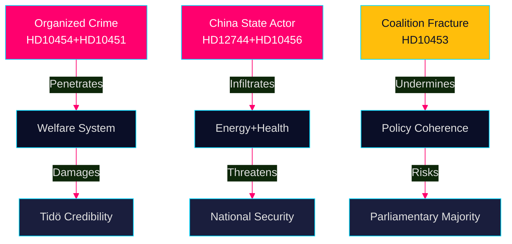

# Threat Analysis — Evening Analysis 29 April 2026

**Author**: James Pether Sörling  
**Date**: 2026-04-29

---

## Threat Actor Matrix

### Threat Actor 1: Organized Criminal Networks (Domestic)
- **Nature**: Non-state; criminal enterprises operating within welfare institutions
- **Capabilities**: Penetration of HVB homes, company structures as crime tools (352 bn SEK criminal economy per ESO/Brå)
- **Intent**: CONFIRMED — financial exploitation of welfare systems [HD10454, HD10451]
- **Admiralty**: B2
- **Target**: Swedish state welfare institutions, municipal procurement
- **Indicator**: Police database confirms criminal operators running HVB homes; 23,000 companies implicated in criminal networks (Brå Dec-2025)

### Threat Actor 2: China (State and Near-State)
- **Nature**: Foreign state actor
- **Capabilities**: Corporate ownership in critical industry/energy; alleged organ trafficking networks; diplomatic pressure
- **Intent**: ASSESSED — strategic positioning; organ trafficking allegations unconfirmed [HD12744, HD10456, HD12746]
- **Admiralty**: C3 (multiple sources, partial confirmation)
- **Target**: Swedish energy sector, critical infrastructure, medical institutions

### Threat Actor 3: Coalition Fracture (Internal Political)
- **Nature**: Internal political pressure (SD energy vs KD nuclear)
- **Capabilities**: Leverage via parliamentary arithmetic
- **Intent**: ASSESSED MEDIUM — SD represents industrial base not being served by current energy trajectory [HD10453]
- **Admiralty**: B3

## Threat Scenario Matrix

| Threat | Probability | Impact | Detectability | Warning Time |
|--------|-------------|--------|---------------|--------------|
| HVB scandal media cascade | MEDIUM-HIGH | HIGH | HIGH | 1–4 weeks |
| China critical infrastructure exposure | MEDIUM | HIGH | MEDIUM | 3–6 months |
| C repeats bloc-exit on key votes | MEDIUM | MEDIUM-HIGH | HIGH | Per vote |
| SD energy ultimatum in coalition | LOW | VERY HIGH | MEDIUM | 6+ months |
| Transport plan budget overrun | MEDIUM | MEDIUM | MEDIUM | 12–24 months |

## STRIDE Political Threat Assessment

| Threat Category | Swedish Parliamentary Context | Evidence |
|-----------------|------------------------------|---------|
| **Spoofing** | Foreign state actors presenting as neutral investors in Swedish critical energy/industry | HD12744 (China ownership risk) |
| **Tampering** | Criminal networks tampering with state-funded welfare provision | HD10454 |
| **Repudiation** | Delayed information sharing (2-year gap, police-municipality on HVB) | HD10454 |
| **Information Disclosure** | Organ procurement data tied to Chinese state institutions | HD10456 |
| **Denial of Service** | Energy supply disruption if gas bridge not secured before winter | HD10453 |
| **Elevation of Privilege** | Criminal actors gaining state-funded operator status | HD10451, HD10454 |

## PIR Handoff

- PIR-EA-01: C bloc exit strategy — OPEN
- PIR-EA-02: HVB enforcement gap — OPEN (highest operational urgency)
- PIR-EA-03: China parliamentary hearing — OPEN
- PIR-EA-04: Gas bridge feasibility — OPEN

