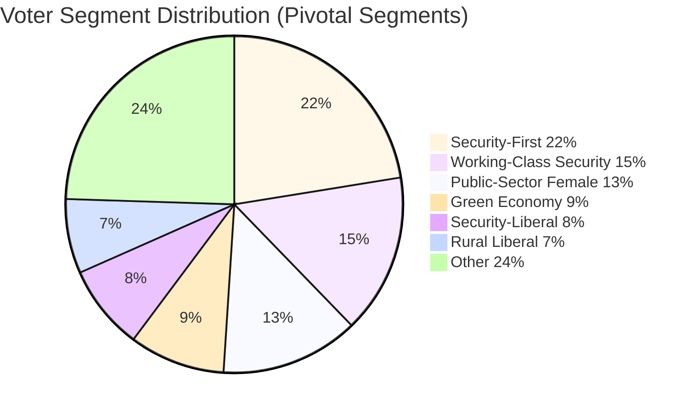

# Voter Segmentation Analysis — Evening Analysis 29 April 2026

**Author**: James Pether Sörling  
**Date**: 2026-04-29

---

## Segmentation Framework

Six key voter segments identified as pivotal for 2026 election outcome:

---

## Segment 1: Security-First Voters (~22% of electorate)

**Profile**: Crime is top concern; support strict migration; accept gun regulation; often former S voters
**2022 behaviour**: Split between S (declining) and SD (rising)
**Today's signal**: JuU10 + SfU28 both adopted → this segment's agenda is being delivered across blocs
**Movement risk**: LOW — agenda being served by current Riksdag; less likely to punish Tidö
**Party competition**: S is actively competing for this segment (today's cross-bloc JA votes)

---

## Segment 2: Rural/Agricultural Liberal Voters (~7% of electorate)

**Profile**: Hunting rights, gun ownership, property rights; formerly reliable C voters
**2022 behaviour**: Many moved from C to M; C fell to 6.7%
**Today's signal**: C voted NEJ on JuU10 — directly protecting this segment's interest
**Movement risk**: MEDIUM — C is trying to recapture this segment; M competing
**Party competition**: C vs M for rural liberal voter

---

## Segment 3: Security-Liberal Crossover (~8% of electorate)

**Profile**: Educated urban; support EU/NATO; suspicious of SD; support moderate crime legislation; attracted to C or L
**2022 behaviour**: Split L/C/M
**Today's signal**: C voted NEJ on gun regulation (civil liberties signal) while supporting FöU20 (security)
**Movement risk**: HIGH — C's principled positioning has potential to attract this segment away from L
**Party competition**: C vs L; both at risk of falling below 4% threshold

---

## Segment 4: Working-Class Security Voters (~15% of electorate)

**Profile**: Blue-collar; LO membership; crime/migration concern; traditional S loyalty eroding
**2022 behaviour**: Large S-to-SD transfer; S lost ~4pp to SD among this group
**Today's signal**: S's JA on security legislation is directly targeted at this segment
**Movement risk**: MEDIUM — S's security pivot may halt bleeding; SD's gas bridge stance (protecting industrial jobs) competes
**Party competition**: S vs SD for working-class north/industrial vote

---

## Segment 5: Public-Sector Female Voters (~13% of electorate)

**Profile**: High public sector employment; welfare state concerns; HVB scandal directly resonant
**2022 behaviour**: Stable S + MP
**Today's signal**: HVB scandal (HD10454) directly concerns this segment — welfare institutions infiltrated by criminals
**Movement risk**: HIGH — if HVB scandal escalates, this segment punishes Tidö (insufficient oversight) AND S (if perceived as enabler)
**Party competition**: S retains if accountability message; MP and V compete on care/welfare narrative

---

## Segment 6: Green Economy Voters (~9% of electorate)

**Profile**: Climate policy as top concern; educated urban; below-35
**2022 behaviour**: MP + V + L (green-liberal overlap)
**Today's signal**: SD vs KD energy fracture (gas bridge HD10453) raises doubt about Tidö's green credentials
**Movement risk**: MEDIUM — V's NATO isolation may deter some; MP depends on crossing 4% threshold
**Party competition**: MP vs V vs L; energy fracture benefits opposition narrative

---

## Cross-Segment Summary

| Segment | Size | Today's Driver | Key Risk | Party Competition |
|---------|------|---------------|----------|-------------------|
| Security-First | 22% | Weapons+Citizenship ADOPTED | Low risk for Tidö | S vs SD |
| Rural Liberal | 7% | C NEJ JuU10 | C recapture | C vs M |
| Security-Liberal | 8% | C civil-liberties signal | C/L threshold risk | C vs L |
| Working-Class Security | 15% | S security pivot | SD industrial appeal | S vs SD |
| Public-Sector Female | 13% | HVB scandal | Welfare accountability | S vs MP |
| Green Economy | 9% | Energy fracture (SD-KD) | Threshold risk MP/L | MP vs V vs L |

