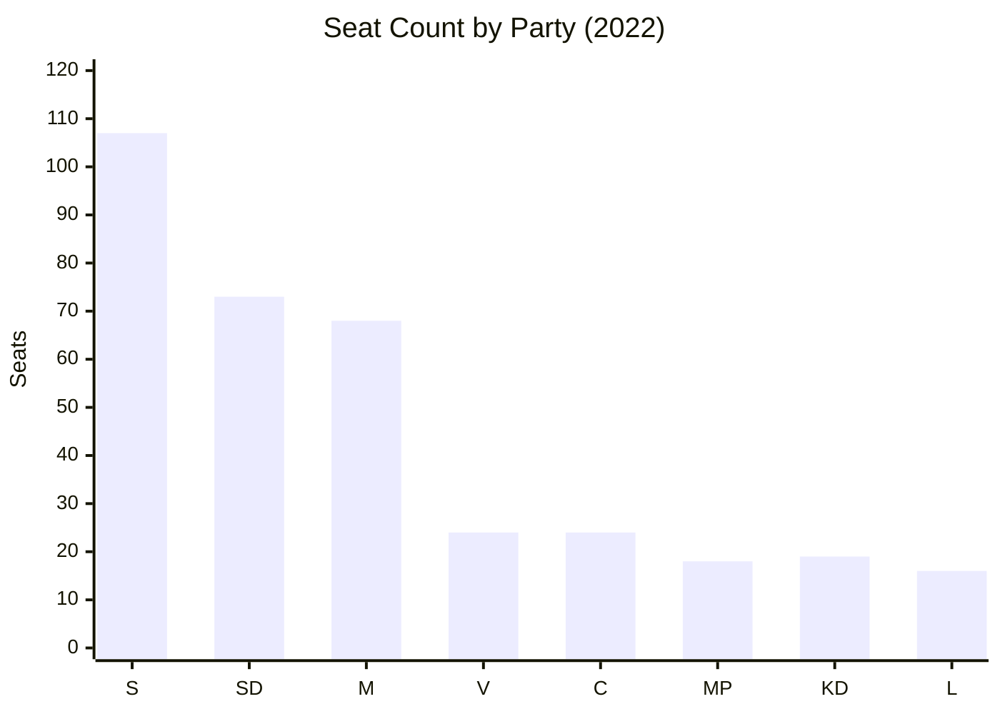

# Coalition Mathematics — Interpellations 2026-04-29

**Author**: James Pether Sörling | **Confidence**: MEDIUM [C2]

## Current Riksdag Seat Distribution (2022 Election)

| Party | Seats | Bloc | Government Role |
|-------|-------|------|----------------|
| SD (Sverigedemokraterna) | 73 | Tidö | External support |
| S (Socialdemokraterna) | 107 | Opposition | Main opposition |
| M (Moderaterna) | 68 | Tidö | PM party |
| V (Vänsterpartiet) | 24 | Opposition | Opposition |
| C (Centerpartiet) | 24 | Neutral | Swing |
| KD (Kristdemokraterna) | 19 | Tidö | Coalition |
| MP (Miljöpartiet) | 18 | Opposition | Opposition |
| L (Liberalerna) | 16 | Tidö | Coalition |
| **Total** | **349** | | |

**Government majority**: M(68)+KD(19)+L(16)+SD(73) = **176** (just above threshold of 175)  
**Opposition**: S(107)+V(24)+MP(18) = **149** | +C(24) = **173** (still needs more)

## Vote Dynamics for Key Interpellation Topics

### HD10451/HD10454 (Criminal Economy — Crime Governance)
Predicted vote if forced to a division on no-confidence:

| Party | Position | Seats |
|-------|---------|-------|
| S | Ja (no confidence) | 107 |
| V | Ja (no confidence) | 24 |
| MP | Ja (no confidence) | 18 |
| C | Ja (no confidence) — if crime governance framing | 24 |
| **Opposition total (hypothetical)** | | **173** |
| M | Nej (confidence) | 68 |
| KD | Nej (confidence) | 19 |
| L | Nej (confidence) | 16 |
| SD | Nej (confidence) | 73 |
| **Government total** | | **176** |

**Result**: Government survives 176-173 if C stays out, 176-149 without C.

### HD10453 (Energy — if SD motion filed)
| Party | Position | Seats |
|-------|---------|-------|
| SD | Ja (gas bridge) | 73 |
| S | Abstår (tactical) | 107 |
| V | Nej (anti-fossil) | 24 |
| MP | Nej (anti-fossil) | 18 |
| C | Nej (pro-climate) | 24 |
| M | Nej (follow coalition) | 68 |
| KD | Nej (coalition energy policy) | 19 |
| L | Nej (anti-gas) | 16 |

**Result**: SD gas bridge motion fails 73-169 (even with S abstaining: 73 Ja, 169 Nej/Abstår). No coalition rupture arithmetically possible on this specific vote.

### No-Confidence Motion (Hypothetical — triggered by HVB Scenario B)
For Scenario B to materialize into a no-confidence vote:
- C (24 seats) would need to join opposition
- C has stated it will not be "red-green" kingmaker
- 176-173 margin means C abstention = government survives 176-149

**Assessment**: The mathematical margin of the Tidökoalitionen (176/349 = 50.4%) is razor thin but stable given C's publicly stated refusal to enable S-led government without entering coalition.

## Key Voting Mathematics Visual

## Coalition Stability Index

| Factor | Assessment | Coalition Risk |
|--------|-----------|---------------|
| Mathematical majority | 176/349 (barely) | HIGH |
| SD energy pressure (HD10453) | Strategic not structural | LOW |
| Crime narrative (HD10454/HD10451) | Policy embarrassment, not vote risk | MEDIUM |
| C swing potential | C publicly opposed to S leadership | LOW |
| Pre-election coalition discipline | Historical norm: coalitions hold | LOW |

**Overall coalition stability**: 85% probability of coalition completing term to September 2026 election.
