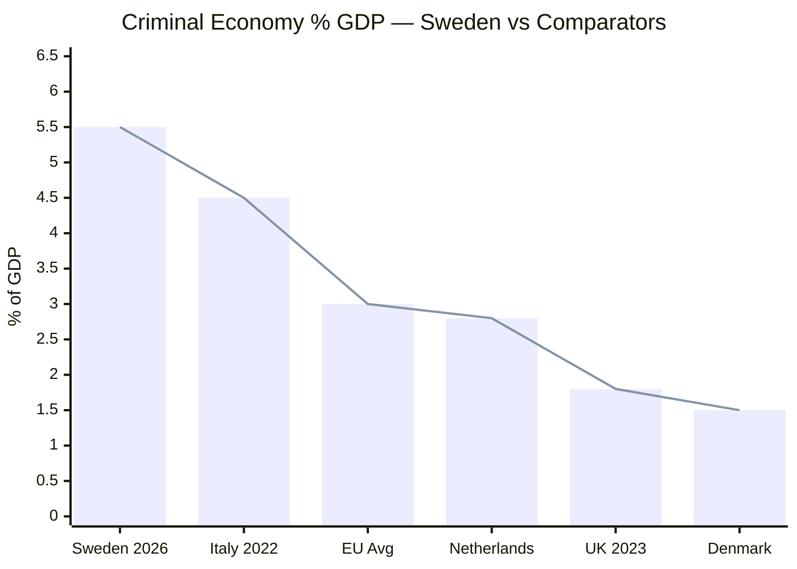

# Comparative International Context — Interpellations 2026-04-29

**Author**: James Pether Sörling | **Confidence**: MEDIUM [C2]

## Comparative Framework

Four key policy domains with international comparators.

---

## Domain 1: Criminal Economy as Percentage of GDP

| Country | Criminal Economy (% GDP) | Key Report | Response Mechanism |
|---------|--------------------------|------------|-------------------|
| **Sweden (2026)** | **5.5%** (ESO 2026) | ESO: 352bn SEK | Pending interpellation response |
| EU Average | 2.5-3.5% | Europol 2023 | Varies by member state |
| Netherlands | 2.8% | WODC 2021 | Anti-MICA trust framework |
| Italy | 4.5% | Eurispes 2022 | Anti-mafia legislation since 1982 |
| United Kingdom | 1.8% | Home Office 2023 | Companies House Reform Act 2023 |
| Denmark | 1.5% | Justice Ministry 2022 | Corporate transparency register |

**Sweden anomaly**: 5.5% is unusually high for a Nordic country, more comparable to Southern European states with historical organized crime. The Brå report identifying 23,000 companies aligns with ESO's macro estimate.

---

## Domain 2: Organ Harvesting Legislation

| Country | Legislative Status | Scope | Year |
|---------|-------------------|-------|------|
| **Sweden (2026)** | **No specific legislation** (HD10456) | Healthcare receiving coerced organs not criminalized | — |
| Spain | Law 45/2015 | Anti-trafficking includes organ trafficking | 2015 |
| Belgium | Law on trafficking | Organ trafficking criminalized | 2005 |
| Israel | Organ Transplant Act | Prohibits paid organ transplants abroad | 2008 |
| Taiwan | Human Organ Transplant Act amended | Specifically targets China-origin organs | 2015 |
| UK | Human Trafficking Act | General anti-trafficking covers organs | 2015 |
| EU | Council of Europe Convention | Anti-trafficking in human organs | 2014 |

**Sweden gap**: Multiple comparable nations have acted. Council of Europe Convention available for ratification.

---

## Domain 3: Energy Grid Investment Compared (Europe)

| Country | Grid Investment Plan | Nuclear Policy | Bridge Fuel |
|---------|---------------------|----------------|-------------|
| **Sweden** | 1 trillion SEK/20yr (SVK) | New nuclear: ~2034+ | Contested (HD10453) |
| Germany | Energiewende: 600bn EUR/20yr | Phase-out complete 2023 | LNG gas (temporary) |
| Poland | PLN 300bn grid 2030 | Nuclear planned (2033) | Coal bridge active |
| Finland | Olkiluoto 3 operational | Nuclear major share | No bridge needed |
| Denmark | 40bn DKK/10yr | No nuclear | Wind dominant |
| France | EDF 100bn EUR | Nuclear dominant | No bridge |

**Sweden context**: Compared to Germany, Sweden's nuclear decision delay creates similar bridge fuel pressure that Germany resolved with LNG. Finland's success with nuclear provides the contrast SD likely alludes to.

---

## Domain 4: Women's Shelter Funding Models

| Country | Funding Model | Shelter Availability | Government Responsibility |
|---------|--------------|---------------------|--------------------------|
| **Sweden (2026)** | Municipal-dependent, under pressure (HD10438) | Closures reported | State framework + municipal |
| Norway | National fund + municipal | Stable | National Directorate for Children |
| Denmark | National funding floor | Stable | Social Services Act guarantees |
| Germany | Federal + Lander + church | Robust | Mixed public-private |
| UK | Central government + charity | Constrained post-austerity | Home Office |
| Finland | National mandate + municipal | Stable | STEA lottery-based funding |

**Sweden gap**: Norway and Denmark maintain stability through national funding floors that Sweden's model lacks.

---

## Key International Comparative Judgments

1. **Criminal economy**: Sweden at 5.5% GDP is an outlier in Nordic context; UK and Denmark have taken aggressive corporate transparency reform steps Sweden has not yet matched (LOW CONFIDENCE [C2] that Swedish legislature will act before election).

2. **Organ harvesting**: Sweden is behind comparable democracies; Council of Europe convention provides ready implementation path (HIGH CONFIDENCE [B2] that legislation could pass with cross-party support if government moves).

3. **Grid investment**: Sweden's 15x grid investment need is consistent with European norms for post-2030 electrification; bridge fuel debate is a Swedish variant of wider European dilemma resolved differently in Germany vs Finland.

4. **Women's shelters**: Nordic comparators (Norway, Denmark, Finland) all have stronger national mandate; Sweden's municipal dependency is anomalous in Nordic context.

