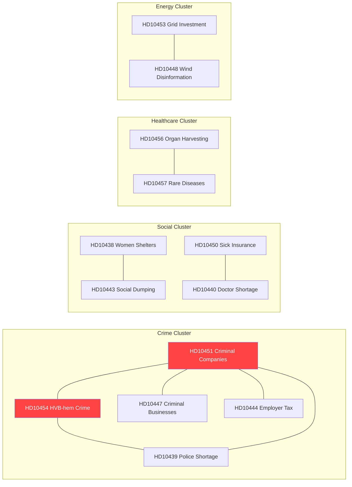

# Cross-Reference Map — Interpellations 2026-04-29

**Author**: James Pether Sörling | **Confidence**: HIGH [B2]

## Primary Cross-References

### Crime Governance Network
- **HD10451** (Bolag som brottsverktyg) ↔ **HD10454** (HVB-hem kriminella) — same root cause: criminal infiltration of Swedish institutions
- **HD10451** ↔ **HD10447** (Kriminellas drivna företag) — identical theme, different angles
- **HD10451** ↔ **HD10444** (Sänkta arbetsgivaravgifter) — policy exploited by criminal entities
- **HD10439** (Polisbristen Stockholm) → affects capacity to detect **HD10454**, **HD10451** patterns
- **HD10441** (Rättstillämpning) → provides constitutional framing for **HD10452**, **HD10451**

### Social Safety Net Network
- **HD10438** (Kvinnojourer) ↔ **HD10443** (Social dumpning) — both signal municipal welfare capacity erosion
- **HD10450** (Sjukförsäkring dag 180) ↔ **HD10440** (Företagsläkare brist) — sick insurance system depends on occupational doctors that don't exist
- **HD10442** (Ätstörningsvård) ↔ **HD10440** (Företagsläkare) — specialist healthcare capacity crisis

### Healthcare Cross-References
- **HD10456** (Organhandel) ↔ **HD10457** (Sällsynta sjukdomar) — both healthcare ethics under KD minister Lann
- **HD10457** (Sällsynta sjukdomar) ↔ **HD10450** (Sjukförsäkring) — healthcare access/finance
- **HD10442** (Ätstörningsvård) ↔ **HD10457** (Sällsynta sjukdomar) — specialized medicine capacity

### Energy/Infrastructure Cross-References
- **HD10453** (Elnät investering) ↔ **HD10448** (Desinformation vindkraft) — energy policy integrity; SD challenges KD
- **HD10449** (Södra stambanan) ↔ **HD10453** (Elnät) — both infrastructure investment gaps

## External Evidence Cross-References

| Internal Document | External Source | Relationship |
|------------------|-----------------|--------------|
| HD10451 | Brå-rapport Dec 2025 | Direct evidence: 23,000 companies used as crime tools |
| HD10451 | ESO-rapport 2026 | Direct evidence: 352bn SEK = 5.5% GDP criminal economy |
| HD10454 | Polismyndigheten rapport 2024 | 2-year delay in releasing HVB-home criminal list |
| HD10453 | Svenska kraftnät investment plan | Grid 15x investment need cited |
| HD10439 | Polismyndigheten budget data | Stockholm police shortage data |
| HD10446 | Skatteregistret data | False death declaration statistics (~30/year) |

## Temporal Cross-References

| Horizon | Documents | Notes |
|---------|-----------|-------|
| Immediate (April-May 2026) | HD10454, HD10451, HD10456 | High-urgency with 2026-05-20 deadline |
| Short-term (Q2 2026) | HD10453, HD10438, HD10450 | Election positioning window opens |
| Medium-term (Q3-Q4 2026) | All crime governance cluster | Election September 2026 impact |
| Long-term | HD10453 (20-year grid plan), HD10457 (EU rare disease framework) | Structural reforms |

## Mermaid: Cross-Reference Network

