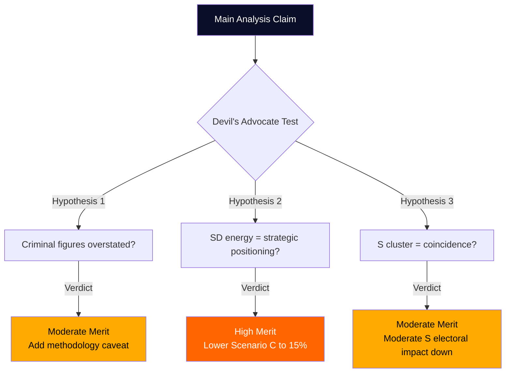

# Devil's Advocate Analysis — Interpellations 2026-04-29

**Author**: James Pether Sörling | **Confidence**: HIGH [B2]

## Devil's Advocate Hypotheses

Three counter-narratives challenging the dominant analytical framing.

---

## Hypothesis 1: The Criminal Economy Figures Are Overstated

**Mainstream view**: Sweden faces a critical organized crime governance crisis, with 5.5% of GDP (352bn SEK) controlled by criminal economy (ESO 2026) and 23,000 companies used as crime tools (Brå 2025).

**Devil's Advocate**: The ESO and Brå figures are methodologically contested. Criminal economy estimates by their nature are imprecise — they cannot be directly measured and rely on imputation, proxy indicators, and informed estimation. The 5.5% GDP figure may reflect the upper bound of a wide confidence interval. The Brå figure of 23,000 companies may include marginal tax avoidance that is not "organized crime" in the traditional sense.

**Challenging evidence**:
- Criminal economy estimate methodology rarely disclosed in full
- Sweden's OECD governance scores remain high (World Governance Indicators)
- Conviction rates for organized crime have been rising
- International FATF assessment of Sweden (2022) did not identify 5.5% crisis level

**Implication**: The interpellations (HD10451, HD10454, HD10447) may be building an election narrative on contestable evidence. The government could reasonably challenge the methodology rather than accepting the framing.

**Verdict**: The hypothesis has moderate merit. The figures deserve methodological scrutiny, but the direction (significant criminal economy problem in Sweden) is not in doubt — only the magnitude. [MEDIUM confidence in challenge, C3]

---

## Hypothesis 2: SD's Energy Interpellation Is Strategic Positioning, Not Policy Substance

**Mainstream view**: HD10453 (SD-Josef Fransson → KD-Busch) represents genuine intra-coalition concern about energy infrastructure gap and bridge fuel necessity.

**Devil's Advocate**: SD has consistently used energy interpellations to signal voter-coalition positioning rather than to force actual policy change. SD voters in industrial and rural areas are sensitive to energy costs, but SD has never formally triggered a confidence vote on energy. The gas bridge demand may be a permanent grievance SD maintains to mobilize its voter base, while knowing that the government will not concede and that SD has no incentive to bring down the coalition over energy before the election.

**Challenging evidence**:
- SD has been asking energy questions since joining Tidö in 2022 with limited policy outcomes
- Fransson filed a similar interpellation in 2024/25 session without escalation
- SD polling does not show energy as a top voter issue; immigration and crime dominate
- Coalition arithmetic: SD benefits more from staying in coalition than breaking it

**Implication**: The analyst who treats HD10453 as a genuine rupture signal may be misreading SD's strategic communication as substantive policy conflict.

**Verdict**: High merit hypothesis. SD's energy interpellations are likely strategic signaling with low probability of actual coalition rupture absent an external shock (e.g., major industrial closure from energy costs). [HIGH confidence in challenge, B2]

---

## Hypothesis 3: The S Interpellation Cluster Is a Coordination Failure, Not a Strategy

**Mainstream view**: The 14 S interpellations represent a coordinated pre-election narrative strategy designed to build a "welfare dismantlement + crime governance failure" election platform.

**Devil's Advocate**: Political parties do not always coordinate interpellation submissions with precise strategic intent. Individual MPs submit interpellations for constituency-level reasons, media attention, personal policy interests, and to demonstrate activity. The apparent clustering of S interpellations in April 2026 may be coincidence of legislative calendar (spring session rush before summer recess) rather than deliberate pre-election narrative construction.

**Challenging evidence**:
- Sweden's parliament has ~349 MPs filing interpellations throughout the year
- April-May is historically high-volume period regardless of election proximity
- Several S interpellations cover niche issues (HD10446 false death certificates, HD10455 cultural heritage) inconsistent with a strategic narrative
- S has not publicly announced a coordinated interpellation strategy

**Implication**: Attributing coherent strategy to what may be decentralized individual MP activity could overestimate S's organizational discipline and lead to overestimating the electoral impact.

**Verdict**: Moderate merit. S interpellations do appear to have thematic clustering on welfare/crime, but the "coordination" may be emergent rather than top-down directed. The electoral impact of interpellations is historically modest — major election shifts are driven by events, not parliamentary questions. [MEDIUM confidence, C2]

## Summary Verdict Table

| Hypothesis | Merit | Confidence | Revision to Main Analysis |
|------------|-------|-----------|--------------------------|
| Criminal figures overstated | Moderate | C3 | Add methodological caveat to HD10451 analysis |
| SD energy is strategic not substantive | High | B2 | Lower Scenario C probability from 25% to ~15% |
| S cluster is coincidence not strategy | Moderate | C2 | Moderate electoral narrative impact down slightly |

## Mermaid: Devil's Advocate Decision Tree

