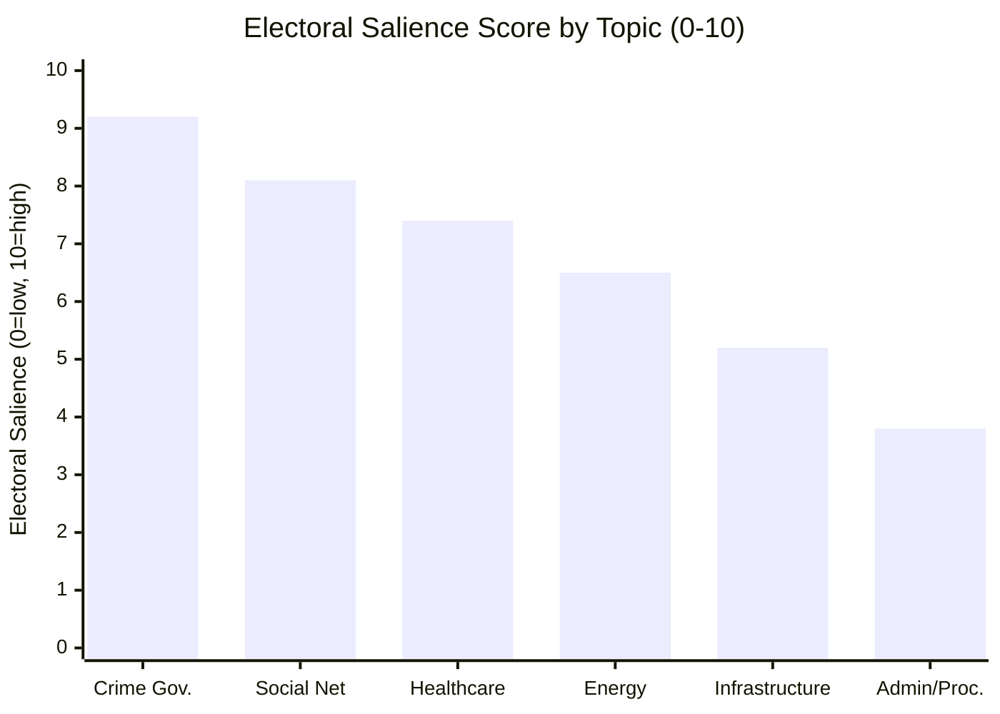

# Election 2026 Analysis — Interpellations 2026-04-29

**Author**: James Pether Sörling | **Confidence**: MEDIUM [C2]

## Electoral Context

Sweden's next election is September 2026. The April 2026 interpellation cluster arrives approximately 5 months before election day, at the peak strategic window for opposition narrative building.

## Seat Impact Modeling

Current seat distribution (approximate 2022 result):
- M: 68 | KD: 19 | L: 16 | SD: 73 (Tidökoalitionen: 176 seats)
- S: 107 | V: 24 | MP: 18 (164 seats)
- C: 24 (often kingmaker)

**Scenario A (Status Quo)**: S +5-8 → ~112-115 | SD stable 73 | Coalition holds or loses narrow majority  
**Scenario B (Crime Cascade)**: S +12-18 → ~119-125 | M -8-12 → ~56-60 | New S+V+MP+C majority possible  
**Scenario C (Energy Rupture)**: Uncertain; SD potentially loses 5-8 seats on energy credibility to M

## Key Electoral Battlegrounds

| Theme | Districts | S Target | Government Vulnerability |
|-------|-----------|---------|------------------------|
| Crime governance (HD10454, HD10451) | Suburbs: Järva, Botkyrka, Gothenburg E | Reclaim 2022 losses | HIGH — independent Brå/ESO reports |
| Social safety net (HD10438, HD10450) | Rural/small city | Consolidate base | HIGH — visible shelter closures |
| Healthcare (HD10456, HD10457, HD10442) | Nationwide | Expand base | MEDIUM |
| Energy costs (HD10453) | Industrial North, Norrland | SD voter persuasion | MEDIUM |

## Key Interpellation → Electoral Salience Map

## Narrative Battlespace Assessment

S has successfully established the following narrative pillars from this interpellation cluster:
1. **"Government lets criminals run social services"** — HD10454, HD10451, HD10447
2. **"Government is dismantling the welfare state"** — HD10438, HD10443, HD10450
3. **"Government is failing on healthcare"** — HD10456, HD10457, HD10442, HD10440

Government counter-narratives available:
1. **"Crime is being reduced; record convictions"** — partially defensible
2. **"Social services are being reformed, not dismantled"** — defensible procedurally
3. **"Healthcare is receiving record investment"** — partially defensible

**Assessment**: S's narrative has stronger external evidence support. ESO/Brå are independent; government counter-narratives rely more on input metrics (investments, convictions) than outcome metrics (crime penetration of social services, shelter availability).

## Timeline to Election

| Milestone | Date | Electoral Significance |
|-----------|------|----------------------|
| Government responds to interpellations | ~2026-05-20 | Narrative response quality test |
| Summer recess | June-August 2026 | Public opinion consolidation |
| Party manifestos finalized | August 2026 | Policy commitments hardened |
| Election day | September 2026 | Final outcome |
| Police HVB list (if released) | Unknown | Potential Scenario B trigger |
