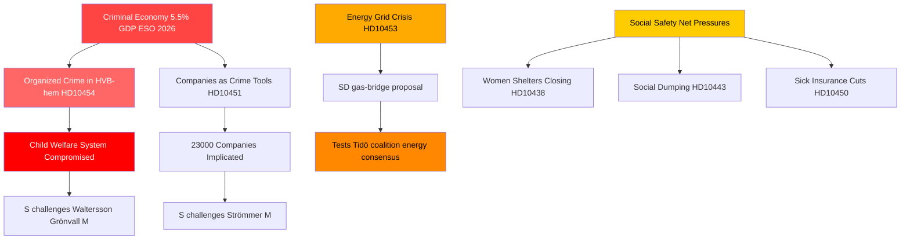

# Organized Crime, Energy Transition, and Social System Pressures: Swedish Interpellation Storm

**Author**: James Pether Sörling  
**Date**: 2026-04-29  
**Classification**: PUBLIC — GDPR Art. 9(2)(e,g)  
**Confidence**: HIGH [B2]

---

## 🎯 BLUF

Sweden's interpellation calendar on 2026-04-29 reveals a government under simultaneous pressure across three strategic fault lines: the penetration of organized crime into welfare and business systems, an energy-infrastructure investment crisis requiring immediate bridging solutions, and deteriorating social safety-net services. The opposition — predominantly the Social Democrats — is exploiting documented failures (HVB-home infiltration, the criminal economy at 5.5% of GDP) to challenge the government's core competency claim on law and order, while SD challenges the government's energy realism from within the coalition's support base.

## 🧭 3 Decisions This Brief Supports

1. **For government crisis management**: Prioritize response to HVB-hem infiltration (HD10454) — the two-year delay in sharing police intelligence with Stockholm represents a reputational vulnerability that now combines crime, child welfare, and administrative competence into one narrative.

2. **For energy policy actors**: The gas-bridging proposal (HD10453, Josef Fransson/SD) tests coalition cohesion — SD is explicitly challenging KD/Ebba Busch's grid-investment-first approach. Decision: whether to offer gas as a transitional measure risks fracturing Tidökoalitionen's energy consensus.

3. **For social policy watchers**: The combination of sick-insurance exceptions (HD10450), social dumping between municipalities (HD10443), and women's shelter closures (HD10438) signals a social-safety-net narrative consolidation by S heading into 2026 election positioning.

## 60-Second Bullets

- 🔴 **HVB-hem scandal** (HD10454): Stockholm waited ~2 years for police list of criminal-operated youth care homes; S demands action from Waltersson Grönvall (M). Deadline: answer by 2026-05-20.
- 🔴 **Criminal economy** (HD10451): Brå confirms 1-in-5 network criminals runs a company; ESO estimates criminal GDP at 352 bn SEK (5.5%). S challenges Strömmer (M) on government passivity.
- 🟡 **Energy grid** (HD10453): SD's Fransson challenges Busch on gas-as-bridge. SVK investment 15x in 20 years; calls for Öresundsverket activation.
- 🟡 **Organ harvesting from China** (HD10456): SD's Nima Gholam Ali Pour demands Sweden criminalize receipt of organs from coerced donors; cites Spain, Belgium, Israel precedents.
- 🟡 **Rare diseases** (HD10457): S's Magnusson challenges healthcare minister on medicine supply disruptions for rare-disease patients.
- 🟢 **Constitutional change** (HD10452): Independent Elsa Widding challenges Justice Minister Strömmer on procedural conflicts of interest in legal reviews.

## Top Forward Trigger

🔴 Answer deadline for HD10454 and HD10456: **2026-05-20**. If Waltersson Grönvall fails to announce concrete steps to ban criminal operators of HVB-homes by that date, expect S/V/MP to escalate to a formal inquiry motion.

## Mermaid: Key Intelligence Picture

