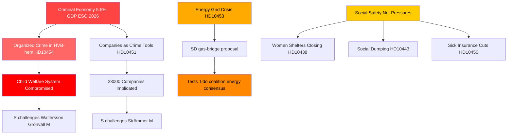

<!-- dir: rtl -->
# الجريمة المنظمة وانتقال الطاقة والضغط على المنظومات الاجتماعية: عاصفة الاستجوابات السويدية

**المؤلف**: James Pether Sörling  
**التاريخ**: 2026-04-29  
**التصنيف**: عام — المادة 9(2)(ه،ز) من اللائحة الأوروبية لحماية البيانات  
**مستوى الثقة**: عالٍ [B2]

---

## 🎯 BLUF

يكشف جدول الاستجوابات السويدي في 2026-04-29 عن حكومة تتعرض لضغوط متزامنة على ثلاثة خطوط صدع استراتيجية: تغلغل الجريمة المنظمة في منظومات الرعاية والأعمال، وأزمة استثمار في البنية التحتية للطاقة تستلزم حلولاً انتقالية فورية، وتراجع خدمات شبكة الأمان الاجتماعي. تستغل المعارضة — وفي مقدمتها الاشتراكيون الديمقراطيون — الإخفاقات الموثقة (اختراق دور رعاية الشباب HVB، والاقتصاد الإجرامي بنسبة 5.5 % من الناتج المحلي الإجمالي) للطعن في ادعاء الحكومة بالكفاءة في مجال القانون والنظام، فيما تتحدى SD واقعية الحكومة في مجال الطاقة من داخل القاعدة الداعمة للائتلاف.

## 🧭 3 قرارات يدعمها هذا الموجز

1. **لإدارة أزمة الحكومة**: إعطاء الأولوية للاستجابة لاختراق دور الرعاية HVB (HD10454) — شكّل التأخير لمدة عامين في مشاركة معلومات الشرطة مع ستوكهولم ثغرة في السمعة تجمع الآن الجريمة ورعاية الطفل والكفاءة الإدارية في رواية واحدة.

2. **للجهات الفاعلة في سياسة الطاقة**: يختبر اقتراح جسر الغاز (HD10453، Josef Fransson/SD) تماسك الائتلاف — إذ يتحدى SD صراحةً نهج KD/Ebba Busch المتمحور حول الاستثمار في الشبكة. القرار: تقديم الغاز كإجراء انتقالي يخاطر بتشقق توافق الطاقة لدى ائتلاف Tidö.

3. **لمراقبي السياسة الاجتماعية**: تشير مجموعة استثناءات تأمين المرض (HD10450) وإغراق الضمان الاجتماعي بين البلديات (HD10443) وإغلاق دور المرأة (HD10438) إلى توطيد رواية S حول شبكة الأمان الاجتماعي في ضوء التموضع الانتخابي لعام 2026.

## نقاط الستين ثانية

- 🔴 **فضيحة دور الرعاية HVB** (HD10454): انتظرت ستوكهولم ~عامين للحصول على قائمة الشرطة بدور رعاية الشباب التي يديرها المجرمون؛ تطالب S بإجراءات من Waltersson Grönvall (M). الموعد النهائي: رد بحلول 2026-05-20.
- 🔴 **الاقتصاد الإجرامي** (HD10451): تؤكد Brå أن 1 من كل 5 من مجرمي الشبكة يدير شركة؛ تقدّر ESO الناتج المحلي الإجرامي بـ 352 مليار كرونة سويدية (5.5 %). تتحدى S ستروميرMوكالة عن سلبية الحكومة.
- 🟡 **شبكة الطاقة** (HD10453): يتحدى فرانسون من SD بوش بشأن الغاز كجسر. ارتفعت استثمارات SVK 15 مرة في 20 عاماً؛ يطالب بتفعيل Öresundsverket.
- 🟡 **انتزاع الأعضاء من الصين** (HD10456): يطالب Nima Gholam Ali Pour من SD بتجريم السويد استقبال أعضاء من متبرعين مكرهين؛ يستشهد بسوابق إسبانيا وبلجيكا وإسرائيل.
- 🟡 **الأمراض النادرة** (HD10457): يتحدى ماغنوسون من S وزير الرعاية الصحية بشأن اضطرابات إمداد الأدوية لمرضى الأمراض النادرة.
- 🟢 **التعديل الدستوري** (HD10452): تتحدى المستقلة Elsa Widding وزير العدل ستروميرM بشأن تعارضات المصالح الإجرائية في المراجعات القانونية.

## أهم إشارة استشرافية

🔴 الموعد النهائي للرد على HD10454 وHD10456: **2026-05-20**. إذا أخفقت Waltersson Grönvall في الإعلان عن خطوات ملموسة لحظر المشغلين الجنائيين لدور رعاية الشباب بحلول ذلك التاريخ، يُتوقع أن ترتقي S/V/MP إلى تقديم اقتراح تحقيق رسمي.

## Mermaid: صورة الاستخبارات الرئيسية

<!-- source-sha: 710341b307c7929bdbc2496e5627bc3766ba9d38 -->
