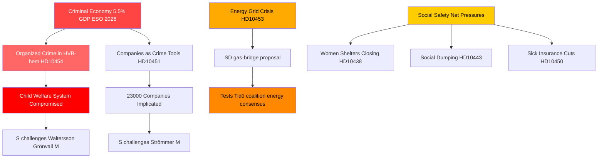

# Organiseret kriminalitet, energiomstilling og socialsystemets pres: Svensk interpellationsstorm

**Forfatter**: James Pether Sörling  
**Dato**: 2026-04-29  
**Klassificering**: OFFENTLIG — GDPR Art. 9(2)(e,g)  
**Konfidens**: HØJ [B2]

---

## 🎯 BLUF

Sveriges interpellationskalender den 2026-04-29 afslører en regering under simultant pres langs tre strategiske brudlinjer: organiseret kriminalitets infiltration af velfærds- og erhvervssystemer, en investeringskrise i energiinfrastrukturen der kræver øjeblikkelige overgangsløsninger, og forringet sociale sikkerhedsnet. Oppositionen — overvejende Socialdemokraterne — udnytter dokumenterede svigt (infiltration af HVB-hjem, kriminel økonomi på 5,5 % af BNP) til at anfægte regeringens kompetencekrav om lov og orden, mens SD udfordrer regeringens energirealisme indefra koalitionens støttebase.

## 🧭 3 Beslutninger dette notat understøtter

1. **For regeringens krisestyring**: Prioriter svar på HVB-hjems-infiltrationen (HD10454) — den toårige forsinkelse med at dele politieftretninger med Stockholm udgør en omdømmesårbarhed der nu forbinder kriminalitet, børneomsorg og administrativ kompetence i én fortælling.

2. **For energipolitiske aktører**: Gasbro-forslaget (HD10453, Josef Fransson/SD) tester koalitionens sammenhæng — SD udfordrer eksplicit KD/Ebba Buschs netinvesteringsfokus. Beslutning: at tilbyde gas som en overgangsforanstaltning risikerer at splitte Tidökoalitionens energikonsensus.

3. **For socialpolitiske iagttagere**: Kombinationen af sygesikringsundtagelser (HD10450), social dumping mellem kommuner (HD10443) og lukning af kvindekrisecentre (HD10438) signalerer en konsolidering af S's fortælling om det sociale sikkerhedsnet forud for valgpositioneringen i 2026.

## 60-sekunders punkter

- 🔴 **HVB-hjemsskandalen** (HD10454): Stockholm ventede ~2 år på politiets liste over kriminelt drevne ungdomshjem; S kræver handling fra Waltersson Grönvall (M). Frist: svar senest 2026-05-20.
- 🔴 **Kriminel økonomi** (HD10451): Brå bekræfter at hvert 5. netværkskriminelle individ driver en virksomhed; ESO estimerer kriminelt BNP til 352 mia. SEK (5,5 %). S udfordrer Strömmer (M) om regeringens passivitet.
- 🟡 **Energinet** (HD10453): SD's Fransson udfordrer Busch om gas som bro. SVK-investeringer steget 15× på 20 år; kræver aktivering af Øresundsværket.
- 🟡 **Organhøst fra Kina** (HD10456): SD's Nima Gholam Ali Pour kræver at Sverige kriminaliserer modtagelse af organer fra tvungne donorer; citerer præcedenser fra Spanien, Belgien og Israel.
- 🟡 **Sjældne sygdomme** (HD10457): S's Magnusson udfordrer sundhedsministeren om lægemiddelforsyningsforstyrrelser for patienter med sjældne sygdomme.
- 🟢 **Grundlovsændring** (HD10452): Den uafhængige Elsa Widding udfordrer justitsminister Strömmer om proceduremæssige interessekonflikter i juridiske gennemgange.

## Vigtigste fremadrettede signal

🔴 Svarsfrist for HD10454 og HD10456: **2026-05-20**. Hvis Waltersson Grönvall undlader at bekendtgøre konkrete skridt til at forbyde kriminelle operatører af HVB-hjem inden den dato, forventes S/V/MP at eskalere til en formel undersøgelsesforespørgsel.

## Mermaid: Centralt efterretningsbillede

<!-- source-sha: 710341b307c7929bdbc2496e5627bc3766ba9d38 -->
