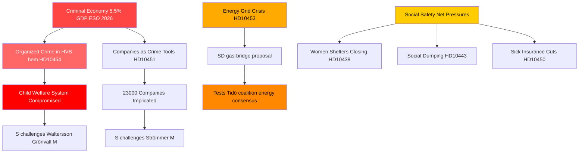

# Organisierte Kriminalität, Energiewende und Sozialsystemdruck: Schwedischer Interpellationssturm

**Autor**: James Pether Sörling  
**Datum**: 2026-04-29  
**Einstufung**: ÖFFENTLICH — DSGVO Art. 9(2)(e,g)  
**Vertrauensniveau**: HOCH [B2]

---

## 🎯 BLUF

Der schwedische Interpellationskalender vom 2026-04-29 enthüllt eine Regierung, die gleichzeitig entlang dreier strategischer Bruchlinien unter Druck steht: die Infiltration organisierter Kriminalität in Wohlfahrts- und Unternehmenssysteme, eine Investitionskrise in der Energieinfrastruktur, die sofortige Überbrückungslösungen erfordert, sowie sich verschlechternde Sozialsicherungsleistungen. Die Opposition — überwiegend die Sozialdemokraten — nutzt dokumentierte Versäumnisse (HVB-Heim-Infiltration, kriminelle Wirtschaft bei 5,5 % des BIP), um den Kompetenzanspruch der Regierung in Bezug auf Recht und Ordnung in Frage zu stellen, während SD die Energierealismus der Regierung aus der Unterstützungsbasis der Koalition heraus herausfordert.

## 🧭 3 Entscheidungen, die dieses Briefing unterstützt

1. **Für das Krisenmanagement der Regierung**: Priorisieren Sie die Reaktion auf die Infiltration der HVB-Heime (HD10454) — die zweijährige Verzögerung bei der Weitergabe von Polizeierkenntnissen an Stockholm stellt eine Reputationsschwachstelle dar, die nun Kriminalität, Kinderwohlfahrt und administrative Kompetenz in einer einzigen Erzählung verbindet.

2. **Für energiepolitische Akteure**: Der Gasbrücken-Vorschlag (HD10453, Josef Fransson/SD) testet den Koalitionszusammenhalt — SD fordert explizit KDs/Ebba Buschs Netzinvestitionsfokus heraus. Entscheidung: das Angebot von Gas als Übergangsmaßnahme riskiert, den Energiekonsens der Tidö-Koalition zu zerbrechen.

3. **Für sozialpolitische Beobachter**: Die Kombination aus Krankenversicherungsausnahmen (HD10450), Sozialdumping zwischen Kommunen (HD10443) und Frauenhaus-Schließungen (HD10438) signalisiert eine Konsolidierung der S-Erzählung über das soziale Sicherheitsnetz im Hinblick auf die Wahlpositionierung 2026.

## 60-Sekunden-Punkte

- 🔴 **HVB-Heim-Skandal** (HD10454): Stockholm wartete ~2 Jahre auf die Polizeiliste kriminell betriebener Jugendheime; S fordert Maßnahmen von Waltersson Grönvall (M). Frist: Antwort bis 2026-05-20.
- 🔴 **Kriminelle Wirtschaft** (HD10451): Brå bestätigt, dass jede 5. netzwerkkriminelle Person ein Unternehmen führt; ESO schätzt das kriminelle BIP auf 352 Mrd. SEK (5,5 %). S fordert Strömmer (M) wegen Regierungspassivität heraus.
- 🟡 **Energienetz** (HD10453): SDs Fransson fordert Busch bei Gas als Brücke heraus. SVK-Investitionen 15-fach in 20 Jahren gestiegen; fordert Aktivierung des Öresundsverkets.
- 🟡 **Organentnahme aus China** (HD10456): SDs Nima Gholam Ali Pour fordert, dass Schweden den Empfang von Organen erzwungener Spender kriminalisiert; zitiert Präzedenzfälle aus Spanien, Belgien und Israel.
- 🟡 **Seltene Krankheiten** (HD10457): S' Magnusson fordert den Gesundheitsminister wegen Arzneimittelversorgungsstörungen für Patienten mit seltenen Krankheiten heraus.
- 🟢 **Verfassungsänderung** (HD10452): Die unabhängige Elsa Widding fordert Justizminister Strömmer zu verfahrensrechtlichen Interessenkonflikten bei Rechtsprüfungen heraus.

## Wichtigstes Vorwärtssignal

🔴 Antwortfrist für HD10454 und HD10456: **2026-05-20**. Wenn Waltersson Grönvall bis zu diesem Datum keine konkreten Schritte zum Verbot krimineller Betreiber von HVB-Heimen ankündigt, werden S/V/MP voraussichtlich zu einem formellen Untersuchungsantrag eskalieren.

## Mermaid: Zentrales Geheimdienstbild

<!-- source-sha: 710341b307c7929bdbc2496e5627bc3766ba9d38 -->
