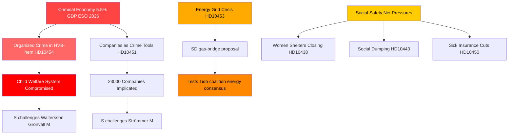

# Crimen organizado, transición energética y presión sobre los sistemas sociales: tormenta de interpelaciones en Suecia

**Autor**: James Pether Sörling  
**Fecha**: 2026-04-29  
**Clasificación**: PÚBLICO — RGPD Art. 9(2)(e,g)  
**Nivel de confianza**: ALTO [B2]

---

## 🎯 BLUF

El calendario de interpelaciones sueco del 2026-04-29 revela un gobierno bajo presión simultánea a lo largo de tres líneas de fractura estratégicas: la infiltración del crimen organizado en los sistemas de bienestar y empresariales, una crisis de inversión en infraestructura energética que requiere soluciones puente inmediatas, y el deterioro de los servicios de la red de seguridad social. La oposición — predominantemente los Socialdemócratas — aprovecha fallos documentados (infiltración de hogares HVB, economía criminal en el 5,5 % del PIB) para cuestionar la competencia del gobierno en materia de ley y orden, mientras SD desafía el realismo energético del gobierno desde dentro de la base de apoyo de la coalición.

## 🧭 3 decisiones que apoya este informe

1. **Para la gestión de crisis del gobierno**: Priorizar la respuesta a la infiltración de los hogares HVB (HD10454) — el retraso de dos años en compartir inteligencia policial con Estocolmo representa una vulnerabilidad reputacional que ahora combina crimen, bienestar infantil y competencia administrativa en un solo relato.

2. **Para los actores de política energética**: La propuesta de puente de gas (HD10453, Josef Fransson/SD) pone a prueba la cohesión de la coalición — SD desafía explícitamente el enfoque de inversión en redes de KD/Ebba Busch. Decisión: ofrecer gas como medida de transición arriesga fracturar el consenso energético de la coalición Tidö.

3. **Para los observadores de política social**: La combinación de excepciones al seguro de enfermedad (HD10450), dumping social entre municipios (HD10443) y cierres de refugios para mujeres (HD10438) señala una consolidación del relato de S sobre la red de seguridad social de cara al posicionamiento electoral de 2026.

## Puntos en 60 segundos

- 🔴 **Escándalo de los hogares HVB** (HD10454): Estocolmo esperó ~2 años la lista policial de hogares juveniles gestionados criminalmente; S exige medidas a Waltersson Grönvall (M). Plazo: respuesta antes del 2026-05-20.
- 🔴 **Economía criminal** (HD10451): Brå confirma que 1 de cada 5 criminales en red dirige una empresa; el ESO estima el PIB criminal en 352 mil millones SEK (5,5 %). S interpela a Strömmer (M) sobre la pasividad gubernamental.
- 🟡 **Red eléctrica** (HD10453): Fransson de SD interpela a Busch sobre el gas como puente. Inversiones SVK multiplicadas por 15 en 20 años; solicita activación del Öresundsverket.
- 🟡 **Extracción de órganos de China** (HD10456): Nima Gholam Ali Pour de SD exige que Suecia criminalice la recepción de órganos de donantes coaccionados; cita precedentes de España, Bélgica e Israel.
- 🟡 **Enfermedades raras** (HD10457): Magnusson de S interpela al ministro de sanidad sobre las interrupciones en el suministro de medicamentos para pacientes con enfermedades raras.
- 🟢 **Cambio constitucional** (HD10452): La independiente Elsa Widding interpela al ministro de justicia Strömmer sobre conflictos de interés procedimentales en revisiones jurídicas.

## Señal prospectiva más importante

🔴 Fecha límite de respuesta para HD10454 y HD10456: **2026-05-20**. Si Waltersson Grönvall no anuncia pasos concretos para prohibir a los operadores criminales de hogares HVB antes de esa fecha, se espera que S/V/MP escale a una moción de investigación formal.

## Mermaid: Imagen clave de inteligencia

<!-- source-sha: 710341b307c7929bdbc2496e5627bc3766ba9d38 -->
