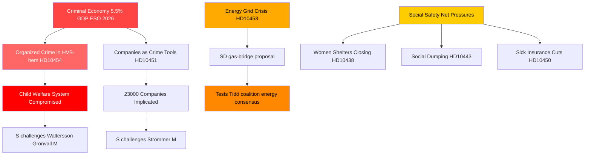

# Järjestäytynyt rikollisuus, energiasiirtymä ja sosiaaliturvan paine: Ruotsin kyselytuntiryöppy

**Tekijä**: James Pether Sörling  
**Päivämäärä**: 2026-04-29  
**Luokitus**: JULKINEN — GDPR Art. 9(2)(e,g)  
**Luottamustaso**: KORKEA [B2]

---

## 🎯 BLUF

Ruotsin interpellaatiokalenteri 2026-04-29 paljastaa hallituksen, joka kohtaa samanaikaisia paineita kolmella strategisella rintamalla: järjestäytyneen rikollisuuden tunkeutuminen hyvinvointi- ja yritystoimintajärjestelmiin, energiainfrastruktuuri-investointeihin liittyvä kriisi, joka vaatii välittömiä siirtymäratkaisuja, sekä heikentyvät sosiaaliturvapalvelut. Oppositio — pääasiassa Sosiaalidemokraatit — hyödyntää dokumentoituja epäonnistumisia (HVB-kotien infiltraatio, kriminaalitalouden osuus 5,5 % BKT:sta) kyseenalaistaakseen hallituksen osaamisen lain ja järjestyksen alalla, kun taas SD haastaa hallituksen energiarealismin koalition tukipilareiden sisältä.

## 🧭 3 päätöstä, joita tämä tiivis tukee

1. **Hallituksen kriisinhallintaan**: Aseta HVB-kotien infiltraatioon vastaaminen (HD10454) etusijalle — kahden vuoden viive poliisin tietojen jakamisessa Tukholmalle muodostaa mainehaitan, joka yhdistää nyt rikollisuuden, lastenhuollon ja hallinnollisen osaamisen yhdeksi narratiiviksi.

2. **Energiapolitiikan toimijoille**: Kaasusilta-ehdotus (HD10453, Josef Fransson/SD) testaa koalition yhtenäisyyttä — SD haastaa nimenomaisesti KD:n/Ebba Buschin verkkoinvestointipainotuksen. Päätös: kaasun tarjoaminen siirtymäkeinona voi murtaa Tidö-koalition energiakonsensuksen.

3. **Sosiaalipolitiikan seuraajille**: Sairasvakuutuspoikkeuksien (HD10450), kuntien välisen sosiaalisen dumpingin (HD10443) ja naisten turvakodin sulkemisten (HD10438) yhdistelmä signaloi S:n sosiaaliturvanarratiivin konsolidoitumista vuoden 2026 vaaliasemointia varten.

## 60 sekunnin pääkohdat

- 🔴 **HVB-koti-skandaali** (HD10454): Tukholma odotti ~2 vuotta poliisin listaa rikollisjohtoisista nuorisokodeista; S vaatii toimia Waltersson Grönvallilta (M). Määräaika: vastaus viimeistään 2026-05-20.
- 🔴 **Kriminaalitalous** (HD10451): Brå vahvistaa, että joka viides verkostorikolllinen yksilö johtaa yritystä; ESO arvioi kriminaalitalouden BKT:ksi 352 mrd. SEK (5,5 %). S haastaa Strömmerin (M) hallituksen passiivisuudesta.
- 🟡 **Sähköverkko** (HD10453): SD:n Fransson haastaa Buschin kaasusilta-kysymyksessä. SVK:n investoinnit 15-kertaistuivat 20 vuodessa; vaatii Öresundverketin aktivoimista.
- 🟡 **Elinten korjuu Kiinasta** (HD10456): SD:n Nima Gholam Ali Pour vaatii Ruotsia kriminalisoimaan pakotetuilta luovuttajilta saatujen elinten vastaanottamisen; viittaa Espanjan, Belgian ja Israelin ennakkotapauksiin.
- 🟡 **Harvinaiset sairaudet** (HD10457): S:n Magnusson haastaa terveydenhuoltoministerin harvinaissairaspotilaiden lääketoimitushäiriöistä.
- 🟢 **Perustuslain muutos** (HD10452): Riippumaton Elsa Widding haastaa oikeusministeri Strömmerin juridisiin arviointeihin liittyvistä menettelyllisistä eturistiriidoista.

## Tärkein ennakoiva signaali

🔴 Vastauksen määräaika HD10454:lle ja HD10456:lle: **2026-05-20**. Jos Waltersson Grönvall ei siihen mennessä ilmoita konkreettisia toimenpiteitä HVB-kotien rikollisoperaattoreiden kieltämiseksi, S/V/MP odotettavasti esittää virallisen tutkimuspyynnön.

## Mermaid: Keskeinen tiedustelutilanteen kuva

<!-- source-sha: 710341b307c7929bdbc2496e5627bc3766ba9d38 -->
