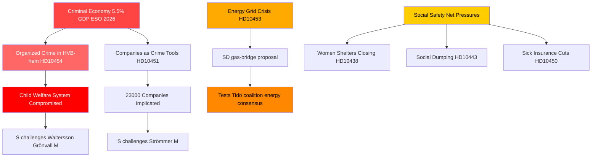

# Crime organisé, transition énergétique et pression sur les systèmes sociaux : tempête d'interpellations en Suède

**Auteur** : James Pether Sörling  
**Date** : 2026-04-29  
**Classification** : PUBLIC — RGPD Art. 9(2)(e,g)  
**Niveau de confiance** : ÉLEVÉ [B2]

---

## 🎯 BLUF

Le calendrier des interpellations suédois du 2026-04-29 révèle un gouvernement soumis à des pressions simultanées sur trois lignes de fracture stratégiques : l'infiltration du crime organisé dans les systèmes sociaux et d'entreprise, une crise d'investissement dans les infrastructures énergétiques nécessitant des solutions transitoires immédiates, et la dégradation des services du filet de sécurité sociale. L'opposition — principalement les Sociaux-démocrates — exploite des défaillances documentées (infiltration de foyers HVB, économie criminelle à 5,5 % du PIB) pour remettre en cause la compétence du gouvernement en matière d'ordre public, tandis que SD remet en question le réalisme énergétique du gouvernement depuis l'intérieur de la base de soutien de la coalition.

## 🧭 3 décisions que ce document éclaire

1. **Pour la gestion de crise du gouvernement** : Prioriser la réponse à l'infiltration des foyers HVB (HD10454) — le retard de deux ans dans la transmission des renseignements policiers à Stockholm constitue une vulnérabilité en termes de réputation qui combine désormais crime, protection de l'enfance et compétence administrative en un seul récit.

2. **Pour les acteurs de la politique énergétique** : La proposition de pont gazier (HD10453, Josef Fransson/SD) teste la cohésion de la coalition — SD conteste explicitement l'approche investissement réseau de KD/Ebba Busch. Décision : proposer le gaz comme mesure transitoire risque de briser le consensus énergétique de la coalition Tidö.

3. **Pour les observateurs de la politique sociale** : La combinaison d'exceptions à l'assurance maladie (HD10450), de dumping social entre communes (HD10443) et de fermetures de refuges pour femmes (HD10438) signale une consolidation du récit de S sur le filet de protection sociale en vue du positionnement électoral 2026.

## Points en 60 secondes

- 🔴 **Scandale des foyers HVB** (HD10454) : Stockholm a attendu ~2 ans la liste policière des foyers pour jeunes à gestion criminelle ; S exige des mesures de Waltersson Grönvall (M). Délai : réponse au plus tard le 2026-05-20.
- 🔴 **Économie criminelle** (HD10451) : Brå confirme qu'1 criminel en réseau sur 5 dirige une entreprise ; l'ESO estime le PIB criminel à 352 milliards SEK (5,5 %). S interpelle Strömmer (M) sur la passivité gouvernementale.
- 🟡 **Réseau électrique** (HD10453) : Fransson (SD) interpelle Busch sur le gaz comme pont. Investissements SVK multipliés par 15 en 20 ans ; demande d'activation de l'Öresundsverket.
- 🟡 **Prélèvement d'organes en Chine** (HD10456) : Nima Gholam Ali Pour (SD) demande à la Suède de criminaliser la réception d'organes de donneurs contraints ; cite les précédents d'Espagne, de Belgique et d'Israël.
- 🟡 **Maladies rares** (HD10457) : Magnusson (S) interpelle le ministre de la santé sur les perturbations d'approvisionnement en médicaments pour les patients atteints de maladies rares.
- 🟢 **Modification constitutionnelle** (HD10452) : L'indépendante Elsa Widding interpelle le ministre de la justice Strömmer sur les conflits d'intérêts procéduraux dans les examens juridiques.

## Principal signal prospectif

🔴 Délai de réponse pour HD10454 et HD10456 : **2026-05-20**. Si Waltersson Grönvall ne parvient pas à annoncer des mesures concrètes pour interdire les opérateurs criminels de foyers HVB d'ici cette date, S/V/MP devrait escalader vers une motion d'enquête formelle.

## Mermaid : Image clé du renseignement

<!-- source-sha: 710341b307c7929bdbc2496e5627bc3766ba9d38 -->
