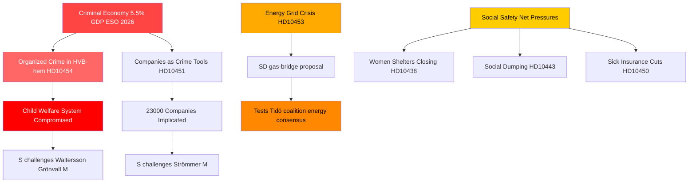

<!-- dir: rtl -->
# פשע מאורגן, מעבר אנרגטי ולחץ על מערכות הרווחה: סערת השאילתות הסווידית

**מחבר**: James Pether Sörling  
**תאריך**: 2026-04-29  
**סיווג**: ציבורי — GDPR Art. 9(2)(e,g)  
**רמת אמינות**: גבוהה [B2]

---

## 🎯 BLUF

לוח השאילתות הסווידי מיום 2026-04-29 חושף ממשלה שנמצאת תחת לחץ בו-זמני לאורך שלושה קווי שבר אסטרטגיים: חדירת הפשע המאורגן למערכות הרווחה והעסקים, משבר השקעות בתשתיות האנרגיה הדורש פתרונות גישור מיידיים, והידרדרות שירותי רשת הביטחון הסוציאלי. האופוזיציה — בעיקר הסוציאל-דמוקרטים — מנצלת כישלונות מתועדים (חדירה לבתי ה-HVB, כלכלה פלילית בשיעור 5.5% מהתמ"ג) כדי לערער על טענת הממשלה לכשירות בתחום החוק והסדר, בעוד SD מאתגרת את הריאליזם האנרגטי של הממשלה מבפנים, מתוך בסיס התמיכה של הקואליציה.

## 🧭 3 החלטות שמסמך זה תומך בהן

1. **לניהול המשבר הממשלתי**: תעדוף מענה לחדירה לבתי ה-HVB (HD10454) — עיכוב של שנתיים בשיתוף מידע משטרתי עם שטוקהולם מהווה פגיעות תדמיתית המשלבת כעת פשע, רווחת הילד וכשירות מינהלית לנרטיב אחד.

2. **לגורמים בתחום מדיניות האנרגיה**: הצעת גשר הגז (HD10453, Josef Fransson/SD) בוחנת את לכידות הקואליציה — SD מאתגרת במפורש את גישת השקעות הרשת של KD/Ebba Busch. ההחלטה: הצעת גז כאמצעי מעבר מסכנת לשבור את הקונצנזוס האנרגטי של קואליציית Tidö.

3. **למשקיפים על המדיניות הסוציאלית**: השילוב של חריגים בביטוח מחלה (HD10450), דמפינג סוציאלי בין עיריות (HD10443) וסגירת מקלטים לנשים (HD10438) מסמן גיבוש נרטיב S בנוגע לרשת הביטחון הסוציאלי לקראת המיצוב הבחירתי לשנת 2026.

## נקודות של 60 שניות

- 🔴 **שערוריית בתי ה-HVB** (HD10454): שטוקהולם המתינה ~2 שנים לרשימת המשטרה של בתי הנוער המנוהלים על ידי עבריינים; S דורשת פעולה מ-Waltersson Grönvall (M). מועד: תשובה עד 2026-05-20.
- 🔴 **הכלכלה הפלילית** (HD10451): Brå מאשרת שכל אחד מ-5 עבריינים ברשת מנהל חברה; ESO מעריכה את התמ"ג הפלילי ב-352 מיליארד SEK (5.5%). S מאתגרת את Strömmer (M) על פסיביות הממשלה.
- 🟡 **רשת החשמל** (HD10453): Fransson של SD מאתגר את Busch על גז כגשר. השקעות SVK גדלו פי 15 ב-20 שנה; קורא להפעלת Öresundsverket.
- 🟡 **קצירת איברים מסין** (HD10456): Nima Gholam Ali Pour של SD דורש שסווידן תפלילית קבלת איברים מתורמים בכפייה; מצטט תקדימים מספרד, בלגיה וישראל.
- 🟡 **מחלות נדירות** (HD10457): Magnusson של S מאתגר את שר הבריאות על שיבושים בהספקת תרופות לחולי מחלות נדירות.
- 🟢 **שינוי חוקתי** (HD10452): העצמאית Elsa Widding מאתגרת את שר המשפטים Strömmer בנוגע לניגודי עניינים פרוצדורליים בסקירות משפטיות.

## האות הצופה הקריטי ביותר

🔴 מועד אחרון למענה על HD10454 וHD10456: **2026-05-20**. אם Waltersson Grönvall לא תכריז על צעדים קונקרטיים לאסור על מפעילים פליליים של בתי HVB עד לאותו תאריך, צפוי ש-S/V/MP יסלימו להצעת חקירה פורמלית.

## Mermaid: תמונת המודיעין המרכזית

<!-- source-sha: 710341b307c7929bdbc2496e5627bc3766ba9d38 -->
