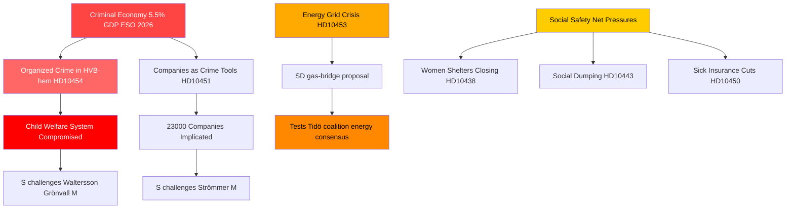

# 組織犯罪、エネルギー転換、社会システムへの圧力：スウェーデン質問書の嵐

**著者**: James Pether Sörling  
**日付**: 2026-04-29  
**分類**: 公開 — GDPR Art. 9(2)(e,g)  
**信頼水準**: 高 [B2]

---

## 🎯 BLUF

2026-04-29のスウェーデンの質問書（インテルペラション）日程は、三つの戦略的断層線に沿って同時に圧力を受けている政府を露わにしている。組織犯罪が福祉・ビジネスシステムへ浸透していること、即時の橋渡し策を要するエネルギーインフラへの投資危機、そして社会的セーフティネット・サービスの悪化である。野党—主に社会民主党—は文書化された失敗（HVBホームへの浸透、GDP比5.5%の犯罪経済）を利用して、治安と秩序に関する政府の能力主張を問い質している。一方SDは連立政権の支持基盤内部からエネルギー現実主義を問いただしている。

## 🧭 このブリーフィングが支援する3つの意思決定

1. **政府の危機管理のために**: HVBホームへの浸透（HD10454）への対応を優先すること — 警察情報をストックホルムと共有するのに2年かかった遅延は、犯罪、児童福祉、行政能力を一つの物語に結びつける評判上の脆弱性となっている。

2. **エネルギー政策の関係者のために**: ガス橋渡し提案（HD10453、Josef Fransson/SD）は連立の結束を試している — SDはKD/Ebba Buschの送電網投資重視のアプローチを明示的に問い質している。決断：ガスを過渡的措置として提供することは、Tidö連立のエネルギーコンセンサスを分断するリスクがある。

3. **社会政策の観察者のために**: 傷病保険の例外措置（HD10450）、自治体間の社会的ダンピング（HD10443）、女性シェルターの閉鎖（HD10438）の組み合わせは、2026年選挙ポジショニングに向けてSが社会的セーフティネットの物語を集約しつつあることを示している。

## 60秒箇条書き

- 🔴 **HVBホーム・スキャンダル**（HD10454）：ストックホルムは犯罪組織が運営する青少年ケアホームの警察リストを~2年待った；SはWaltersson Grönvall（M）に対応を要求。期限：2026-05-20までに回答。
- 🔴 **犯罪経済**（HD10451）：Bråは5人に1人のネットワーク犯罪者が企業を経営していることを確認；ESOは犯罪GDPを3,520億SEK（5.5%）と推定。SはStrömmer（M）に政府の消極性を問い質す。
- 🟡 **電力網**（HD10453）：SDのFranssonはBuschにガス橋渡しについて問い質す。SVKの投資は20年で15倍；Öresundsverketの稼働を求める。
- 🟡 **中国からの臓器摘出**（HD10456）：SDのNima Gholam Ali Pourはスウェーデンが強制提供者からの臓器受け取りを犯罪化するよう求める；スペイン、ベルギー、イスラエルの先例を挙げる。
- 🟡 **希少疾患**（HD10457）：SのMagnussonは希少疾患患者向け医薬品の供給障害について保健大臣に問い質す。
- 🟢 **憲法改正**（HD10452）：無所属のElsa Widdingは法律審査における手続き上の利益相反についてStrömmer司法相に問い質す。

## 最重要の将来シグナル

🔴 HD10454およびHD10456の回答期限：**2026-05-20**。Waltersson Grönvallがその日付までにHVBホームの犯罪的運営者を禁止する具体的な措置を発表しない場合、S/V/MPは正式な調査動議にエスカレートすると予想される。

## Mermaid: 主要インテリジェンス概況

<!-- source-sha: 710341b307c7929bdbc2496e5627bc3766ba9d38 -->
