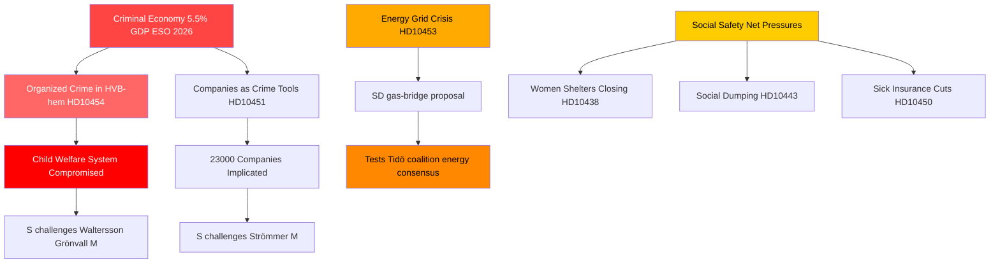

# 조직범죄, 에너지 전환, 사회 시스템 압박: 스웨덴 질의서 폭풍

**저자**: James Pether Sörling  
**날짜**: 2026-04-29  
**분류**: 공개 — GDPR Art. 9(2)(e,g)  
**신뢰 수준**: 높음 [B2]

---

## 🎯 BLUF

2026-04-29 스웨덴 질의서(인테르펠라시온) 일정은 세 가지 전략적 단층선을 따라 동시에 압박을 받는 정부를 드러낸다. 복지·사업 시스템에 대한 조직범죄 침투, 즉각적인 과도기적 해결책을 필요로 하는 에너지 인프라 투자 위기, 그리고 사회 안전망 서비스의 악화가 그것이다. 야당—주로 사회민주당—은 문서화된 실패(HVB 시설 침투, GDP의 5.5%에 달하는 범죄 경제)를 활용해 법과 질서에 관한 정부의 역량 주장에 의문을 제기하고 있으며, SD는 연립 지지 기반 내부에서 정부의 에너지 현실주의에 도전하고 있다.

## 🧭 이 브리핑이 지원하는 3가지 결정

1. **정부 위기 관리를 위해**: HVB 시설 침투(HD10454)에 대한 대응을 우선시할 것 — 경찰 정보를 스톡홀름과 공유하는 데 2년이 걸린 지연은 이제 범죄, 아동 복지, 행정 역량을 하나의 서사로 결합하는 평판상 취약점이 되었다.

2. **에너지 정책 행위자들을 위해**: 가스 교량 제안(HD10453, Josef Fransson/SD)은 연립 결속력을 시험하고 있다 — SD는 KD/Ebba Busch의 전력망 투자 우선 접근 방식에 명시적으로 도전하고 있다. 결정: 가스를 과도기적 조치로 제공하면 Tidö 연립의 에너지 합의가 깨질 위험이 있다.

3. **사회정책 관찰자들을 위해**: 상병보험 예외(HD10450), 지자체 간 사회적 덤핑(HD10443), 여성 쉼터 폐쇄(HD10438)의 조합은 2026년 선거 포지셔닝을 앞두고 S의 사회 안전망 서사가 공고화되고 있음을 시사한다.

## 60초 핵심 요약

- 🔴 **HVB 시설 스캔들** (HD10454): 스톡홀름은 범죄 조직이 운영하는 청소년 케어 시설 경찰 목록을 ~2년 기다렸다; S는 Waltersson Grönvall(M)에 조치를 요구. 기한: 2026-05-20까지 답변.
- 🔴 **범죄 경제** (HD10451): Brå는 네트워크 범죄자 5명 중 1명이 회사를 운영한다고 확인; ESO는 범죄 GDP를 3,520억 SEK(5.5%)로 추산. S는 Strömmer(M)에 정부 소극성을 문제 삼음.
- 🟡 **전력망** (HD10453): SD의 Fransson이 Busch에게 가스 교량에 대해 질의. SVK 투자 20년간 15배 증가; Öresundsverket 가동 촉구.
- 🟡 **중국의 장기 적출** (HD10456): SD의 Nima Gholam Ali Pour는 스웨덴이 강요된 기증자의 장기 수령을 범죄화할 것을 요구; 스페인, 벨기에, 이스라엘의 선례 인용.
- 🟡 **희귀 질환** (HD10457): S의 Magnusson이 희귀 질환 환자 의약품 공급 중단에 대해 보건부 장관에 질의.
- 🟢 **헌법 개정** (HD10452): 무소속 Elsa Widding이 법률 검토에서의 절차적 이해충돌에 대해 Strömmer 법무부 장관에 질의.

## 가장 중요한 전망 신호

🔴 HD10454 및 HD10456 답변 기한: **2026-05-20**. Waltersson Grönvall이 그 날짜까지 HVB 시설 범죄적 운영자 금지를 위한 구체적 조치를 발표하지 않을 경우, S/V/MP가 공식 조사 동의를 에스컬레이션할 것으로 예상된다.

## Mermaid: 핵심 정보 현황

<!-- source-sha: 710341b307c7929bdbc2496e5627bc3766ba9d38 -->
