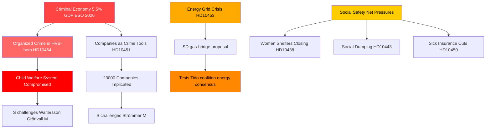

# Georganiseerde misdaad, energietransitie en druk op sociale systemen: Zweedse interpellatiestorm

**Auteur**: James Pether Sörling  
**Datum**: 2026-04-29  
**Classificatie**: OPENBAAR — AVG Art. 9(2)(e,g)  
**Betrouwbaarheidsniveau**: HOOG [B2]

---

## 🎯 BLUF

De Zweedse interpellatiekalender van 2026-04-29 onthult een regering die tegelijkertijd onder druk staat langs drie strategische breuklijnen: de infiltratie van de georganiseerde misdaad in welzijns- en bedrijfssystemen, een investeringscrisis in de energie-infrastructuur die onmiddellijke overgangsoplossingen vereist, en verslechterende sociale vangnetten. De oppositie — overwegend de Sociaal-democraten — benut gedocumenteerde tekortkomingen (infiltratie van HVB-tehuizen, criminele economie op 5,5 % van het BBP) om de competentieaanspraak van de regering op wet en orde in twijfel te trekken, terwijl SD het energierealisme van de regering uitdaagt vanuit de steunbasis van de coalitie.

## 🧭 3 beslissingen die dit briefing ondersteunt

1. **Voor crisismanagement van de regering**: Prioriteer de respons op de infiltratie van HVB-tehuizen (HD10454) — de tweejarige vertraging in het delen van politie-inlichtingen met Stockholm vormt een reputatiekwetsbaarheid die nu misdaad, kinderwelzijn en bestuurlijke competentie combineert in één narratief.

2. **Voor energiepolitieke actoren**: Het gasbrugvoorstel (HD10453, Josef Fransson/SD) test de coalitiecohesie — SD daagt expliciet het netwerkinvesteringsfocus van KD/Ebba Busch uit. Beslissing: het aanbieden van gas als overgangsmaatregel riskeert de energieconsensus van de Tidö-coalitie te breken.

3. **Voor sociaalbeleid-watchers**: De combinatie van uitzonderingen op de ziekteverzekering (HD10450), sociale dumping tussen gemeenten (HD10443) en sluitingen van vrouwenopvang (HD10438) signaleert een consolidatie van het S-narratief over het sociale vangnet met het oog op de verkiezingspositionering in 2026.

## 60-seconden punten

- 🔴 **HVB-tehuis-schandaal** (HD10454): Stockholm wachtte ~2 jaar op de politielijst van crimineel gerunde jeugdzorgtehuizen; S eist actie van Waltersson Grönvall (M). Deadline: antwoord uiterlijk 2026-05-20.
- 🔴 **Criminele economie** (HD10451): Brå bevestigt dat 1 op 5 netwerkcriminelen een bedrijf runt; ESO schat het criminele BBP op 352 mrd. SEK (5,5 %). S daagt Strömmer (M) uit over overheidspassiviteit.
- 🟡 **Energienet** (HD10453): Fransson van SD daagt Busch uit over gas als brug. SVK-investeringen 15× gestegen in 20 jaar; vraagt activering van het Öresundsverket.
- 🟡 **Orgaanoogst uit China** (HD10456): Nima Gholam Ali Pour van SD eist dat Zweden de ontvangst van organen van gedwongen donoren criminaliseert; citeert precedenten uit Spanje, België en Israël.
- 🟡 **Zeldzame ziekten** (HD10457): Magnusson van S daagt de zorgminister uit over verstoringen in de geneesmiddelenlevering voor patiënten met zeldzame ziekten.
- 🟢 **Grondwetswijziging** (HD10452): De onafhankelijke Elsa Widding daagt minister van Justitie Strömmer uit over procedurele belangenconflicten in juridische beoordelingen.

## Belangrijkste vooruitkijkend signaal

🔴 Antwoorddeadline voor HD10454 en HD10456: **2026-05-20**. Als Waltersson Grönvall voor die datum nalaat concrete stappen aan te kondigen om criminele exploitanten van HVB-tehuizen te verbieden, wordt verwacht dat S/V/MP escaleert naar een formele onderzoeksmotion.

## Mermaid: Centraal inlichtingenbeeld

<!-- source-sha: 710341b307c7929bdbc2496e5627bc3766ba9d38 -->
