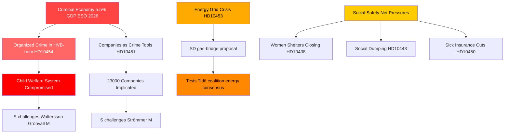

# Organisert kriminalitet, energiomstilling og velferdsystemets press: Svensk interpellasjonsstorm

**Forfatter**: James Pether Sörling  
**Dato**: 2026-04-29  
**Klassifisering**: OFFENTLIG — GDPR Art. 9(2)(e,g)  
**Konfidens**: HØY [B2]

---

## 🎯 BLUF

Sveriges interpellasjonskalender 2026-04-29 avslører en regjering under simultant press langs tre strategiske bruddlinjer: organisert kriminalitets infiltrasjon av velferds- og næringslivssystemer, en investeringskrise i energiinfrastrukturen som krever umiddelbare overgangsløsninger, og forverret sosialt sikkerhetsnett. Opposisjonen — overveiende Sosialdemokratene — utnytter dokumenterte svikt (infiltrasjon av HVB-hjem, kriminell økonomi på 5,5 % av BNP) til å utfordre regjeringens kompetansekrav om lov og orden, mens SD utfordrer regjeringens energirealisme fra innsiden av koalisjonens støttebase.

## 🧭 3 Beslutninger dette notatet støtter

1. **For regjeringens krisehåndtering**: Prioriter svar på HVB-hjems-infiltrasjonen (HD10454) — den toårige forsinkelsen med å dele politiettretninger med Stockholm utgjør en omdømmesårbarhet som nå kombinerer kriminalitet, barnepleie og administrativ kompetanse i én fortelling.

2. **For energipolitiske aktører**: Gasbroforslaget (HD10453, Josef Fransson/SD) tester koalisjonens samhold — SD utfordrer eksplisitt KD/Ebba Buschs nettinvesteringsfokus. Beslutning: å tilby gass som en overgangsforanstaltning risikerer å splitte Tidökoalisjonens energikonsensus.

3. **For sosialpolitiske observatører**: Kombinasjonen av sykeforsikringsunntak (HD10450), sosial dumping mellom kommuner (HD10443) og stengning av krisesentre for kvinner (HD10438) signaliserer en konsolidering av S's fortelling om det sosiale sikkerhetsnettet foran valgposisjonering i 2026.

## 60-sekunders punkter

- 🔴 **HVB-hjem-skandalen** (HD10454): Stockholm ventet ~2 år på politiets liste over kriminelt drevne ungdomshjem; S krever tiltak fra Waltersson Grönvall (M). Frist: svar innen 2026-05-20.
- 🔴 **Kriminell økonomi** (HD10451): Brå bekrefter at hvert 5. nettverkskriminelle individ driver et selskap; ESO anslår kriminelt BNP til 352 mrd. SEK (5,5 %). S utfordrer Strömmer (M) om regjeringens passivitet.
- 🟡 **Energinett** (HD10453): SD's Fransson utfordrer Busch om gass som bro. SVK-investeringer økt 15× på 20 år; krever aktivering av Øresundsverket.
- 🟡 **Organhandel fra Kina** (HD10456): SD's Nima Gholam Ali Pour krever at Sverige kriminaliserer mottak av organer fra tvungne donorer; siterer presedens fra Spania, Belgia og Israel.
- 🟡 **Sjeldne sykdommer** (HD10457): S's Magnusson utfordrer helseministeren om legemiddelleveringsforstyrrelser for pasienter med sjeldne sykdommer.
- 🟢 **Grunnlovsendring** (HD10452): Den uavhengige Elsa Widding utfordrer justisminister Strömmer om prosessuelle interessekonflikter i juridiske gjennomganger.

## Viktigste fremadrettede signal

🔴 Svarsfrist for HD10454 og HD10456: **2026-05-20**. Hvis Waltersson Grönvall ikke kunngjør konkrete tiltak for å forby kriminelle operatører av HVB-hjem innen den datoen, forventes S/V/MP å eskalere til et formelt undersøkelsesforslag.

## Mermaid: Sentralt etterretningsbilde

<!-- source-sha: 710341b307c7929bdbc2496e5627bc3766ba9d38 -->
