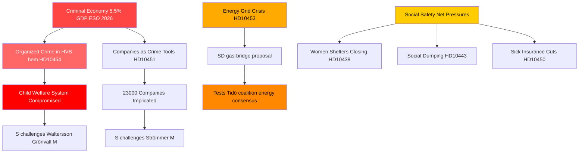

# Organiserad brottslighet, energiomställning och trygghetssystemens press: Sveriges interpellationsstorm

**Författare**: James Pether Sörling  
**Datum**: 2026-04-29  
**Klassificering**: OFFENTLIG — GDPR Art. 9(2)(e,g)  
**Konfidensgrad**: HÖG [B2]

---

## 🎯 BLUF

Sveriges interpellationskalender den 2026-04-29 avslöjar en regering under samtidigt tryck längs tre strategiska spricklinjer: den organiserade brottslighetens infiltration av välfärds- och affärssystem, en kris i energiinfrastrukturens investeringar som kräver omedelbara övergångslösningar, och försämrande sociala skyddsnätets tjänster. Oppositionen — till övervägande del Socialdemokraterna — utnyttjar dokumenterade misslyckanden (infiltration av HVB-hem, den kriminella ekonomin på 5,5 % av BNP) för att ifrågasätta regeringens kompetensanspråk på lag och ordning, medan SD ifrågasätter regeringens energirealism inifrån koalitionens stödbas.

## 🧭 3 Beslut detta underlag stöder

1. **För regeringens krishantering**: Prioritera svar på infiltrationen av HVB-hem (HD10454) — den tvååriga förseningen med att dela polisunderrättelser med Stockholm utgör en reputationsrisk som nu förenar brott, barnomsorg och administrativ kompetens i en enda berättelse.

2. **För energipolitiska aktörer**: Gasövergångsförslaget (HD10453, Josef Fransson/SD) prövar koalitionens sammanhållning — SD utmanar explicit KD:s/Ebba Buschs nätinvesteringsfokus. Beslut: att erbjuda gas som övergångslösning riskerar att spräcka Tidökoalitionens energikonsensus.

3. **För socialpolitiska bevakare**: Kombinationen av sjukförsäkringsundantag (HD10450), social dumpning mellan kommuner (HD10443) och stängda kvinnojourer (HD10438) signalerar en konsolidering av S:s berättelse om det sociala skyddsnätet inför valpositioneringen 2026.

## 60-sekunders punkter

- 🔴 **HVB-hemsskandalen** (HD10454): Stockholm väntade ~2 år på polisens lista över kriminellt drivna ungdomshem; S kräver åtgärder av Waltersson Grönvall (M). Svarstid: svar senast 2026-05-20.
- 🔴 **Kriminell ekonomi** (HD10451): Brå bekräftar att vart femte nätverkskriminellt individ driver ett företag; ESO uppskattar kriminellt BNP till 352 mdr SEK (5,5 %). S utmanar Strömmer (M) om regeringens passivitet.
- 🟡 **Elnätet** (HD10453): SD:s Fransson utmanar Busch om gas som brygga. SVK:s investeringar har ökat 15 gånger på 20 år; begär aktivering av Öresundsverket.
- 🟡 **Organskördar från Kina** (HD10456): SD:s Nima Gholam Ali Pour kräver att Sverige kriminaliserar mottagande av organ från tvingade donatorer; hänvisar till prejudikat i Spanien, Belgien och Israel.
- 🟡 **Sällsynta sjukdomar** (HD10457): S:s Magnusson utmanar sjukvårdsministern om störningar i läkemedelsleveranser för patienter med sällsynta sjukdomar.
- 🟢 **Grundlagsändring** (HD10452): Den oberoende Elsa Widding utmanar justitieminister Strömmer om processuella intressekonflikter i rättsgranskningar.

## Viktigaste framåtblickande signal

🔴 Svarsfrist för HD10454 och HD10456: **2026-05-20**. Om Waltersson Grönvall misslyckas med att till det datumet tillkännage konkreta steg för att förbjuda kriminella operatörer av HVB-hem, förväntas S/V/MP eskalera till ett formellt utskottsutredningsyrkande.

## Mermaid: Viktigaste underrättelsebilden

<!-- source-sha: 710341b307c7929bdbc2496e5627bc3766ba9d38 -->
