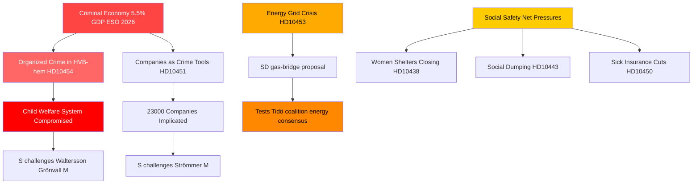

# 有组织犯罪、能源转型与社会体系压力：瑞典质询风暴

**作者**：James Pether Sörling  
**日期**：2026-04-29  
**密级**：公开 — GDPR第9条第2款(e、g)项  
**可信度**：高 [B2]

---

## 🎯 BLUF

2026-04-29瑞典质询（interpellation）日程揭示，政府同时承受沿三条战略断层线的压力：有组织犯罪渗入福利和商业体系、能源基础设施投资危机需要立即出台过渡解决方案，以及社会安全网服务恶化。反对党——主要是社会民主党——利用有据可查的失败（HVB之家渗透、犯罪经济占GDP 5.5%）质疑政府在法律与秩序方面的能力主张，而瑞典民主党则从联合执政基础内部挑战政府的能源现实主义。

## 🧭 本简报支持的3项决策

1. **对于政府危机管理**：优先回应HVB之家渗透问题（HD10454）——与斯德哥尔摩共享警方情报延迟两年，已形成将犯罪、儿童福利和行政能力合并为单一叙事的声誉漏洞。

2. **对于能源政策参与者**：天然气过渡方案（HD10453，Josef Fransson/SD）考验联合执政凝聚力——SD明确挑战KD/Ebba Busch的电网投资优先路线。决策：将天然气作为过渡措施可能导致Tidö联合执政能源共识破裂。

3. **对于社会政策观察者**：病假保险例外（HD10450）、市镇间社会倾销（HD10443）和女性庇护所关闭（HD10438）的组合表明，S正在为2026年选举定位巩固其社会安全网叙事。

## 60秒要点

- 🔴 **HVB之家丑闻**（HD10454）：斯德哥尔摩等待警方违法运营青少年之家名单约2年；S要求Waltersson Grönvall（M）采取行动。截止日期：2026-05-20前答复。
- 🔴 **犯罪经济**（HD10451）：Brå证实每5名网络犯罪分子中有1名经营公司；ESO估算犯罪GDP为3520亿瑞典克朗（5.5%）。S就政府消极性质询Strömmer（M）。
- 🟡 **电力网络**（HD10453）：SD的Fransson就天然气作为过渡桥梁质询Busch。SVK投资20年增长15倍；要求启用Öresundsverket。
- 🟡 **中国器官摘取**（HD10456）：SD的Nima Gholam Ali Pour要求瑞典将接受强迫捐献者器官入罪；援引西班牙、比利时、以色列先例。
- 🟡 **罕见病**（HD10457）：S的Magnusson就罕见病患者药品供应中断质询卫生部长。
- 🟢 **宪法修改**（HD10452）：独立议员Elsa Widding就法律审查中程序利益冲突质询司法部长Strömmer。

## 最重要的前瞻信号

🔴 HD10454和HD10456答复截止日期：**2026-05-20**。若Waltersson Grönvall未能在该日期前宣布禁止HVB之家犯罪运营者的具体措施，预计S/V/MP将上升为正式调查动议。

## Mermaid：核心情报图景

<!-- source-sha: 710341b307c7929bdbc2496e5627bc3766ba9d38 -->
