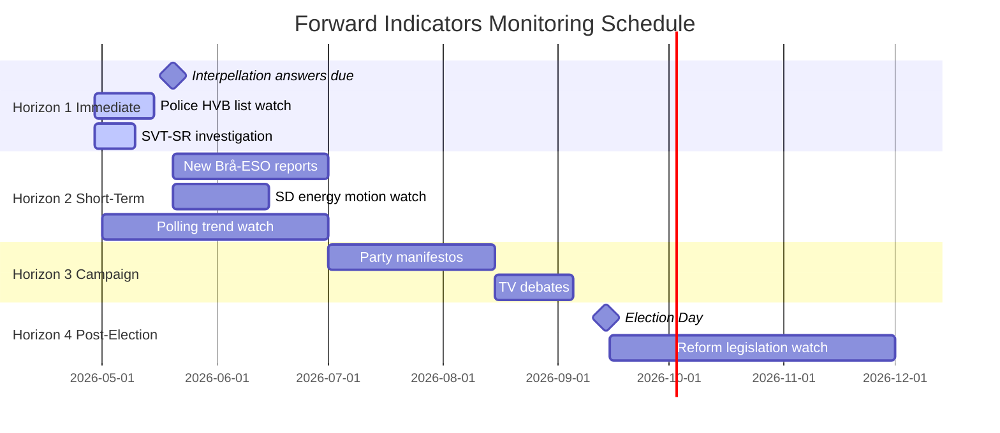

# Forward Indicators — Interpellations 2026-04-29

**Author**: James Pether Sörling | **Confidence**: HIGH [B2]

## Intelligence Requirements

This forward indicators file supports PIR-2026-INTERP-001 through PIR-2026-INTERP-005 with dated collection windows.

---

## Horizon 1: Immediate (May 2026)

| # | Indicator | Watch By | If Triggered | PIR |
|---|-----------|----------|-------------|-----|
| 1 | Government answers HD10454 in full — does it acknowledge 2-year delay? | 2026-05-20 | Yes=Scenario B reinforced; No=political cover attempted | PIR-001 |
| 2 | Government answers HD10451 — does it commit to criminal company registry? | 2026-05-20 | Yes=policy response functional; No=S election narrative confirmed | PIR-001 |
| 3 | Police HVB criminal list publicly released | 2026-05-15 | Yes=Scenario B activation; No=continued stonewalling | PIR-001 |
| 4 | SVT/SR investigative follow-up on HVB story | 2026-05-10 | Yes=media amplification; No=story dies without evidence | PIR-001 |
| 5 | Lann (KD) responds to HD10456 with Council of Europe convention reference | 2026-05-20 | Yes=policy movement; No=continued inaction | PIR-004 |

## Horizon 2: Short-term (June-July 2026)

| # | Indicator | Watch By | If Triggered | PIR |
|---|-----------|----------|-------------|-----|
| 6 | New Brå or ESO report on criminal economy | 2026-07-01 | Confirms/revises 5.5% estimate | PIR-001 |
| 7 | SD files formal energy motion (not just interpellation) | 2026-06-15 | Escalation to Scenario C territory | PIR-002 |
| 8 | Polling: S lead exceeds 6 points over Tidö | 2026-07-01 | Social safety net narrative breaking through | PIR-003 |
| 9 | Women's shelter emergency funding from government | 2026-06-30 | Concession to S pressure; political not substantive fix | PIR-003 |
| 10 | Industrial energy price index Sweden vs EU | 2026-07-01 | If Swedish prices remain >20% above EU average, SD pressure continues | PIR-002 |

## Horizon 3: Election Campaign (August-September 2026)

| # | Indicator | Watch By | If Triggered | PIR |
|---|-----------|----------|-------------|-----|
| 11 | S manifesto features "criminal economy" as top-3 issue | 2026-08-15 | Confirms strategy based on this interpellation cluster | PIR-001 |
| 12 | Riksdag extra session on crime governance legislation | 2026-09-01 | Rare — government acting defensively before election | PIR-001 |
| 13 | TV debate: crime governance dominates over immigration | 2026-09-05 | Frame shift from 2022 pattern; S advantage | PIR-001 |
| 14 | Police Stockholm staffing reaches 90% target | 2026-09-01 | Government can defuse HD10439 narrative | PIR-003 |

## Horizon 4: Post-Election (October-December 2026)

| # | Indicator | Watch By | If Triggered | PIR |
|---|-----------|----------|-------------|-----|
| 15 | S wins election with >175 seats (any combination) | 2026-09-14 | Scenario B activated; criminal economy reform agenda follows | PIR-001 |
| 16 | Tidökoalitionen wins with SD support retained | 2026-09-14 | Scenario A/C confirmed; criminal economy reform delayed | PIR-001 |
| 17 | Organ harvesting legislation introduced to Riksdag | 2026-12-01 | Implementation of HD10456 recommendation | PIR-004 |
| 18 | Criminal company registry legislation tabled | 2026-12-01 | Implementation of HD10451 recommendation | PIR-001 |

---

## Collection Priority Matrix

| PIR | Priority | Horizon 1 Indicators | Horizon 2 Indicators |
|-----|---------|---------------------|---------------------|
| PIR-001 (Crime Governance) | CRITICAL | #1, #2, #3, #4 | #6, #7 |
| PIR-002 (SD Energy) | HIGH | #5 (indirect) | #7, #10 |
| PIR-003 (Social Net) | HIGH | #5 | #8, #9 |
| PIR-004 (Organ Harvesting) | MEDIUM | #5 | — |

## Mermaid: Forward Indicator Timeline

