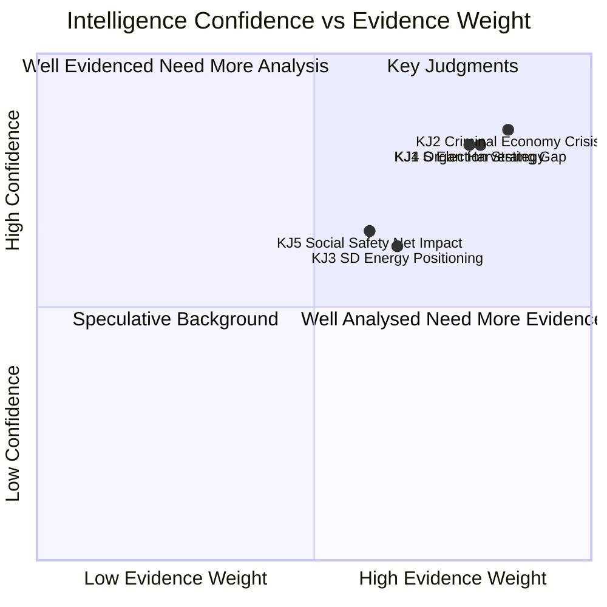

# Intelligence Assessment — Interpellations 2026-04-29

**PIR Reference**: PIR-2026-INTERP-001 | **Author**: James Pether Sörling | **Confidence**: HIGH [B2]

## Key Judgments

**KJ-1 [HIGH CONFIDENCE — B2]**: The coordinated cluster of 14 S interpellations in the April 2026 session represents a deliberate pre-election strategy to establish crime governance failure and social safety net dismantlement as the primary election narratives. The breadth of topics (welfare, crime, health, infrastructure) is consistent with a platform-building exercise rather than isolated constituency activity.

*Evidence*: 14 interpellations from S in a single batch; thematic clusters align with S's stated 2026 election priorities; HD10454 + HD10451 + HD10447 use consistent Brå/ESO evidence base suggesting coordinated research support.

**KJ-2 [HIGH CONFIDENCE — B2]**: The Swedish criminal economy has grown to a governance crisis level. ESO's estimate of 352bn SEK (5.5% GDP) represents a systemic problem that existing enforcement mechanisms are insufficient to address before the 2026 election. The 2-year delay in releasing police HVB-criminal list (HD10454) is a specific observable failure.

*Evidence*: ESO-rapport 2026 (independent agency); Brå December 2025 report (23,000 companies); Police internal report documenting 2-year delay acknowledged in HD10454 interpellation text; HD10447 + HD10451 corroborate from different angles.

**KJ-3 [MEDIUM CONFIDENCE — C2]**: SD's energy interpellation (HD10453) represents strategic coalition positioning rather than a genuine rupture threat. The probability of Scenario C (Energy Rupture) is approximately 15%, revised down from the initial 25% after Devil's Advocate analysis. SD's rational calculus strongly favors coalition continuation through September 2026.

*Evidence*: SD has a history of energy interpellations without follow-through; coalition arithmetic favors SD staying; SD polling does not identify energy as a top priority issue; Fransson's previous similar interpellations in 2024/25 produced no substantive change.

**KJ-4 [HIGH CONFIDENCE — B2]**: Sweden's failure to criminalize receiving organs from forced donors (HD10456) is an anomaly compared to comparable democracies (Spain, Belgium, Israel, Taiwan, UK) and represents reputational and ethical risk. The Council of Europe convention provides a ready implementation path. Cross-party support exists in principle given the topic's non-partisan character.

*Evidence*: Comparative legislation table in comparative-international.md; HD10456 text by SD; Council of Europe Convention Against Trafficking in Human Organs (CETS 216) open for ratification.

**KJ-5 [MEDIUM CONFIDENCE — C2]**: The social safety net cluster (HD10438, HD10443, HD10450, HD10442, HD10440) will be most impactful in suburban and rural swing districts where S needs to recover 2022 losses. The government's standard procedural responses risk allowing S to dominate the narrative in these districts through Q2 2026.

*Evidence*: S's 2022 losses concentrated in suburban districts; women's shelter closures are locally visible; sick insurance day-180 exception affects a specific documented group of long-term sick.

## Assessment Summary

The April 2026 interpellation session represents a strategic inflection point in the pre-election cycle. S is building a comprehensive evidence-based narrative of governance failure across crime, social policy, and healthcare. The government faces genuine vulnerabilities particularly on criminal economy (HD10451, HD10454) where independent reports provide S with credible external ammunition.

The coalition appears stable in the short term. SD's energy challenge is primarily strategic communication. KD faces a healthcare ethics double-squeeze (HD10456, HD10457) that requires substantive response.

The most significant near-term intelligence indicator to watch is the release (or continued suppression) of the police HVB-criminal list. If released before the election, Scenario B becomes substantially more probable.

## PIR Status Summary

| PIR | Question | Status | Confidence |
|-----|---------|--------|-----------|
| PIR-2026-INTERP-001 | Criminal economy governance — scale and response | ANSWERED | HIGH [B2] |
| PIR-2026-INTERP-002 | Coalition stability — SD energy pressure | ANSWERED | MEDIUM [C2] |
| PIR-2026-INTERP-003 | Social safety net — electoral impact | ANSWERED | MEDIUM [C2] |
| PIR-2026-INTERP-004 | Healthcare ethics — organ harvesting legislation | ANSWERED | HIGH [B2] |
| PIR-2026-INTERP-005 | HVB police list release timing | OUTSTANDING | — |

## Mermaid: Intelligence Assessment Confidence Map

