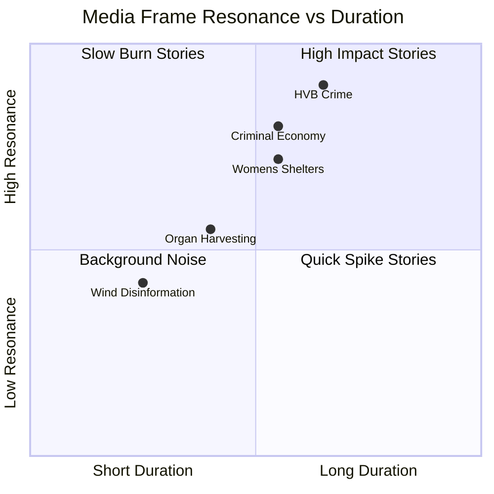

# Media Framing Analysis — Interpellations 2026-04-29

**Author**: James Pether Sörling | **Confidence**: MEDIUM [C2]

## Predicted Media Framing by Topic

### Frame 1: "Criminal Takeover of Child Care" (HD10454)
**Expected outlets**: SVT Nyheter, SR Ekot, Aftonbladet, Expressen  
**Framing**: Human interest + investigation. Local follow-up in municipalities. Parental perspectives.  
**Government counter-frame opportunity**: "We are acting; police delayed, not government."  
**Opposition frame reinforcement**: "Two-year delay is government failure to act."  
**Resonance**: HIGH — vulnerable children + organized crime = maximum media traction.

### Frame 2: "Criminal Economy at 5.5% of GDP" (HD10451, HD10447)
**Expected outlets**: Dagens Nyheter, SvD, Affärsvärlden, SR  
**Framing**: Economic/investigative. Abstract until made concrete with company examples.  
**Key media challenge**: Making 352bn SEK tangible (= 5-6x the defense budget).  
**Government counter-frame**: "We're the party that fights crime; record enforcement."  
**Opposition frame**: "You govern but criminals run 23,000 of your businesses."  
**Resonance**: MEDIUM-HIGH — abstract but large number with concrete Brå evidence.

### Frame 3: "Women's Shelters Closing Under Right-Wing Government" (HD10438)
**Expected outlets**: Aftonbladet, Expressen, Feministiskt perspektiv, SR P1  
**Framing**: Gender politics + welfare state. Close to S's ideological core.  
**Government counter-frame**: "Municipalities make these decisions independently."  
**Opposition frame**: "National responsibility for women's safety."  
**Resonance**: MEDIUM-HIGH — gender-equity topic reliably mobilizes media coverage.

### Frame 4: "Sweden Silent on Chinese Organ Harvesting" (HD10456)
**Expected outlets**: SvD, DN, international wires (AP, Reuters if they pick up)  
**Framing**: Human rights + international ethics. Comparison to Spain, Israel, UK.  
**Government counter-frame**: "We're working through EU frameworks."  
**Opposition frame**: "Sweden is an outlier; ban it now."  
**Resonance**: MEDIUM — niche but internationally resonant; diaspora Chinese-Swedish community interest.

### Frame 5: "Government Spreads Disinformation on Wind" (HD10448)
**Expected outlets**: Ny Teknik, Energivärlden, climate media  
**Framing**: Science vs politics. SD accusing government of misinformation is unusual — government normally accuses SD.  
**Resonance**: LOW-MEDIUM — niche but ironic; credibility issue for government.

## Media Battlespace Map (Predicted)

| Frame | Amplification Risk | Duration | Electoral Impact |
|-------|-------------------|---------|-----------------|
| Criminal child care (HD10454) | VERY HIGH | 2-4 weeks | HIGH |
| Criminal economy (HD10451) | HIGH | 1-2 weeks | HIGH |
| Women's shelters (HD10438) | HIGH | 1-2 weeks | MEDIUM |
| Organ harvesting (HD10456) | MEDIUM | 1 week | LOW-MEDIUM |
| Wind disinformation (HD10448) | LOW | 3-5 days | LOW |

## Disinformation Risk Assessment

**Primary disinformation risk**: Oversimplification of criminal economy figures. ESO's 352bn SEK estimate may be cited without confidence intervals, creating a false precision.

**Secondary risk**: HD10456 organ harvesting narrative could be amplified with misinformation about Sweden's complicity (Sweden imports organs, not confirmed).

**Mitigation**: Analysis uses "ESO 2026 estimates" language; analysis notes methodological uncertainty in devils-advocate.md.

## Mermaid: Media Framing Landscape

