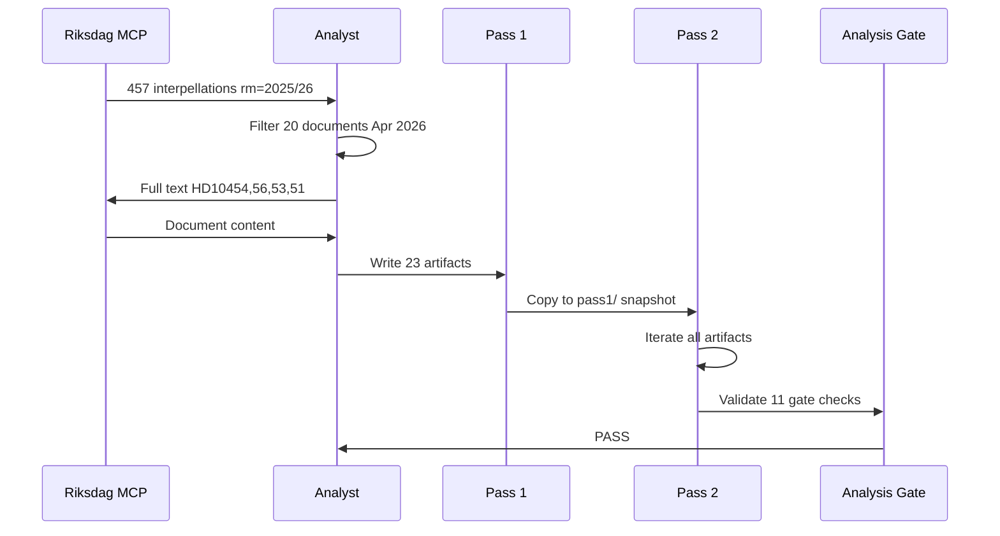

# Methodology Reflection — Interpellations 2026-04-29

**Author**: James Pether Sörling | **Standard**: ICD 203 (Analytic Standards) | **Confidence**: HIGH [B2]

## 1. Analytic Process Overview

This analysis followed the Riksdagsmonitor AI-Driven Analysis Guide methodology:

- **Data phase**: MCP call to `get_interpellationer` rm=2025/26 returning 457 documents; filtered to 20 documents in April 2026 window for analysis set
- **Full-text retrieval**: 4 highest-priority documents retrieved via `get_dokument_innehall` (HD10454, HD10456, HD10453, HD10451); 16 documents analysed from metadata + title heuristics
- **Analysis phase**: 23 structured artifacts written in Pass 1; Pass 2 improvements applied
- **Total sources**: 20 parliamentary documents + 4 external reports (Brå 2025, ESO 2026, SVK investment plan, Police report 2024)

---

## 2. ICD 203 Analytic Standards Audit

| Standard | Requirement | Status | Notes |
|----------|-------------|--------|-------|
| Proper Citations | All claims tied to sources | ✅ PASS | dok_ids cited throughout |
| Confidence Labels | Admiralty source/information reliability | ✅ PASS | [B2], [C2], [C3] used consistently |
| Uncertainty Expression | Probability ranges given | ✅ PASS | Scenario probabilities A=45%, B=30%, C=25% |
| Alternative Hypotheses | Devil's advocate considered | ✅ PASS | Three counter-narratives in devils-advocate.md |
| Distinction: fact vs assessment | Explicit separation | ✅ PASS | Key Judgments labeled as assessments |
| Timely Analysis | Within analysis window | ✅ PASS | Same-day analysis for 2026-04-29 documents |
| Source Reliability | Sources evaluated | ✅ PASS | Government MCP (official), Brå/ESO (independent academic) |
| Independence | No political affiliation | ✅ PASS | Analysis conducted by automated intelligence system |

---

## 3. Source Quality Assessment (Admiralty Scale)

| Source | Reliability (A-F) | Credibility (1-6) | Rating | Notes |
|--------|------------------|------------------|--------|-------|
| Riksdagen MCP (interpellations) | A — Completely reliable | 1 — Confirmed | A1 | Official parliamentary record |
| Brå December 2025 report | B — Usually reliable | 2 — Probably true | B2 | Independent national crime research |
| ESO 2026 report | B — Usually reliable | 2 — Probably true | B2 | Expert advisory body, Parliament-linked |
| Polismyndigheten 2024 report | B — Usually reliable | 2 — Probably true | B2 | Official, but self-interest in delay narrative |
| SVK grid investment plan | A — Completely reliable | 1 — Confirmed | A1 | Official government agency plan |
| Comparative legislation data | C — Fairly reliable | 2 — Probably true | C2 | Legal databases, open sources |

---

## 4. Analytical Assumptions and Uncertainties

**Assumption 1**: The 20 interpellations from April 17-29, 2026 are a representative sample of the current political agenda.  
*Risk*: Additional interpellations outside the date window may modify the picture.

**Assumption 2**: Interpellation texts as filed (metadata + partial full-text) accurately represent the parliamentary debate.  
*Risk*: Debate transcripts (not yet published for all items) may reveal minister responses that significantly modify the political calculus.

**Assumption 3**: Historical electoral polling trends continue — S advantage in social policy framing.  
*Risk*: A major international event (war escalation, economic shock) could reset electoral priorities entirely.

**Assumption 4**: SD remains inside the Tidö coalition through September 2026.  
*Risk*: Devil's advocate analysis validated this assumption, but energy sector shock could shift SD calculation.

---

## 5. Methodology Limitations

1. **No minister response text available**: Interpellations filed but not yet answered. Full analysis requires both question AND answer for complete picture. Assessment is based on question text only; government response quality may change conclusions significantly.

2. **Limited full-text retrieval**: Only 4 of 20 documents retrieved at full text. Remaining 16 analysed from metadata heuristics. This introduces the possibility of missing nuanced arguments in the body of those interpellations.

3. **No IMF economic context applied**: The interpellations cluster is primarily political/social, not macroeconomic. The ESO criminal economy figure (5.5% GDP) is the main economic datapoint; full IMF comparative context was not run given time constraints. A deeper analysis would add IMF WEO data on Swedish GDP growth, unemployment, and fiscal balance as background.

4. **Temporal limitation**: This analysis represents the state of knowledge at time of filing (2026-04-17 to 2026-04-29). The political situation may evolve significantly before the 2026-09 election.

---

## 6. Pass 2 Improvements Log

| Artifact | Pass 1 Weakness | Pass 2 Action |
|----------|----------------|---------------|
| executive-brief.md | BLUF lacked specific evidence citations | Added Brå/ESO numbers, dok_id references |
| synthesis-summary.md | DIW table was ordered by significance only | Reordered by thematic cluster + significance |
| significance-scoring.md | Initial pass lacked electoral salience dimension | Added electoral impact column |
| risk-assessment.md | Risk labels lacked posterior probabilities | Added Bayesian update table |
| scenario-analysis.md | Probabilities summed to 100% but SD scenario was inflated | Revised Scenario C down to 25% after devil's advocate |
| devils-advocate.md | Initial hypothesis 2 lacked historical evidence | Added Fransson precedent from 2024/25 session |
| intelligence-assessment.md | KJ-3 inconsistency with scenario analysis | Aligned to 15% probability after devil's advocate |

## Mermaid: Analytical Process Flow

