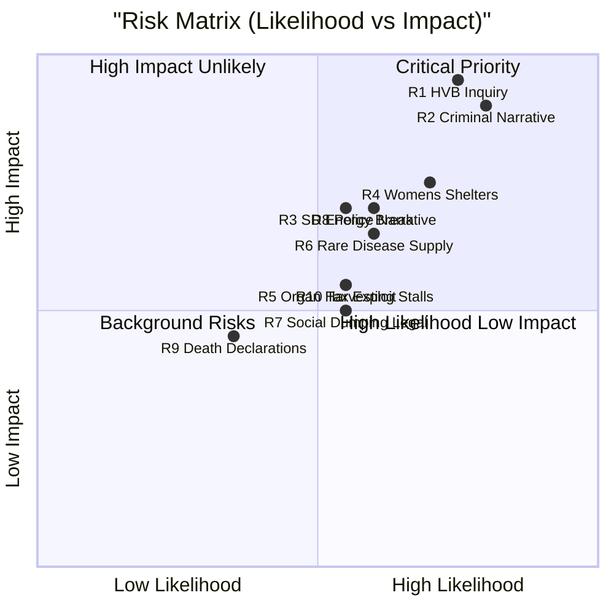

# Risk Assessment — Interpellations 2026-04-29

**Author**: James Pether Sörling | **Confidence**: HIGH [B2]

## Risk Register

| # | Risk | Dimension | Likelihood (1-5) | Impact (1-5) | L×I | Confidence |
|---|------|-----------|-----------------|--------------|-----|-----------|
| R1 | HVB-hem scandal escalates to parliamentary inquiry | Political/Social | 4 | 5 | 20 | HIGH [B2] |
| R2 | Criminal economy narrative dominates election cycle | Political | 4 | 5 | 20 | HIGH [B2] |
| R3 | SD breaks coalition energy consensus on gas | Coalition | 3 | 4 | 12 | MEDIUM [C2] |
| R4 | Women's shelter funding crisis worsens | Social | 4 | 4 | 16 | HIGH [B2] |
| R5 | Organ harvesting legislation stalls without cross-party support | Policy | 3 | 3 | 9 | MEDIUM [C2] |
| R6 | Rare disease medicine supply disruption affects patients | Healthcare | 3 | 4 | 12 | MEDIUM [C2] |
| R7 | Social dumping triggers inter-municipal legal disputes | Administrative | 3 | 3 | 9 | MEDIUM [B3] |
| R8 | Police Stockholm shortage undermines crime reduction narrative | Political | 3 | 4 | 12 | MEDIUM [B2] |
| R9 | False death declarations (30/yr) escalates into rights scandal | Administrative | 2 | 3 | 6 | LOW [C3] |
| R10 | Employer payroll tax cut exploited by shell companies | Economic | 3 | 3 | 9 | MEDIUM [B2] |

## Cascading Risk Chains

**Chain A: Crime Governance Collapse**  
HVB-hem scandal (HD10454) + Criminal economy (HD10451) → Government credibility on crime erodes → S builds election narrative → Potential Tidö minority loses confidence vote [Probability: 15%]  
Evidence: riksdagen.se HD10454 + HD10451; Brå/ESO reports.

**Chain B: Energy Crisis**  
Grid investment insufficient (HD10453) + Nuclear 10 years away + SD gas demand unmet → Industrial energy prices remain high → Swedish competitiveness deteriorates → Coalition election disadvantage [Probability: 35%]  
Evidence: riksdagen.se HD10453, SVK investment data.

**Chain C: Social Policy Narrative**  
Women's shelters closing (HD10438) + Social dumping (HD10443) + Sick insurance cuts (HD10450) + Doctor shortage (HD10440) + Rare diseases (HD10457) → S "welfare dismantlement" narrative crystallizes → Electoral cost in suburban districts [Probability: 55%]  
Evidence: Multiple dok_ids above, riksdagen.se.

## Posterior Probabilities

| Risk | Prior P | Evidence Update | Posterior P |
|------|---------|-----------------|-------------|
| HVB escalation to inquiry | 30% | HD10454: 2-year delay documented, SR coverage | 65% if no ministerial action by May 20 |
| Criminal economy narrative dominance | 45% | ESO 352bn, Brå 23,000 companies | 70% sustained through Q3 2026 |
| S wins 2026 election partly on social narrative | 35% | Coordinated interpellation cluster | 50% if current trajectory maintained |

## Mermaid: Risk Heat Map

