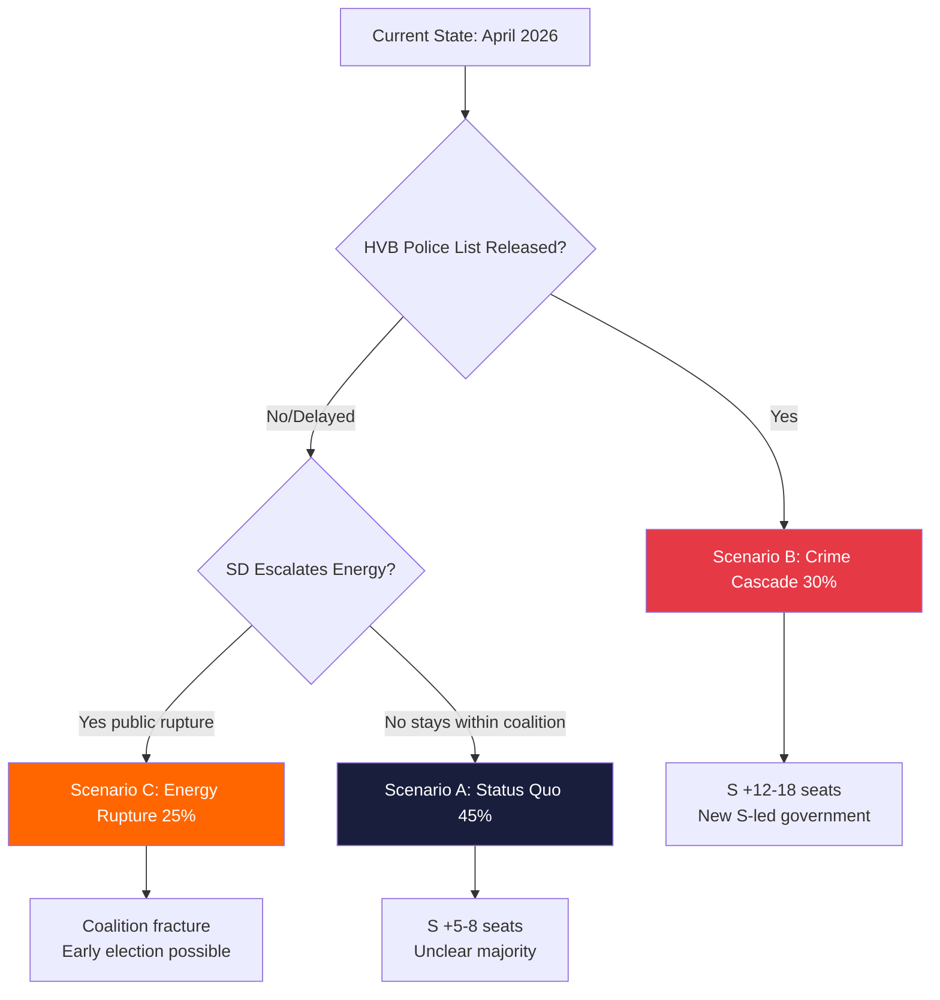

# Scenario Analysis — Interpellations 2026-04-29

**Author**: James Pether Sörling | **Confidence**: HIGH [B2]

## Scenario Framework

Three policy-plausible scenarios derived from the interpellation cluster for 2026-09 election horizon.

---

## Scenario A: Status Quo Drift ("Managed Decline")

**Probability**: 45% | **Confidence**: MEDIUM [C2]

**Description**: Government responds procedurally to all interpellations with limited policy change. The HVB-hem scandal produces a report. The criminal economy narrative is acknowledged but no structural legislative change passes before the election. Energy policy remains contested. Women's shelters receive modest emergency funding. The election is decided primarily on immigration and economic performance.

**Key Assumptions**:
- Coalition holds through September 2026
- No major HVB-hem revelation escalates to parliamentary inquiry
- Police reform continues but Stockholm shortage not resolved

**Driving Forces**:
- Tidökoalitionen inertia and parliamentary majority holds
- SD remains within coalition discipline on energy
- S unable to consolidate multiple narratives into single election message

**Indicators this scenario is materializing**:
- Government answers interpellations with standard procedural responses
- No extraordinary committee referral
- Poll lead for S remains 3-5 points

**Consequences**:
- Moderate S election gains (+5-8 seats); insufficient for clear majority
- Minority government continuation post-election possible
- Criminal economy reforms delayed to 2027

---

## Scenario B: Crime Governance Crisis ("Accountability Cascade")

**Probability**: 30% | **Confidence**: MEDIUM [C2]

**Description**: HVB-hem scandal escalates when the delayed police list is finally released, revealing more criminal operators. Multiple parliamentary inquiries launched. The Brå/ESO criminal economy evidence leads to emergency legislative session. The government's crime-fighting credibility collapses. S is able to present a comprehensive "crime governance failure" narrative that extends beyond individual policies.

**Key Assumptions**:
- Police list delayed 2+ years is eventually released revealing large-scale infiltration
- S successfully links HVB (HD10454), corporate crime (HD10451), and police shortage (HD10439) into single accountability frame
- Media amplifies ESO's 352bn figure into household understanding

**Driving Forces**:
- Brå/ESO reports provide credible evidence base
- Interpellation cluster HD10451/HD10454/HD10447 all heard before same/nearby dates
- SR/SVT investigative journalism potential follow-up

**Indicators this scenario is materializing**:
- Police releases HVB criminal list before election
- Major media investigation publishes following interpellation debates
- Government forces emergency measures on corporate registration

**Consequences**:
- S election gains +12-18 seats
- New government formation: S+MP+V likely majority
- Criminal economy reform legislation in 2027 budget

---

## Scenario C: Energy Rupture ("Coalition Fracture")

**Probability**: 25% | **Confidence**: LOW [C3]

**Description**: SD's challenge on energy (HD10453) escalates into a formal policy conflict with KD/M. SD demands a concrete gas bridge decision with timeline. Government cannot reach consensus. SD threatens to withdraw Tidö support on energy vote. Combined with SD's disinformation accusation against government (HD10448), an intra-coalition public rift emerges.

**Key Assumptions**:
- SD escalates beyond interpellation into formal budget/policy amendment
- KD/Busch refuses gas bridge concession citing climate obligations and EU ETS
- M unable to broker compromise between KD and SD on nuclear timeline

**Driving Forces**:
- 10-year nuclear construction timeline creates credibility gap for gas opposition
- Industrial energy prices remain elevated through summer 2026
- SD constituency pressure from industry-dependent regions

**Indicators this scenario is materializing**:
- SD submits energy motion that diverges from government position
- Public statements by SD Fransson escalate beyond interpellation
- Poll shows SD voters prioritizing energy above immigration for first time

**Consequences**:
- Coalition credibility on energy irreparably damaged
- Early election call possible if Tidö loses budget vote
- Energy policy becomes primary 2026 campaign issue

---

## Comparative Scenario Table

| Dimension | A: Status Quo | B: Crime Cascade | C: Energy Rupture |
|-----------|--------------|-----------------|------------------|
| Coalition stability | High | Medium | Low |
| S election performance | Modest gains | Strong gains | Uncertain |
| Criminal economy reform | Delayed to 2027 | Emergency legislation | Delayed |
| Energy policy | Status quo | Status quo | Structural change |
| HVB-hem | Procedural response | Parliamentary inquiry | Background |
| Probability | 45% | 30% | 25% |

## Mermaid: Scenario Decision Tree

