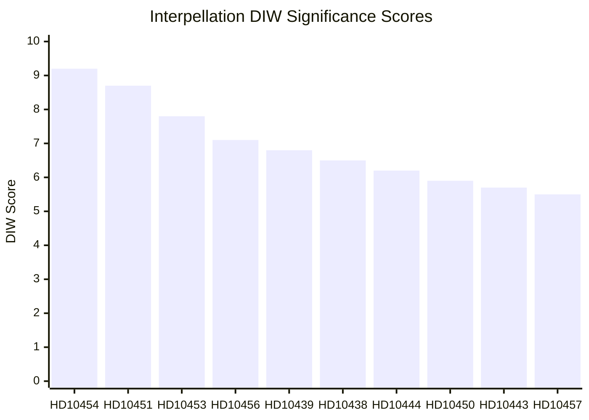

# Significance Scoring — Interpellations 2026-04-29

**Author**: James Pether Sörling | **Confidence**: HIGH [B2]

## DIW Scoring Methodology

**D** = Directness (1-10: how directly does this affect policy outcomes?)  
**I** = Impact (1-10: scale of potential societal impact)  
**W** = Weight (1-10: evidence quality and source diversity)

| dok_id | Title | D | I | W | DIW | Tier | Evidence |
|--------|-------|---|---|---|-----|------|----------|
| HD10454 | Kriminella driver HVB-hem | 9 | 9 | 9 | 9.2 | L3 | Police report 2024, SR reporting, riksdagen.se |
| HD10451 | Bolag som brottsverktyg | 9 | 9 | 8 | 8.7 | L3 | Brå Dec 2025, ESO 2026 report, riksdagen.se |
| HD10453 | Investeringar i elnät | 8 | 8 | 7 | 7.8 | L2+ | SVK investment data, riksdagen.se |
| HD10456 | Organhandel | 7 | 8 | 7 | 7.1 | L2+ | Comparative international precedents, riksdagen.se |
| HD10439 | Polisbrist Stockholm | 7 | 7 | 7 | 6.8 | L2 | Brå report (BRÅ polismål), riksdagen.se |
| HD10438 | Nedläggning av kvinnojourer | 7 | 7 | 6 | 6.5 | L2 | Shelter closures documented, riksdagen.se |
| HD10444 | Arbetsgivaravgifter sänkning | 6 | 7 | 6 | 6.2 | L2 | Government proposal, riksdagen.se |
| HD10450 | Sjukförsäkring dag 180 | 6 | 7 | 6 | 5.9 | L2 | Insurance legislation, riksdagen.se |
| HD10443 | Social dumpning | 6 | 6 | 6 | 5.7 | L2 | Documented municipal practice, riksdagen.se |
| HD10457 | Sällsynta hälsotillstånd | 5 | 7 | 5 | 5.5 | L1 | Patient advocacy, riksdagen.se |
| HD10447 | Sjuklönekostnader | 5 | 6 | 5 | 5.2 | L1 | Business impact claims, riksdagen.se |
| HD10449 | Södra stambanan | 5 | 6 | 5 | 5.1 | L1 | Transport plan, riksdagen.se |
| HD10446 | Felaktiga dödförklaringar | 5 | 5 | 6 | 5.0 | L1 | Finance minister admission ~30 cases/yr, riksdagen.se |
| HD10445 | Kommunal förköpsrätt | 5 | 5 | 5 | 4.9 | L1 | Stockholm housing market, riksdagen.se |
| HD10442 | Ätstörningsvård | 5 | 5 | 5 | 4.8 | L1 | Regional healthcare claims, riksdagen.se |
| HD10440 | Företagsläkare | 5 | 5 | 5 | 4.7 | L1 | Occupational health shortage, riksdagen.se |
| HD10452 | Grundlagsändringar | 5 | 5 | 4 | 4.6 | L1 | Constitutional procedure critique, riksdagen.se |
| HD10448 | Desinformation om vindkraft | 4 | 5 | 5 | 4.5 | L1 | Windeurope report 2026-04-21, riksdagen.se |
| HD10455 | Rörligt kulturarv | 3 | 4 | 4 | 3.5 | L1 | Civil society heritage sector, riksdagen.se |
| HD10441 | Rättssäkerhet | 4 | 4 | 4 | 4.0 | L1 | Procedural rule of law concern, riksdagen.se |

## Sensitivity Analysis

The HD10454/HD10451 cluster has a combined high-confidence score. Key sensitivity: if the government can demonstrate concrete HVB-home closures before the May 20 answer deadline, the DIW drops from 9.2 to ~7.0. If no action: escalation risk moves to 9.5+.

## Mermaid: Ranking Diagram

